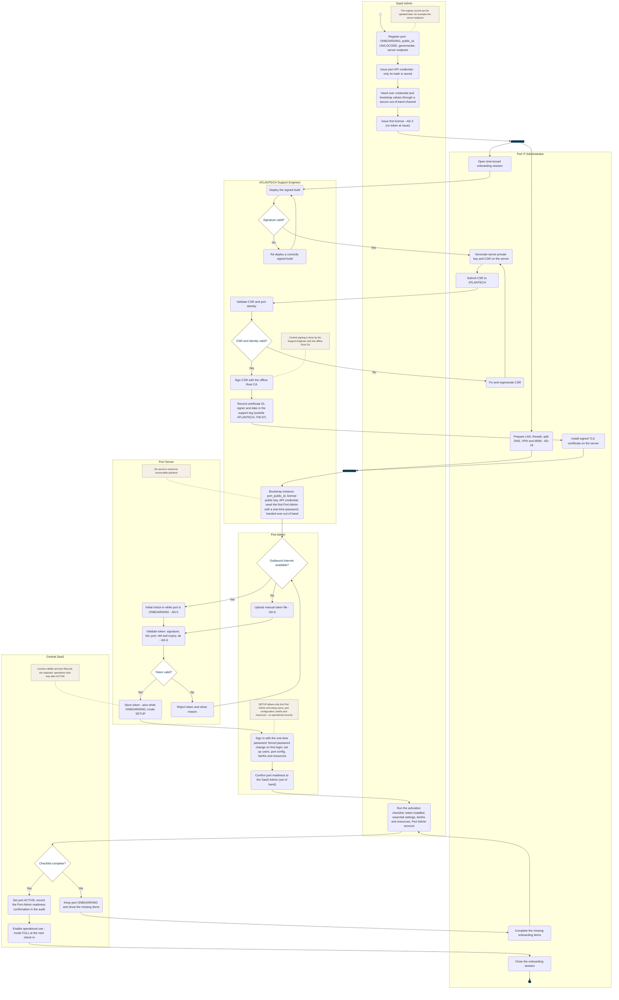

<!-- Generated from docs/reference/uml/ATLANTECH_Activity_Diagrams.md lines 7-98 by build-index.mjs. Do not edit: edit the source and rebuild. -->
### AD-1 — Port onboarding and provisioning

```mermaid
flowchart TD
    subgraph L_SA["SaaS Admin"]
        direction TB
        START@{ shape: sm-circ }
        A1("Register port: ONBOARDING, public_id, UN/LOCODE, governorate, server endpoint")
        A2("Issue port API credential - only its hash is stored")
        A12("Hand over credential and bootstrap values through a secure out-of-band channel")
        A3("Issue first license - AD-2 (no token at issue)")
        R4("Run the activation checklist: token installed, essential settings, berths and resources, Port Admin account")
        N1["The registry record can be updated later, for example the server endpoint"]
    end
    subgraph L_SE["ATLANTECH Support Engineer"]
        direction TB
        P0("Deploy the signed build")
        DS{"Signature valid?"}
        P8("Re-deploy a correctly signed build")
        V1("Validate CSR and port identity")
        DV{"CSR and identity valid?"}
        E2("Sign CSR with the offline Root CA")
        E4("Record certificate ID, signer and date in the support log (outside ATLANTECH, FW-07)")
        E3("Bootstrap instance: port_public_id, license public key, API credential; seed the first Port Admin with a one-time password, handed over out of band")
        N2["Central signing is done by the Support Engineer with the offline Root CA"]
    end
    subgraph L_PIT["Port IT Administrator"]
        direction TB
        P1("Prepare LAN, firewall, split DNS, VPN and MDM - AD-19")
        P7("Open time-boxed onboarding session")
        P2("Generate server private key and CSR on the server")
        P4("Submit CSR to ATLANTECH")
        P5("Fix and regenerate CSR")
        P3("Install signed TLS certificate on the server")
        P6("Complete the missing onboarding items")
        P9("Close the onboarding session")
        STOP1@{ shape: fr-circ }
    end
    subgraph L_PAD["Port Admin"]
        direction TB
        D1{"Outbound internet available?"}
        A5("Upload manual token file - AD-6")
        A8("Sign in with the one-time password; forced password change on first login; set up users, port config, berths and resources")
        N5["SETUP allows only first Port Admin and setup users, port configuration, berths and resources - no operational records"]
        R3("Confirm port readiness to the SaaS Admin (out of band)")
    end
    subgraph L_SRV["Port Server"]
        direction TB
        A4("Initial check-in while port is ONBOARDING - AD-5")
        A6("Validate token: signature, kid, port, nbf and expiry, iat - AD-6")
        D2{"Token valid?"}
        A7("Store token - also while ONBOARDING; mode SETUP")
        A10("Reject token and show reason")
        N3["No secret is stored as recoverable plaintext"]
    end
    subgraph L_SAAS["Central SaaS"]
        direction TB
        D8{"Checklist complete?"}
        A11("Keep port ONBOARDING and show the missing items")
        A9("Set port ACTIVE; record the Port Admin readiness confirmation in the audit")
        A13("Enable operational use - mode FULL at the next check-in")
        N4["License validity and port lifecycle are separate: operations start only after ACTIVE"]
    end
    START --> A1 --> A2 --> A12 --> A3 --> FK1@{ shape: fork }
    FK1 --> P1 --> JN1@{ shape: fork }
    FK1 --> P7 --> P0 --> DS
    DS -->|"No"| P8 --> P0
    DS -->|"Yes"| P2 --> P4 --> V1 --> DV
    DV -->|"No"| P5 --> P2
    DV -->|"Yes"| E2 --> E4 --> P3 --> JN1
    JN1 --> E3 --> D1
    D1 -->|"Yes"| A4 --> A6
    D1 -->|"No"| A5 --> A6
    A6 --> D2
    D2 -->|"No"| A10 --> D1
    D2 -->|"Yes"| A7 --> A8 --> R3 --> R4 --> D8
    D8 -->|"No"| A11 --> P6 --> R4
    D8 -->|"Yes"| A9 --> A13 --> P9 --> STOP1
    N1 -.- A1
    N2 -.- E2
    N3 -.- E3
    N4 -.- A7
    N5 -.- A8
    classDef term fill:#083A4F,stroke:#083A4F,color:#083A4F
    classDef bar fill:#083A4F,stroke:#083A4F
    classDef dec fill:#FFFFFF,stroke:#A58D66,stroke-width:2px,color:#083A4F
    classDef note fill:#F4EFE7,stroke:#A58D66,color:#3B3326,font-size:13px
    class START,STOP1 term
    class FK1,JN1 bar
    class D1,D2,D8,DS,DV dec
    class N1,N2,N3,N4,N5 note
```
