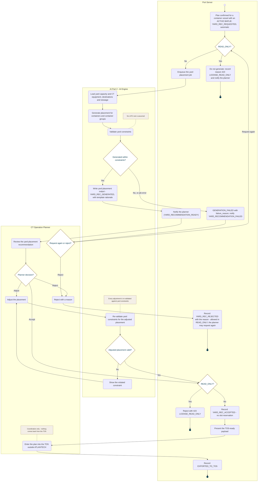

<!-- Generated from docs/reference/uml/ATLANTECH_Activity_Diagrams.md lines 1322-1393 by build-index.mjs. Do not edit: edit the source and rebuild. -->
### AD-14 — Yard placement recommendation

```mermaid
flowchart TD
    subgraph L_SRV["Port Server"]
        direction TB
        START@{ shape: sm-circ }
        A1("Plan confirmed for a container vessel with an ACTIVE BAPLIE: YARD_REC_REQUESTED, automatic")
        D6{"READ_ONLY?"}
        A21("Do not generate: record reason 423 LICENSE_READ_ONLY and notify the planner")
        STOP1@{ shape: fr-circ }
        A2("Enqueue the yard placement job")
        AG("GENERATION_FAILED with failure_reason; notify YARD_RECOMMENDATION_FAILED")
        A6("Notify the planner (YARD_RECOMMENDATION_READY)")
        DA{"READ_ONLY?"}
        A22("Reject with 423 LICENSE_READ_ONLY")
        STOP2@{ shape: fr-circ }
        AC("Record YARD_REC_ACCEPTED - no slot reservation")
        AP("Present the TOS-ready payload")
        AE("Record EXPORTED_TO_TOS")
        STOP3@{ shape: fr-circ }
        A11("Record YARD_REC_REJECTED with the reason - allowed in READ_ONLY; the planner may request again")
        STOP4@{ shape: fr-circ }
    end
    subgraph L_AI2["AI Part 2 - AI Engine"]
        direction TB
        A3("Load yard capacity and CT equipment, destinations and stowage")
        A4("Generate placement for containers and container groups")
        V1("Validate yard constraints")
        D0{"Generated within constraints?"}
        A5("Write yard placement output - YARD_REC_GENERATED, with template rationale")
        A17("Re-validate yard constraints for the adjusted placement")
        D4{"Adjusted placement valid?"}
        A18("Show the violated constraint")
        N4["No LIFO rule is assumed"]
        N5["Every adjustment is re-validated against yard constraints"]
    end
    subgraph L_CTP["CT Operation Planner"]
        direction TB
        A7("Review the yard placement recommendation")
        D1{"Planner decision?"}
        A8("Adjust the placement")
        A10("Reject with a reason")
        D3{"Request again or reject?"}
        A15("Enter the plan into the TOS outside ATLANTECH")
        N2["Coordination only - nothing comes back from the TOS"]
    end
    START --> A1 --> D6
    D6 -->|"Yes"| A21 --> STOP1
    D6 -->|"No"| A2 --> A3 --> A4 --> V1 --> D0
    D0 -->|"No, or job error"| AG --> D3
    D3 -->|"Request again"| D6
    D3 -->|"Reject"| A10
    D0 -->|"Yes"| A5 --> A6 --> A7 --> D1
    D1 -->|"Accept"| DA
    D1 -->|"Adjust"| A8 --> A17 --> D4
    D4 -->|"No"| A18 --> A8
    D4 -->|"Yes"| DA
    DA -->|"Yes"| A22 --> STOP2
    DA -->|"No"| AC --> AP --> A15 --> AE --> STOP3
    D1 -->|"Reject"| A10 --> A11 --> STOP4
    N2 -.- A15
    N4 -.- V1
    N5 -.- A17
    classDef term fill:#083A4F,stroke:#083A4F,color:#083A4F
    classDef bar fill:#083A4F,stroke:#083A4F
    classDef dec fill:#FFFFFF,stroke:#A58D66,stroke-width:2px,color:#083A4F
    classDef note fill:#F4EFE7,stroke:#A58D66,color:#3B3326,font-size:13px
    class START,STOP1,STOP2,STOP3,STOP4 term
    class D0,D1,D3,D4,D6,DA dec
    class N2,N4,N5 note
```
