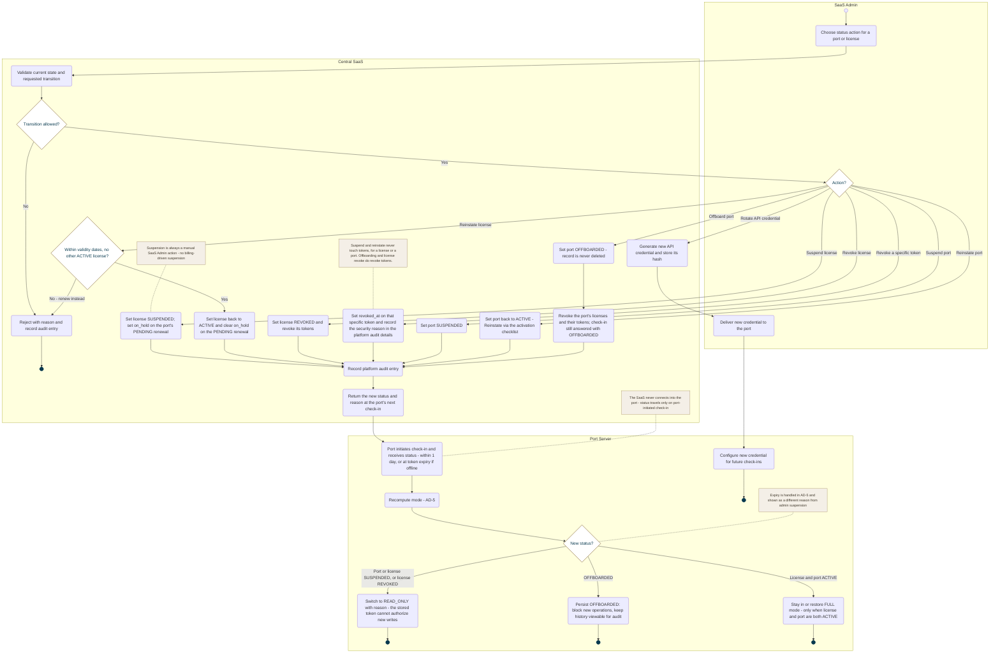

<!-- Generated from docs/reference/uml/ATLANTECH_Activity_Diagrams.md lines 209-285 by build-index.mjs. Do not edit: edit the source and rebuild. -->
### AD-3 — License and port status changes

```mermaid
flowchart TD
    subgraph L_SA["SaaS Admin"]
        direction TB
        START@{ shape: sm-circ }
        A1("Choose status action for a port or license")
        D1{"Action?"}
        A12("Deliver new credential to the port")
    end
    subgraph L_SAAS["Central SaaS"]
        direction TB
        S0("Validate current state and requested transition")
        D4{"Transition allowed?"}
        A13("Reject with reason and record audit entry")
        STOP1@{ shape: fr-circ }
        D5{"Within validity dates, no other ACTIVE license?"}
        A2("Set license SUSPENDED; set on_hold on the port's PENDING renewal")
        A3("Set license back to ACTIVE and clear on_hold on the PENDING renewal")
        A4("Set license REVOKED and revoke its tokens")
        A5("Set revoked_at on that specific token and record the security reason in the platform audit details")
        A6("Set port SUSPENDED")
        A15("Set port back to ACTIVE - Reinstate via the activation checklist")
        A7("Set port OFFBOARDED - record is never deleted")
        A14("Revoke the port's licenses and their tokens; check-in still answered with OFFBOARDED")
        A8("Generate new API credential and store its hash")
        A9("Record platform audit entry")
        A10("Return the new status and reason at the port's next check-in")
        N6["Suspend and reinstate never touch tokens, for a license or a port. Offboarding and license revoke do revoke tokens."]
        N2["Suspension is always a manual SaaS Admin action - no billing-driven suspension"]
        N4["The SaaS never connects into the port - status travels only on port-initiated check-in"]
    end
    subgraph L_SRV["Port Server"]
        direction TB
        P1("Port initiates check-in and receives status - within 1 day, or at token expiry if offline")
        P2("Recompute mode - AD-5")
        D3{"New status?"}
        P3("Switch to READ_ONLY with reason - the stored token cannot authorize new writes")
        STOP3@{ shape: fr-circ }
        P6("Persist OFFBOARDED: block new operations, keep history viewable for audit")
        STOP4@{ shape: fr-circ }
        P4("Stay in or restore FULL mode - only when license and port are both ACTIVE")
        STOP5@{ shape: fr-circ }
        P5("Configure new credential for future check-ins")
        STOP2@{ shape: fr-circ }
        N3["Expiry is handled in AD-5 and shown as a different reason from admin suspension"]
    end
    START --> A1 --> S0 --> D4
    D4 -->|"No"| A13 --> STOP1
    D4 -->|"Yes"| D1
    D1 -->|"Suspend license"| A2 --> A9
    D1 -->|"Reinstate license"| D5
    D5 -->|"No - renew instead"| A13
    D5 -->|"Yes"| A3 --> A9
    D1 -->|"Revoke license"| A4 --> A9
    D1 -->|"Revoke a specific token"| A5 --> A9
    D1 -->|"Suspend port"| A6 --> A9
    D1 -->|"Reinstate port"| A15 --> A9
    D1 -->|"Offboard port"| A7 --> A14 --> A9
    D1 -->|"Rotate API credential"| A8 --> A12 --> P5 --> STOP2
    A9 --> A10 --> P1 --> P2 --> D3
    D3 -->|"Port or license SUSPENDED, or license REVOKED"| P3 --> STOP3
    D3 -->|"OFFBOARDED"| P6 --> STOP4
    D3 -->|"License and port ACTIVE"| P4 --> STOP5
    N6 -.- A5
    N2 -.- A2
    N3 -.- D3
    N4 -.- P1
    classDef term fill:#083A4F,stroke:#083A4F,color:#083A4F
    classDef bar fill:#083A4F,stroke:#083A4F
    classDef dec fill:#FFFFFF,stroke:#A58D66,stroke-width:2px,color:#083A4F
    classDef note fill:#F4EFE7,stroke:#A58D66,color:#3B3326,font-size:13px
    class START,STOP1,STOP2,STOP3,STOP4,STOP5 term
    class D1,D3,D4,D5 dec
    class N2,N3,N4,N6 note
```
