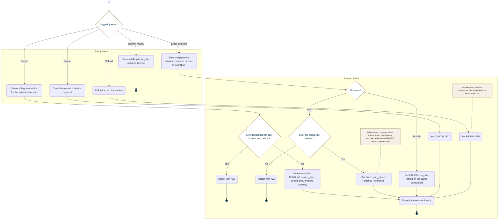

<!-- Generated from docs/reference/uml/ATLANTECH_Activity_Diagrams.md lines 287-343 by build-index.mjs. Do not edit: edit the source and rebuild. -->
### AD-4 — Annual subscription billing

```mermaid
flowchart TD
    START@{ shape: sm-circ }
    D0{"Triggering event?"}
    subgraph L_SA["SaaS Admin"]
        direction TB
        A1("Create billing transaction for the subscription year")
        A4("Enter the payment outcome received outside ATLANTECH")
        A8("Cancel transaction before payment")
        A7("Refund a paid transaction")
        A10("Review billing history by port and license")
        STOP3@{ shape: fr-circ }
    end
    subgraph L_SAAS["Central SaaS"]
        direction TB
        D1{"Live transaction for this license and period?"}
        A2("Reject with 422")
        STOP1@{ shape: fr-circ }
        A3("Save transaction PENDING: period_start, period_end, amount, currency")
        D2{"Outcome?"}
        D12{"external_reference entered?"}
        A20("Reject with 422")
        STOP2@{ shape: fr-circ }
        A6("Set PAID, paid_at and external_reference")
        A11("Set FAILED - may be retried on the same transaction")
        A9("Set REFUNDED")
        A12("Set CANCELLED")
        A14("Record platform audit entry")
        STOP4@{ shape: fr-circ }
        N1["Billing status is separate from license status - PAID never activates a license and FAILED never suspends one"]
        N4["Refunded or cancelled transactions free the period for a new transaction"]
    end
    START --> D0
    D0 -->|"Create"| A1 --> D1
    D1 -->|"Yes"| A2 --> STOP1
    D1 -->|"No"| A3 --> A14
    D0 -->|"Enter outcome"| A4 --> D2
    D2 -->|"PAID"| D12
    D12 -->|"No"| A20 --> STOP2
    D12 -->|"Yes"| A6 --> A14
    D2 -->|"FAILED"| A11 --> A14
    D0 -->|"Cancel"| A8 --> A12 --> A14
    D0 -->|"Refund"| A7 --> A9 --> A14
    D0 -->|"Review history"| A10 --> STOP3
    A14 --> STOP4
    N1 -.- A6
    N4 -.- A9
    classDef term fill:#083A4F,stroke:#083A4F,color:#083A4F
    classDef bar fill:#083A4F,stroke:#083A4F
    classDef dec fill:#FFFFFF,stroke:#A58D66,stroke-width:2px,color:#083A4F
    classDef note fill:#F4EFE7,stroke:#A58D66,color:#3B3326,font-size:13px
    class START,STOP1,STOP2,STOP3,STOP4 term
    class D0,D1,D12,D2 dec
    class N1,N4 note
```
