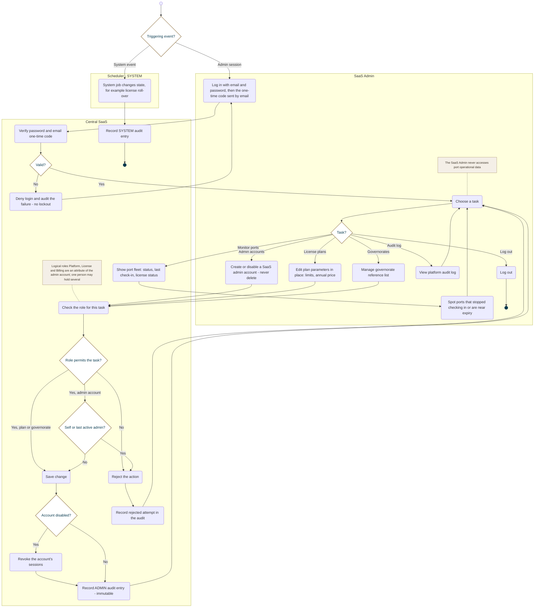

<!-- Generated from docs/reference/uml/ATLANTECH_Activity_Diagrams.md lines 538-611 by build-index.mjs. Do not edit: edit the source and rebuild. -->
### AD-7 — SaaS platform administration

```mermaid
flowchart TD
    START@{ shape: sm-circ }
    D0{"Triggering event?"}
    subgraph L_SA["SaaS Admin"]
        direction TB
        A1("Log in with email and password, then the one-time code sent by email")
        A2("Choose a task")
        D2{"Task?"}
        A3("Create or disable a SaaS admin account - never delete")
        A4("Edit plan parameters in place: limits, annual price")
        A5("Manage governorate reference list")
        A6("View platform audit log")
        A8("Spot ports that stopped checking in or are near expiry")
        A9("Log out")
        STOP1@{ shape: fr-circ }
        N1["The SaaS Admin never accesses port operational data"]
    end
    subgraph L_SAAS["Central SaaS"]
        direction TB
        S1("Verify password and email one-time code")
        D1{"Valid?"}
        S2("Deny login and audit the failure - no lockout")
        S7("Check the role for this task")
        D3{"Role permits the task?"}
        S8("Reject the action")
        D4{"Self or last active admin?"}
        S3("Save change")
        D6{"Account disabled?"}
        S10("Revoke the account's sessions")
        S4("Record ADMIN audit entry - immutable")
        S11("Record rejected attempt in the audit")
        S5("Show port fleet: status, last check-in, license status")
        S6("Record SYSTEM audit entry")
        STOP2@{ shape: fr-circ }
        N2["Logical roles Platform, License and Billing are an attribute of the admin account; one person may hold several"]
    end
    subgraph L_SCH["Scheduler - SYSTEM"]
        direction TB
        J1("System job changes state, for example license roll-over")
    end
    START --> D0
    D0 -->|"Admin session"| A1 --> S1 --> D1
    D1 -->|"No"| S2 --> A1
    D1 -->|"Yes"| A2 --> D2
    D2 -->|"Admin accounts"| A3 --> S7
    D2 -->|"License plans"| A4 --> S7
    D2 -->|"Governorates"| A5 --> S7
    D2 -->|"Audit log"| A6 --> A2
    D2 -->|"Monitor ports"| S5 --> A8 --> A2
    D2 -->|"Log out"| A9 --> STOP1
    S7 --> D3
    D3 -->|"No"| S8 --> S11 --> A2
    D3 -->|"Yes, admin account"| D4
    D3 -->|"Yes, plan or governorate"| S3
    D4 -->|"Yes"| S8
    D4 -->|"No"| S3
    S3 --> D6
    D6 -->|"Yes"| S10 --> S4
    D6 -->|"No"| S4
    S4 --> A2
    D0 -->|"System event"| J1 --> S6 --> STOP2
    N1 -.- A2
    N2 -.- S7
    classDef term fill:#083A4F,stroke:#083A4F,color:#083A4F
    classDef bar fill:#083A4F,stroke:#083A4F
    classDef dec fill:#FFFFFF,stroke:#A58D66,stroke-width:2px,color:#083A4F
    classDef note fill:#F4EFE7,stroke:#A58D66,color:#3B3326,font-size:13px
    class START,STOP1,STOP2 term
    class D0,D1,D2,D3,D4,D6 dec
    class N1,N2 note
```
