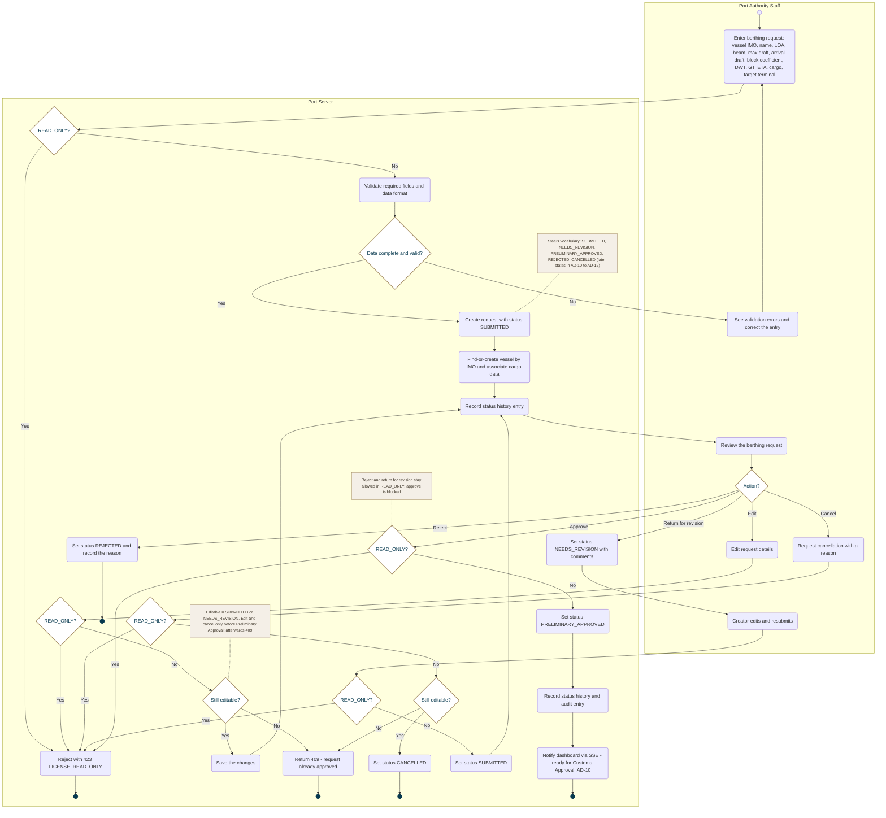

<!-- Generated from docs/reference/uml/ATLANTECH_Activity_Diagrams.md lines 774-854 by build-index.mjs. Do not edit: edit the source and rebuild. -->
### AD-9 — Berthing request lifecycle

```mermaid
flowchart TD
    subgraph L_STAFF["Port Authority Staff"]
        direction TB
        START@{ shape: sm-circ }
        A1("Enter berthing request: vessel IMO, name, LOA, beam, max draft, arrival draft, block coefficient, DWT, GT, ETA, cargo, target terminal")
        A20("See validation errors and correct the entry")
        A8("Review the berthing request")
        D3{"Action?"}
        A9("Edit request details")
        AC("Request cancellation with a reason")
        AR("Creator edits and resubmits")
    end
    subgraph L_SRV["Port Server"]
        direction TB
        D2{"READ_ONLY?"}
        A2("Reject with 423 LICENSE_READ_ONLY")
        STOP1@{ shape: fr-circ }
        A19("Validate required fields and data format")
        D8{"Data complete and valid?"}
        A5("Create request with status SUBMITTED")
        A6("Find-or-create vessel by IMO and associate cargo data")
        A7("Record status history entry")
        DE1{"READ_ONLY?"}
        DE2{"Still editable?"}
        AS("Save the changes")
        DC1{"READ_ONLY?"}
        DC2{"Still editable?"}
        A409("Return 409 - request already approved")
        STOP2@{ shape: fr-circ }
        A10("Set status CANCELLED")
        STOP3@{ shape: fr-circ }
        A11("Set status NEEDS_REVISION with comments")
        DR1{"READ_ONLY?"}
        AR2("Set status SUBMITTED")
        A12("Set status REJECTED and record the reason")
        STOP4@{ shape: fr-circ }
        D4{"READ_ONLY?"}
        A15("Set status PRELIMINARY_APPROVED")
        A16("Record status history and audit entry")
        A17("Notify dashboard via SSE - ready for Customs Approval, AD-10")
        STOP5@{ shape: fr-circ }
        N1["Status vocabulary: SUBMITTED, NEEDS_REVISION, PRELIMINARY_APPROVED, REJECTED, CANCELLED (later states in AD-10 to AD-12)"]
        N2["Editable = SUBMITTED or NEEDS_REVISION. Edit and cancel only before Preliminary Approval; afterwards 409"]
        N3["Reject and return for revision stay allowed in READ_ONLY; approve is blocked"]
    end
    START --> A1 --> D2
    D2 -->|"Yes"| A2 --> STOP1
    D2 -->|"No"| A19 --> D8
    D8 -->|"No"| A20 --> A1
    D8 -->|"Yes"| A5 --> A6 --> A7 --> A8 --> D3
    D3 -->|"Edit"| A9 --> DE1
    DE1 -->|"Yes"| A2
    DE1 -->|"No"| DE2
    DE2 -->|"No"| A409
    DE2 -->|"Yes"| AS --> A7
    D3 -->|"Cancel"| AC --> DC1
    DC1 -->|"Yes"| A2
    DC1 -->|"No"| DC2
    DC2 -->|"No"| A409 --> STOP2
    DC2 -->|"Yes"| A10 --> STOP3
    D3 -->|"Return for revision"| A11 --> AR --> DR1
    DR1 -->|"Yes"| A2
    DR1 -->|"No"| AR2 --> A7
    D3 -->|"Reject"| A12 --> STOP4
    D3 -->|"Approve"| D4
    D4 -->|"Yes"| A2
    D4 -->|"No"| A15 --> A16 --> A17 --> STOP5
    N1 -.- A5
    N2 -.- DE2
    N3 -.- D4
    classDef term fill:#083A4F,stroke:#083A4F,color:#083A4F
    classDef bar fill:#083A4F,stroke:#083A4F
    classDef dec fill:#FFFFFF,stroke:#A58D66,stroke-width:2px,color:#083A4F
    classDef note fill:#F4EFE7,stroke:#A58D66,color:#3B3326,font-size:13px
    class START,STOP1,STOP2,STOP3,STOP4,STOP5 term
    class D2,D3,D4,D8,DC1,DC2,DE1,DE2,DR1 dec
    class N1,N2,N3 note
```
