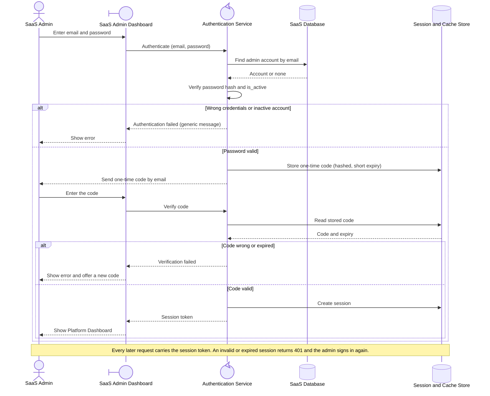

<!-- Generated from docs/reference/uml/ATLANTECH_Sequence_Diagrams.md lines 5-42 by build-index.mjs. Do not edit: edit the source and rebuild. -->
### 1.1 SaaS Admin sign-in

```mermaid
sequenceDiagram
    actor SA as SaaS Admin
    participant UI@{ "type": "boundary" } as SaaS Admin Dashboard
    participant AUTH@{ "type": "control" } as Authentication Service
    participant DB@{ "type": "database" } as SaaS Database
    participant CACHE@{ "type": "database" } as Session and Cache Store

    SA->>UI: Enter email and password
    UI->>AUTH: Authenticate (email, password)
    AUTH->>DB: Find admin account by email
    DB-->>AUTH: Account or none
    AUTH->>AUTH: Verify password hash and is_active

    alt Wrong credentials or inactive account
        AUTH-->>UI: Authentication failed (generic message)
        UI-->>SA: Show error
    else Password valid
        AUTH->>CACHE: Store one-time code (hashed, short expiry)
        AUTH-->>SA: Send one-time code by email
        SA->>UI: Enter the code
        UI->>AUTH: Verify code
        AUTH->>CACHE: Read stored code
        CACHE-->>AUTH: Code and expiry
        alt Code wrong or expired
            AUTH-->>UI: Verification failed
            UI-->>SA: Show error and offer a new code
        else Code valid
            AUTH->>CACHE: Create session
            AUTH-->>UI: Session token
            UI-->>SA: Show Platform Dashboard
        end
    end

    Note over SA,CACHE: Every later request carries the session token. An invalid or expired session returns 401 and the admin signs in again.
```
