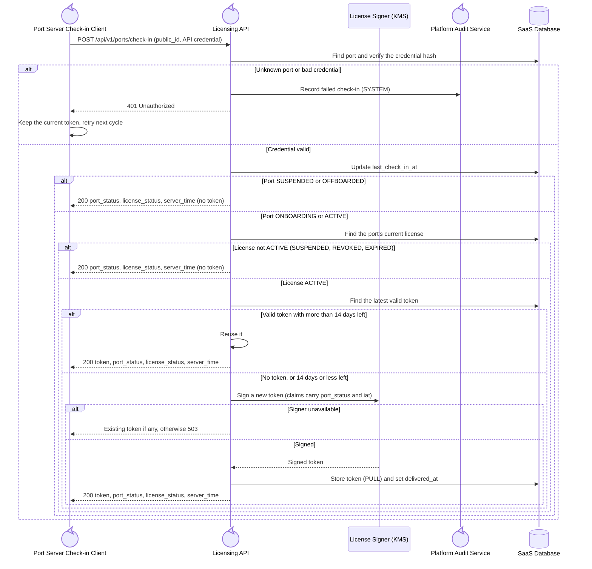

<!-- Generated from docs/reference/uml/ATLANTECH_Sequence_Diagrams.md lines 529-571 by build-index.mjs. Do not edit: edit the source and rebuild. -->
### 1.10 Port check-in on the SaaS side

```mermaid
sequenceDiagram
    participant PS@{ "type": "control" } as Port Server Check-in Client
    participant API@{ "type": "control" } as Licensing API
    participant KMS as License Signer (KMS)
    participant AUDIT@{ "type": "control" } as Platform Audit Service
    participant DB@{ "type": "database" } as SaaS Database

    PS->>API: POST /api/v1/ports/check-in (public_id, API credential)
    API->>DB: Find port and verify the credential hash
    alt Unknown port or bad credential
        API->>AUDIT: Record failed check-in (SYSTEM)
        API-->>PS: 401 Unauthorized
        PS->>PS: Keep the current token, retry next cycle
    else Credential valid
        API->>DB: Update last_check_in_at
        alt Port SUSPENDED or OFFBOARDED
            API-->>PS: 200 port_status, license_status, server_time (no token)
        else Port ONBOARDING or ACTIVE
            API->>DB: Find the port's current license
            alt License not ACTIVE (SUSPENDED, REVOKED, EXPIRED)
                API-->>PS: 200 port_status, license_status, server_time (no token)
            else License ACTIVE
                API->>DB: Find the latest valid token
                alt Valid token with more than 14 days left
                    API->>API: Reuse it
                    API-->>PS: 200 token, port_status, license_status, server_time
                else No token, or 14 days or less left
                    API->>KMS: Sign a new token (claims carry port_status and iat)
                    alt Signer unavailable
                        API-->>PS: Existing token if any, otherwise 503
                    else Signed
                        KMS-->>API: Signed token
                        API->>DB: Store token (PULL) and set delivered_at
                        API-->>PS: 200 token, port_status, license_status, server_time
                    end
                end
            end
        end
    end
```
