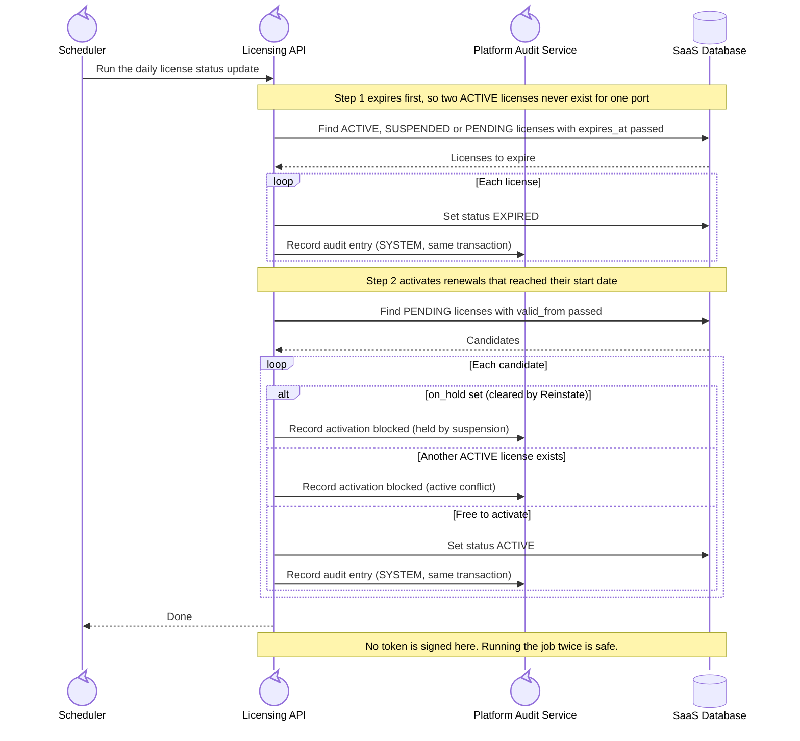

<!-- Generated from docs/reference/uml/ATLANTECH_Sequence_Diagrams.md lines 573-608 by build-index.mjs. Do not edit: edit the source and rebuild. -->
### 1.11 Daily license status roll-over

```mermaid
sequenceDiagram
    participant SCH@{ "type": "control" } as Scheduler
    participant API@{ "type": "control" } as Licensing API
    participant AUDIT@{ "type": "control" } as Platform Audit Service
    participant DB@{ "type": "database" } as SaaS Database

    SCH->>API: Run the daily license status update

    Note over API,DB: Step 1 expires first, so two ACTIVE licenses never exist for one port
    API->>DB: Find ACTIVE, SUSPENDED or PENDING licenses with expires_at passed
    DB-->>API: Licenses to expire
    loop Each license
        API->>DB: Set status EXPIRED
        API->>AUDIT: Record audit entry (SYSTEM, same transaction)
    end

    Note over API,DB: Step 2 activates renewals that reached their start date
    API->>DB: Find PENDING licenses with valid_from passed
    DB-->>API: Candidates
    loop Each candidate
        alt on_hold set (cleared by Reinstate)
            API->>AUDIT: Record activation blocked (held by suspension)
        else Another ACTIVE license exists
            API->>AUDIT: Record activation blocked (active conflict)
        else Free to activate
            API->>DB: Set status ACTIVE
            API->>AUDIT: Record audit entry (SYSTEM, same transaction)
        end
    end

    API-->>SCH: Done
    Note over API,DB: No token is signed here. Running the job twice is safe.
```
