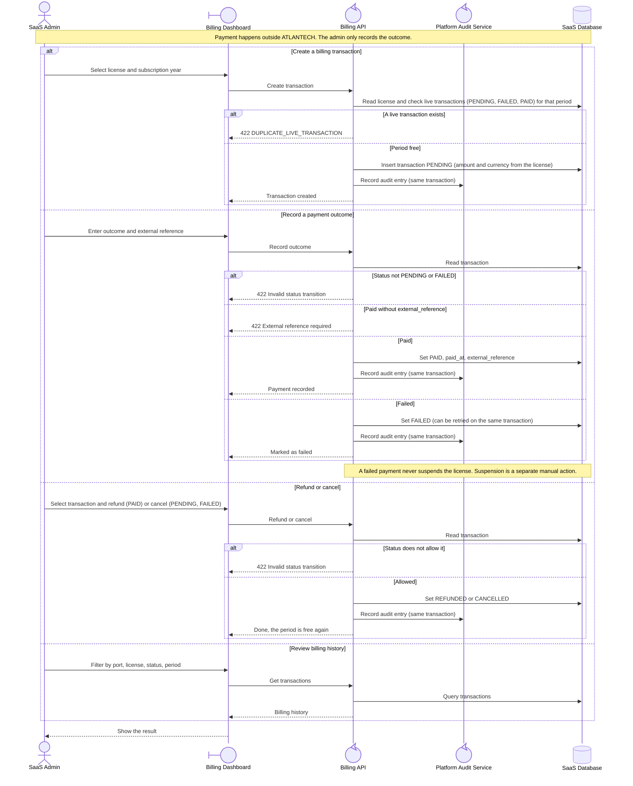

<!-- Generated from docs/reference/uml/ATLANTECH_Sequence_Diagrams.md lines 610-673 by build-index.mjs. Do not edit: edit the source and rebuild. -->
### 1.12 Annual billing records

```mermaid
sequenceDiagram
    actor SA as SaaS Admin
    participant UI@{ "type": "boundary" } as Billing Dashboard
    participant API@{ "type": "control" } as Billing API
    participant AUDIT@{ "type": "control" } as Platform Audit Service
    participant DB@{ "type": "database" } as SaaS Database

    Note over SA,DB: Payment happens outside ATLANTECH. The admin only records the outcome.

    alt Create a billing transaction
        SA->>UI: Select license and subscription year
        UI->>API: Create transaction
        API->>DB: Read license and check live transactions (PENDING, FAILED, PAID) for that period
        alt A live transaction exists
            API-->>UI: 422 DUPLICATE_LIVE_TRANSACTION
        else Period free
            API->>DB: Insert transaction PENDING (amount and currency from the license)
            API->>AUDIT: Record audit entry (same transaction)
            API-->>UI: Transaction created
        end

    else Record a payment outcome
        SA->>UI: Enter outcome and external reference
        UI->>API: Record outcome
        API->>DB: Read transaction
        alt Status not PENDING or FAILED
            API-->>UI: 422 Invalid status transition
        else Paid without external_reference
            API-->>UI: 422 External reference required
        else Paid
            API->>DB: Set PAID, paid_at, external_reference
            API->>AUDIT: Record audit entry (same transaction)
            API-->>UI: Payment recorded
        else Failed
            API->>DB: Set FAILED (can be retried on the same transaction)
            API->>AUDIT: Record audit entry (same transaction)
            API-->>UI: Marked as failed
        end
        Note over API,DB: A failed payment never suspends the license. Suspension is a separate manual action.

    else Refund or cancel
        SA->>UI: Select transaction and refund (PAID) or cancel (PENDING, FAILED)
        UI->>API: Refund or cancel
        API->>DB: Read transaction
        alt Status does not allow it
            API-->>UI: 422 Invalid status transition
        else Allowed
            API->>DB: Set REFUNDED or CANCELLED
            API->>AUDIT: Record audit entry (same transaction)
            API-->>UI: Done, the period is free again
        end

    else Review billing history
        SA->>UI: Filter by port, license, status, period
        UI->>API: Get transactions
        API->>DB: Query transactions
        API-->>UI: Billing history
    end

    UI-->>SA: Show the result
```
