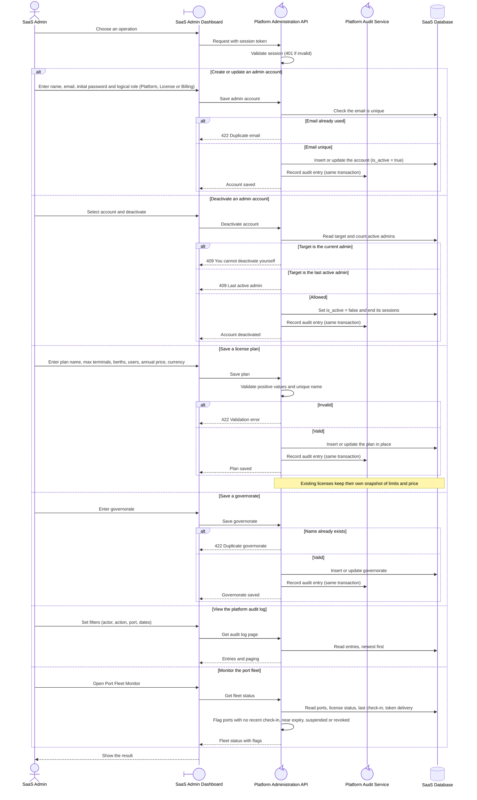

<!-- Generated from docs/reference/uml/ATLANTECH_Sequence_Diagrams.md lines 44-123 by build-index.mjs. Do not edit: edit the source and rebuild. -->
### 1.2 Platform administration

```mermaid
sequenceDiagram
    actor SA as SaaS Admin
    participant UI@{ "type": "boundary" } as SaaS Admin Dashboard
    participant API@{ "type": "control" } as Platform Administration API
    participant AUDIT@{ "type": "control" } as Platform Audit Service
    participant DB@{ "type": "database" } as SaaS Database

    SA->>UI: Choose an operation
    UI->>API: Request with session token
    API->>API: Validate session (401 if invalid)

    alt Create or update an admin account
        SA->>UI: Enter name, email, initial password and logical role (Platform, License or Billing)
        UI->>API: Save admin account
        API->>DB: Check the email is unique
        alt Email already used
            API-->>UI: 422 Duplicate email
        else Email unique
            API->>DB: Insert or update the account (is_active = true)
            API->>AUDIT: Record audit entry (same transaction)
            API-->>UI: Account saved
        end

    else Deactivate an admin account
        SA->>UI: Select account and deactivate
        UI->>API: Deactivate account
        API->>DB: Read target and count active admins
        alt Target is the current admin
            API-->>UI: 409 You cannot deactivate yourself
        else Target is the last active admin
            API-->>UI: 409 Last active admin
        else Allowed
            API->>DB: Set is_active = false and end its sessions
            API->>AUDIT: Record audit entry (same transaction)
            API-->>UI: Account deactivated
        end

    else Save a license plan
        SA->>UI: Enter plan name, max terminals, berths, users, annual price, currency
        UI->>API: Save plan
        API->>API: Validate positive values and unique name
        alt Invalid
            API-->>UI: 422 Validation error
        else Valid
            API->>DB: Insert or update the plan in place
            API->>AUDIT: Record audit entry (same transaction)
            API-->>UI: Plan saved
        end
        Note over API,DB: Existing licenses keep their own snapshot of limits and price

    else Save a governorate
        SA->>UI: Enter governorate
        UI->>API: Save governorate
        alt Name already exists
            API-->>UI: 422 Duplicate governorate
        else Valid
            API->>DB: Insert or update governorate
            API->>AUDIT: Record audit entry (same transaction)
            API-->>UI: Governorate saved
        end

    else View the platform audit log
        SA->>UI: Set filters (actor, action, port, dates)
        UI->>API: Get audit log page
        API->>DB: Read entries, newest first
        API-->>UI: Entries and paging

    else Monitor the port fleet
        SA->>UI: Open Port Fleet Monitor
        UI->>API: Get fleet status
        API->>DB: Read ports, license status, last check-in, token delivery
        API->>API: Flag ports with no recent check-in, near expiry, suspended or revoked
        API-->>UI: Fleet status with flags
    end

    UI-->>SA: Show the result
```
