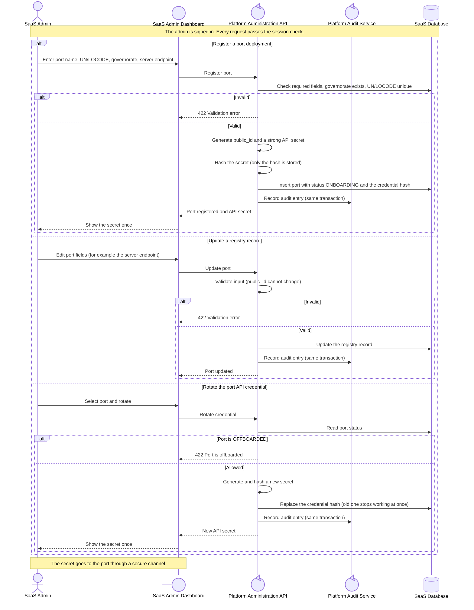

<!-- Generated from docs/reference/uml/ATLANTECH_Sequence_Diagrams.md lines 125-180 by build-index.mjs. Do not edit: edit the source and rebuild. -->
### 1.3 Port registry and API credential

```mermaid
sequenceDiagram
    actor SA as SaaS Admin
    participant UI@{ "type": "boundary" } as SaaS Admin Dashboard
    participant API@{ "type": "control" } as Platform Administration API
    participant AUDIT@{ "type": "control" } as Platform Audit Service
    participant DB@{ "type": "database" } as SaaS Database

    Note over SA,DB: The admin is signed in. Every request passes the session check.

    alt Register a port deployment
        SA->>UI: Enter port name, UN/LOCODE, governorate, server endpoint
        UI->>API: Register port
        API->>DB: Check required fields, governorate exists, UN/LOCODE unique
        alt Invalid
            API-->>UI: 422 Validation error
        else Valid
            API->>API: Generate public_id and a strong API secret
            API->>API: Hash the secret (only the hash is stored)
            API->>DB: Insert port with status ONBOARDING and the credential hash
            API->>AUDIT: Record audit entry (same transaction)
            API-->>UI: Port registered and API secret
            UI-->>SA: Show the secret once
        end

    else Update a registry record
        SA->>UI: Edit port fields (for example the server endpoint)
        UI->>API: Update port
        API->>API: Validate input (public_id cannot change)
        alt Invalid
            API-->>UI: 422 Validation error
        else Valid
            API->>DB: Update the registry record
            API->>AUDIT: Record audit entry (same transaction)
            API-->>UI: Port updated
        end

    else Rotate the port API credential
        SA->>UI: Select port and rotate
        UI->>API: Rotate credential
        API->>DB: Read port status
        alt Port is OFFBOARDED
            API-->>UI: 422 Port is offboarded
        else Allowed
            API->>API: Generate and hash a new secret
            API->>DB: Replace the credential hash (old one stops working at once)
            API->>AUDIT: Record audit entry (same transaction)
            API-->>UI: New API secret
            UI-->>SA: Show the secret once
        end
    end

    Note over SA,UI: The secret goes to the port through a secure channel
```
