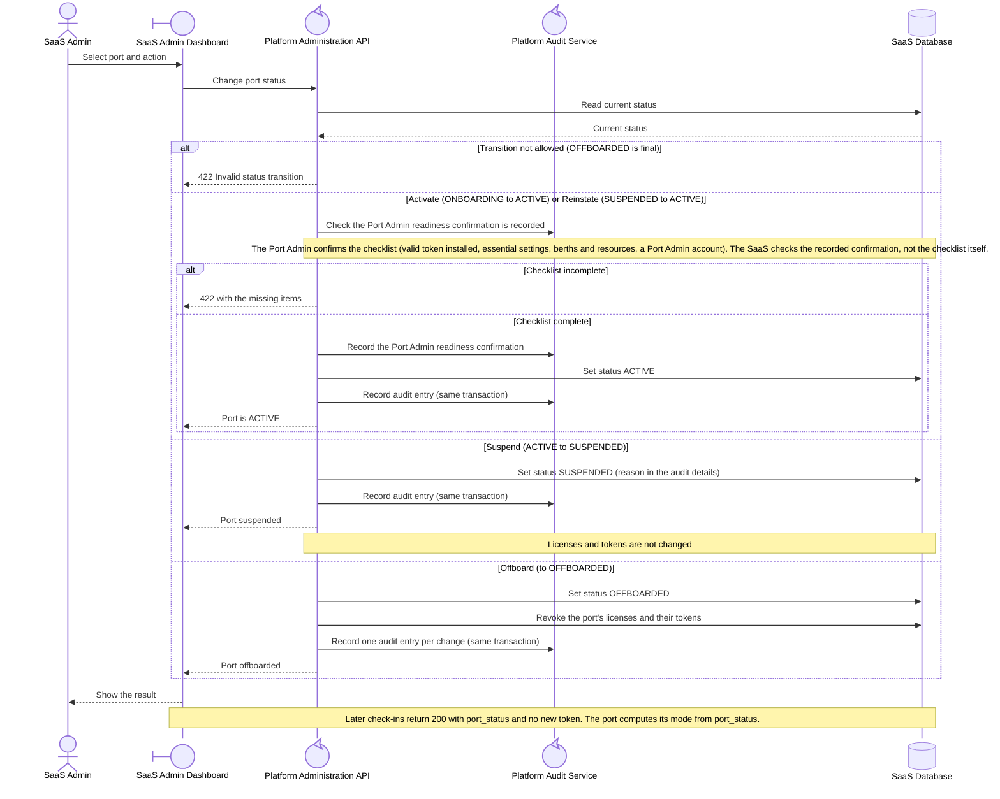

<!-- Generated from docs/reference/uml/ATLANTECH_Sequence_Diagrams.md lines 182-227 by build-index.mjs. Do not edit: edit the source and rebuild. -->
### 1.4 Port status changes

```mermaid
sequenceDiagram
    actor SA as SaaS Admin
    participant UI@{ "type": "boundary" } as SaaS Admin Dashboard
    participant API@{ "type": "control" } as Platform Administration API
    participant AUDIT@{ "type": "control" } as Platform Audit Service
    participant DB@{ "type": "database" } as SaaS Database

    SA->>UI: Select port and action
    UI->>API: Change port status
    API->>DB: Read current status
    DB-->>API: Current status

    alt Transition not allowed (OFFBOARDED is final)
        API-->>UI: 422 Invalid status transition

    else Activate (ONBOARDING to ACTIVE) or Reinstate (SUSPENDED to ACTIVE)
        API->>AUDIT: Check the Port Admin readiness confirmation is recorded
        Note over API,DB: The Port Admin confirms the checklist (valid token installed, essential settings, berths and resources, a Port Admin account). The SaaS checks the recorded confirmation, not the checklist itself.
        alt Checklist incomplete
            API-->>UI: 422 with the missing items
        else Checklist complete
            API->>AUDIT: Record the Port Admin readiness confirmation
            API->>DB: Set status ACTIVE
            API->>AUDIT: Record audit entry (same transaction)
            API-->>UI: Port is ACTIVE
        end

    else Suspend (ACTIVE to SUSPENDED)
        API->>DB: Set status SUSPENDED (reason in the audit details)
        API->>AUDIT: Record audit entry (same transaction)
        API-->>UI: Port suspended
        Note over API,DB: Licenses and tokens are not changed

    else Offboard (to OFFBOARDED)
        API->>DB: Set status OFFBOARDED
        API->>DB: Revoke the port's licenses and their tokens
        API->>AUDIT: Record one audit entry per change (same transaction)
        API-->>UI: Port offboarded
    end

    UI-->>SA: Show the result
    Note over UI,DB: Later check-ins return 200 with port_status and no new token. The port computes its mode from port_status.
```
