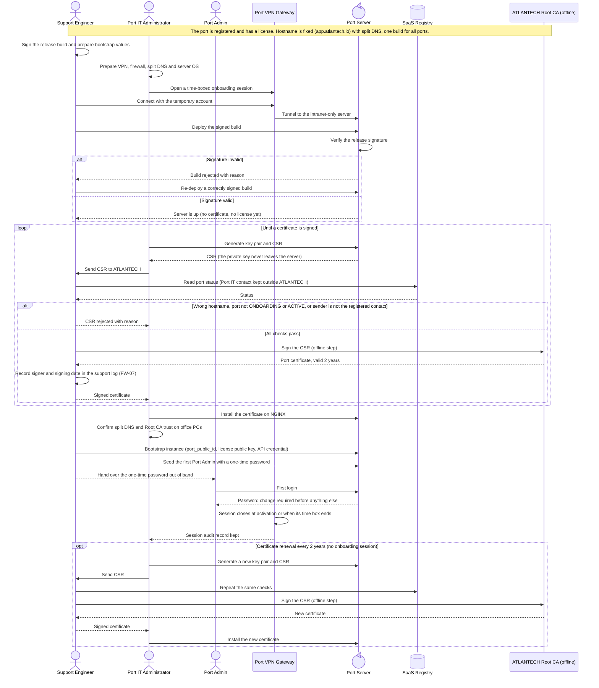

<!-- Generated from docs/reference/uml/ATLANTECH_Sequence_Diagrams.md lines 229-293 by build-index.mjs. Do not edit: edit the source and rebuild. -->
### 1.5 Server provisioning and certificates

```mermaid
sequenceDiagram
    actor SE as Support Engineer
    actor PIT as Port IT Administrator
    actor PA as Port Admin
    participant VPN as Port VPN Gateway
    participant PS@{ "type": "control" } as Port Server
    participant REG@{ "type": "database" } as SaaS Registry
    participant CA as ATLANTECH Root CA (offline)

    Note over SE,CA: The port is registered and has a license. Hostname is fixed (app.atlantech.io) with split DNS, one build for all ports.

    SE->>SE: Sign the release build and prepare bootstrap values
    PIT->>PIT: Prepare VPN, firewall, split DNS and server OS
    PIT->>VPN: Open a time-boxed onboarding session
    SE->>VPN: Connect with the temporary account
    VPN->>PS: Tunnel to the intranet-only server
    SE->>PS: Deploy the signed build
    PS->>PS: Verify the release signature
    alt Signature invalid
        PS-->>SE: Build rejected with reason
        SE->>PS: Re-deploy a correctly signed build
    else Signature valid
        PS-->>SE: Server is up (no certificate, no license yet)
    end

    loop Until a certificate is signed
        PIT->>PS: Generate key pair and CSR
        PS-->>PIT: CSR (the private key never leaves the server)
        PIT->>SE: Send CSR to ATLANTECH
        SE->>REG: Read port status (Port IT contact kept outside ATLANTECH)
        REG-->>SE: Status
        alt Wrong hostname, port not ONBOARDING or ACTIVE, or sender is not the registered contact
            SE-->>PIT: CSR rejected with reason
        else All checks pass
            SE->>CA: Sign the CSR (offline step)
            CA-->>SE: Port certificate, valid 2 years
            SE->>SE: Record signer and signing date in the support log (FW-07)
            SE-->>PIT: Signed certificate
        end
    end

    PIT->>PS: Install the certificate on NGINX
    PIT->>PIT: Confirm split DNS and Root CA trust on office PCs
    SE->>PS: Bootstrap instance (port_public_id, license public key, API credential)
    SE->>PS: Seed the first Port Admin with a one-time password
    SE-->>PA: Hand over the one-time password out of band
    PA->>PS: First login
    PS-->>PA: Password change required before anything else

    VPN->>VPN: Session closes at activation or when its time box ends
    VPN-->>PIT: Session audit record kept

    opt Certificate renewal every 2 years (no onboarding session)
        PIT->>PS: Generate a new key pair and CSR
        PIT->>SE: Send CSR
        SE->>REG: Repeat the same checks
        SE->>CA: Sign the CSR (offline step)
        CA-->>SE: New certificate
        SE-->>PIT: Signed certificate
        PIT->>PS: Install the new certificate
    end
```
