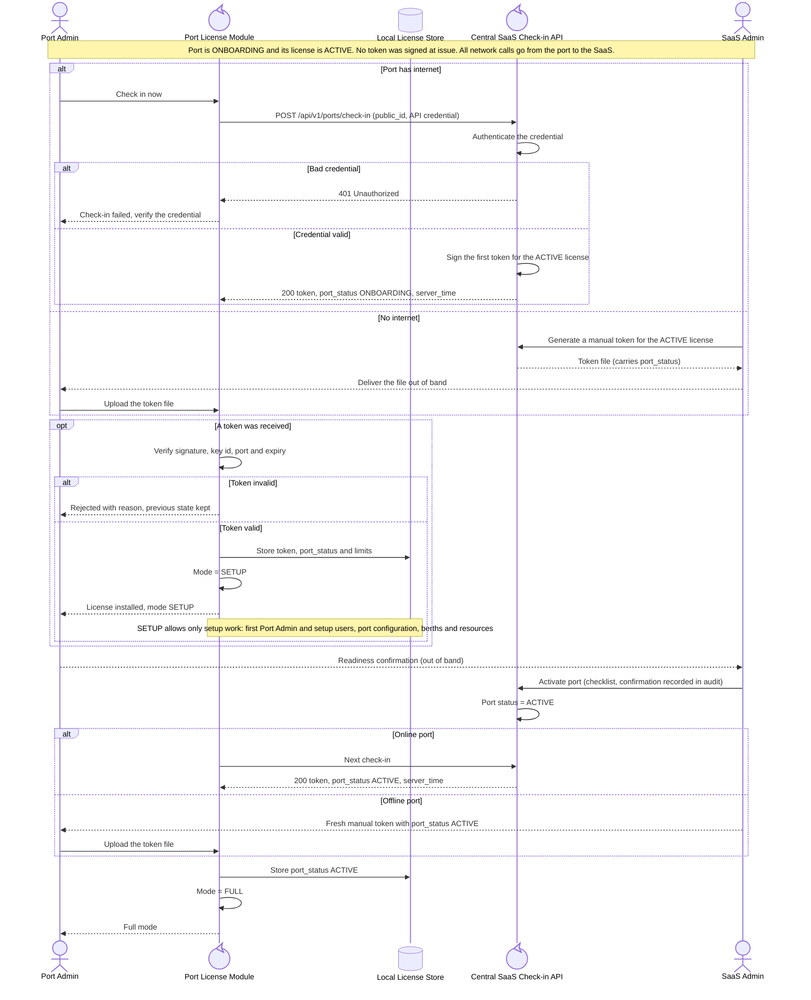

<!-- Generated from docs/reference/uml/ATLANTECH_Sequence_Diagrams.md lines 295-351 by build-index.mjs. Do not edit: edit the source and rebuild. -->
### 1.6 Initial license and activation

```mermaid
sequenceDiagram
    actor PA as Port Admin
    participant LM@{ "type": "control" } as Port License Module
    participant LS@{ "type": "database" } as Local License Store
    participant SAAS@{ "type": "control" } as Central SaaS Check-in API
    actor SA as SaaS Admin

    Note over PA,SA: Port is ONBOARDING and its license is ACTIVE. No token was signed at issue. All network calls go from the port to the SaaS.

    alt Port has internet
        PA->>LM: Check in now
        LM->>SAAS: POST /api/v1/ports/check-in (public_id, API credential)
        SAAS->>SAAS: Authenticate the credential
        alt Bad credential
            SAAS-->>LM: 401 Unauthorized
            LM-->>PA: Check-in failed, verify the credential
        else Credential valid
            SAAS->>SAAS: Sign the first token for the ACTIVE license
            SAAS-->>LM: 200 token, port_status ONBOARDING, server_time
        end
    else No internet
        SA->>SAAS: Generate a manual token for the ACTIVE license
        SAAS-->>SA: Token file (carries port_status)
        SA-->>PA: Deliver the file out of band
        PA->>LM: Upload the token file
    end

    opt A token was received
        LM->>LM: Verify signature, key id, port and expiry
        alt Token invalid
            LM-->>PA: Rejected with reason, previous state kept
        else Token valid
            LM->>LS: Store token, port_status and limits
            LM->>LM: Mode = SETUP
            LM-->>PA: License installed, mode SETUP
            Note over LM,LS: SETUP allows only setup work: first Port Admin and setup users, port configuration, berths and resources
        end
    end

    PA-->>SA: Readiness confirmation (out of band)
    SA->>SAAS: Activate port (checklist, confirmation recorded in audit)
    SAAS->>SAAS: Port status = ACTIVE

    alt Online port
        LM->>SAAS: Next check-in
        SAAS-->>LM: 200 token, port_status ACTIVE, server_time
    else Offline port
        SA-->>PA: Fresh manual token with port_status ACTIVE
        PA->>LM: Upload the token file
    end
    LM->>LS: Store port_status ACTIVE
    LM->>LM: Mode = FULL
    LM-->>PA: Full mode
```
