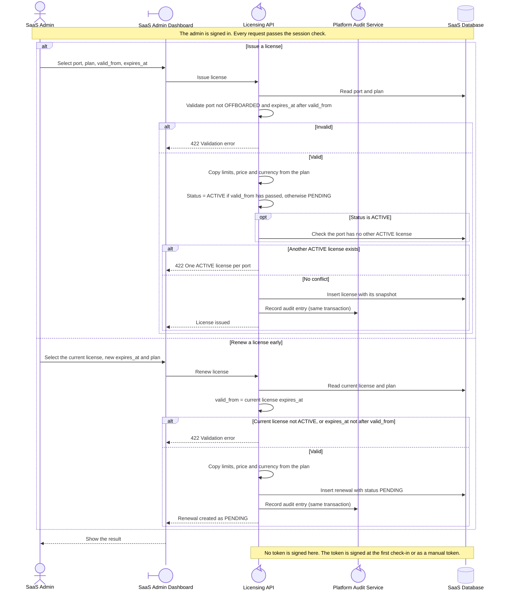

<!-- Generated from docs/reference/uml/ATLANTECH_Sequence_Diagrams.md lines 353-404 by build-index.mjs. Do not edit: edit the source and rebuild. -->
### 1.7 Issue and renew a license

```mermaid
sequenceDiagram
    actor SA as SaaS Admin
    participant UI@{ "type": "boundary" } as SaaS Admin Dashboard
    participant API@{ "type": "control" } as Licensing API
    participant AUDIT@{ "type": "control" } as Platform Audit Service
    participant DB@{ "type": "database" } as SaaS Database

    Note over SA,DB: The admin is signed in. Every request passes the session check.

    alt Issue a license
        SA->>UI: Select port, plan, valid_from, expires_at
        UI->>API: Issue license
        API->>DB: Read port and plan
        API->>API: Validate port not OFFBOARDED and expires_at after valid_from
        alt Invalid
            API-->>UI: 422 Validation error
        else Valid
            API->>API: Copy limits, price and currency from the plan
            API->>API: Status = ACTIVE if valid_from has passed, otherwise PENDING
            opt Status is ACTIVE
                API->>DB: Check the port has no other ACTIVE license
            end
            alt Another ACTIVE license exists
                API-->>UI: 422 One ACTIVE license per port
            else No conflict
                API->>DB: Insert license with its snapshot
                API->>AUDIT: Record audit entry (same transaction)
                API-->>UI: License issued
            end
        end

    else Renew a license early
        SA->>UI: Select the current license, new expires_at and plan
        UI->>API: Renew license
        API->>DB: Read current license and plan
        API->>API: valid_from = current license expires_at
        alt Current license not ACTIVE, or expires_at not after valid_from
            API-->>UI: 422 Validation error
        else Valid
            API->>API: Copy limits, price and currency from the plan
            API->>DB: Insert renewal with status PENDING
            API->>AUDIT: Record audit entry (same transaction)
            API-->>UI: Renewal created as PENDING
        end
    end

    UI-->>SA: Show the result
    Note over API,DB: No token is signed here. The token is signed at the first check-in or as a manual token.
```
