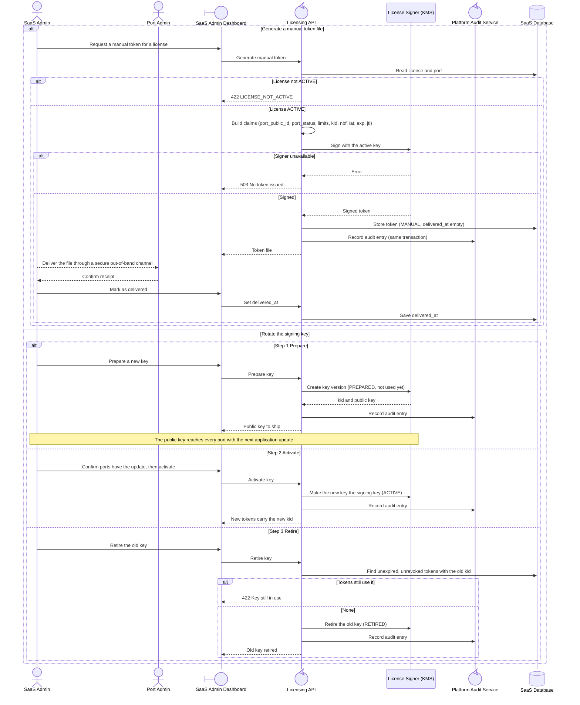

<!-- Generated from docs/reference/uml/ATLANTECH_Sequence_Diagrams.md lines 462-527 by build-index.mjs. Do not edit: edit the source and rebuild. -->
### 1.9 Manual token and signing key rotation

```mermaid
sequenceDiagram
    actor SA as SaaS Admin
    actor PA as Port Admin
    participant UI@{ "type": "boundary" } as SaaS Admin Dashboard
    participant API@{ "type": "control" } as Licensing API
    participant KMS as License Signer (KMS)
    participant AUDIT@{ "type": "control" } as Platform Audit Service
    participant DB@{ "type": "database" } as SaaS Database

    alt Generate a manual token file
        SA->>UI: Request a manual token for a license
        UI->>API: Generate manual token
        API->>DB: Read license and port
        alt License not ACTIVE
            API-->>UI: 422 LICENSE_NOT_ACTIVE
        else License ACTIVE
            API->>API: Build claims (port_public_id, port_status, limits, kid, nbf, iat, exp, jti)
            API->>KMS: Sign with the active key
            alt Signer unavailable
                KMS-->>API: Error
                API-->>UI: 503 No token issued
            else Signed
                KMS-->>API: Signed token
                API->>DB: Store token (MANUAL, delivered_at empty)
                API->>AUDIT: Record audit entry (same transaction)
                API-->>UI: Token file
                SA-->>PA: Deliver the file through a secure out-of-band channel
                PA-->>SA: Confirm receipt
                SA->>UI: Mark as delivered
                UI->>API: Set delivered_at
                API->>DB: Save delivered_at
            end
        end

    else Rotate the signing key
        alt Step 1 Prepare
            SA->>UI: Prepare a new key
            UI->>API: Prepare key
            API->>KMS: Create key version (PREPARED, not used yet)
            KMS-->>API: kid and public key
            API->>AUDIT: Record audit entry
            API-->>UI: Public key to ship
            Note over SA,KMS: The public key reaches every port with the next application update
        else Step 2 Activate
            SA->>UI: Confirm ports have the update, then activate
            UI->>API: Activate key
            API->>KMS: Make the new key the signing key (ACTIVE)
            API->>AUDIT: Record audit entry
            API-->>UI: New tokens carry the new kid
        else Step 3 Retire
            SA->>UI: Retire the old key
            UI->>API: Retire key
            API->>DB: Find unexpired, unrevoked tokens with the old kid
            alt Tokens still use it
                API-->>UI: 422 Key still in use
            else None
                API->>KMS: Retire the old key (RETIRED)
                API->>AUDIT: Record audit entry
                API-->>UI: Old key retired
            end
        end
    end
```
