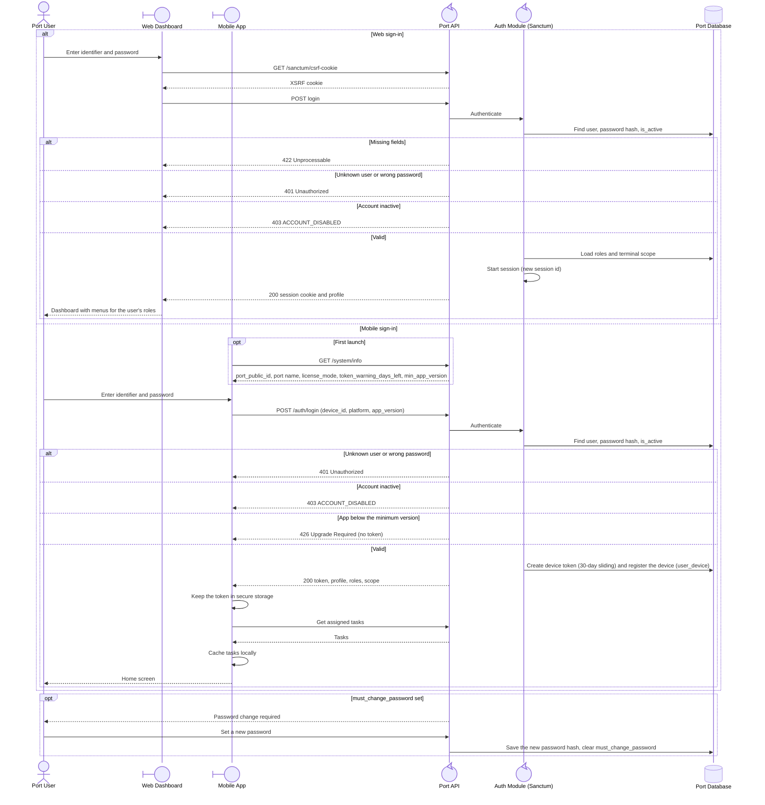

<!-- Generated from docs/reference/uml/ATLANTECH_Sequence_Diagrams.md lines 818-880 by build-index.mjs. Do not edit: edit the source and rebuild. -->
### 2.1 Web and mobile sign-in

```mermaid
sequenceDiagram
    actor U as Port User
    participant WEB@{ "type": "boundary" } as Web Dashboard
    participant MOB@{ "type": "boundary" } as Mobile App
    participant API@{ "type": "control" } as Port API
    participant AUTH@{ "type": "control" } as Auth Module (Sanctum)
    participant DB@{ "type": "database" } as Port Database

    alt Web sign-in
        U->>WEB: Enter identifier and password
        WEB->>API: GET /sanctum/csrf-cookie
        API-->>WEB: XSRF cookie
        WEB->>API: POST login
        API->>AUTH: Authenticate
        AUTH->>DB: Find user, password hash, is_active
        alt Missing fields
            API-->>WEB: 422 Unprocessable
        else Unknown user or wrong password
            API-->>WEB: 401 Unauthorized
        else Account inactive
            API-->>WEB: 403 ACCOUNT_DISABLED
        else Valid
            AUTH->>DB: Load roles and terminal scope
            AUTH->>AUTH: Start session (new session id)
            API-->>WEB: 200 session cookie and profile
            WEB-->>U: Dashboard with menus for the user's roles
        end

    else Mobile sign-in
        opt First launch
            MOB->>API: GET /system/info
            API-->>MOB: port_public_id, port name, license_mode, token_warning_days_left, min_app_version
        end
        U->>MOB: Enter identifier and password
        MOB->>API: POST /auth/login (device_id, platform, app_version)
        API->>AUTH: Authenticate
        AUTH->>DB: Find user, password hash, is_active
        alt Unknown user or wrong password
            API-->>MOB: 401 Unauthorized
        else Account inactive
            API-->>MOB: 403 ACCOUNT_DISABLED
        else App below the minimum version
            API-->>MOB: 426 Upgrade Required (no token)
        else Valid
            AUTH->>DB: Create device token (30-day sliding) and register the device (user_device)
            API-->>MOB: 200 token, profile, roles, scope
            MOB->>MOB: Keep the token in secure storage
            MOB->>API: Get assigned tasks
            API-->>MOB: Tasks
            MOB->>MOB: Cache tasks locally
            MOB-->>U: Home screen
        end
    end

    opt must_change_password set
        API-->>U: Password change required
        U->>API: Set a new password
        API->>DB: Save the new password hash, clear must_change_password
    end
```
