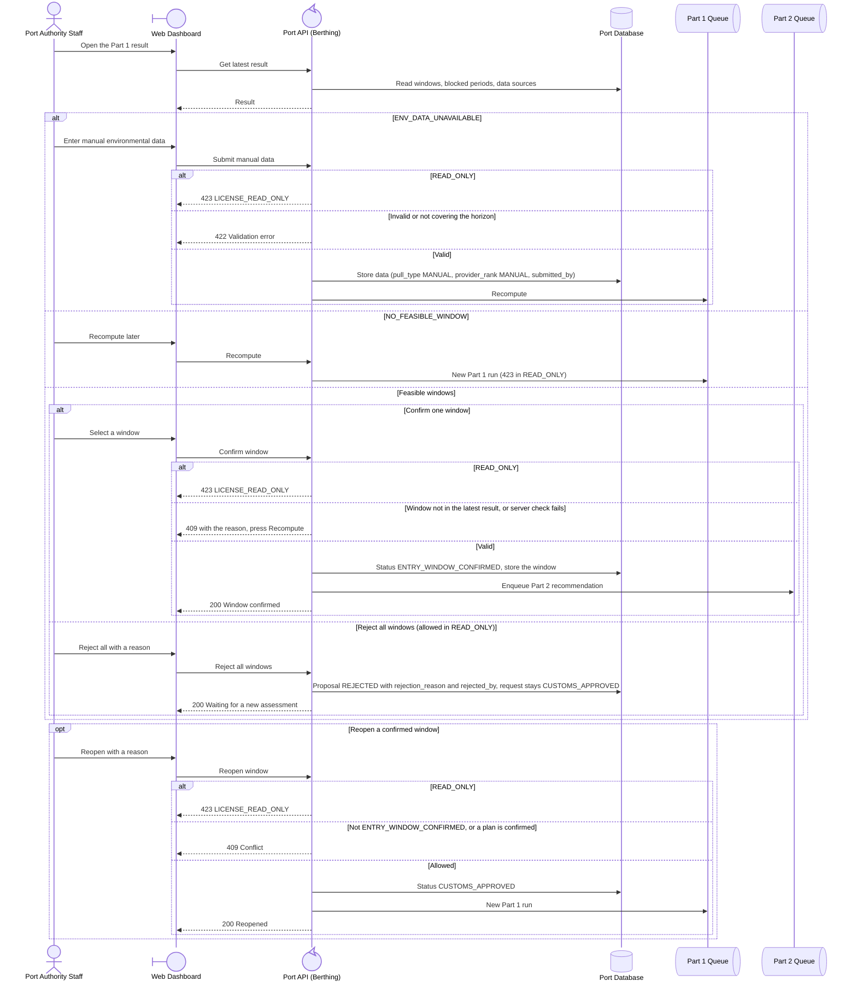

<!-- Generated from docs/reference/uml/ATLANTECH_Sequence_Diagrams.md lines 1418-1485 by build-index.mjs. Do not edit: edit the source and rebuild. -->
### 2.11 Entry-window decision

```mermaid
sequenceDiagram
    actor ST as Port Authority Staff
    participant WEB@{ "type": "boundary" } as Web Dashboard
    participant API@{ "type": "control" } as Port API (Berthing)
    participant DB@{ "type": "database" } as Port Database
    participant Q1@{ "type": "queue" } as Part 1 Queue
    participant Q2@{ "type": "queue" } as Part 2 Queue

    ST->>WEB: Open the Part 1 result
    WEB->>API: Get latest result
    API->>DB: Read windows, blocked periods, data sources
    API-->>WEB: Result

    alt ENV_DATA_UNAVAILABLE
        ST->>WEB: Enter manual environmental data
        WEB->>API: Submit manual data
        alt READ_ONLY
            API-->>WEB: 423 LICENSE_READ_ONLY
        else Invalid or not covering the horizon
            API-->>WEB: 422 Validation error
        else Valid
            API->>DB: Store data (pull_type MANUAL, provider_rank MANUAL, submitted_by)
            API->>Q1: Recompute
        end

    else NO_FEASIBLE_WINDOW
        ST->>WEB: Recompute later
        WEB->>API: Recompute
        API->>Q1: New Part 1 run (423 in READ_ONLY)

    else Feasible windows
        alt Confirm one window
            ST->>WEB: Select a window
            WEB->>API: Confirm window
            alt READ_ONLY
                API-->>WEB: 423 LICENSE_READ_ONLY
            else Window not in the latest result, or server check fails
                API-->>WEB: 409 with the reason, press Recompute
            else Valid
                API->>DB: Status ENTRY_WINDOW_CONFIRMED, store the window
                API->>Q2: Enqueue Part 2 recommendation
                API-->>WEB: 200 Window confirmed
            end
        else Reject all windows (allowed in READ_ONLY)
            ST->>WEB: Reject all with a reason
            WEB->>API: Reject all windows
            API->>DB: Proposal REJECTED with rejection_reason and rejected_by, request stays CUSTOMS_APPROVED
            API-->>WEB: 200 Waiting for a new assessment
        end
    end

    opt Reopen a confirmed window
        ST->>WEB: Reopen with a reason
        WEB->>API: Reopen window
        alt READ_ONLY
            API-->>WEB: 423 LICENSE_READ_ONLY
        else Not ENTRY_WINDOW_CONFIRMED, or a plan is confirmed
            API-->>WEB: 409 Conflict
        else Allowed
            API->>DB: Status CUSTOMS_APPROVED
            API->>Q1: New Part 1 run
            API-->>WEB: 200 Reopened
        end
    end
```
