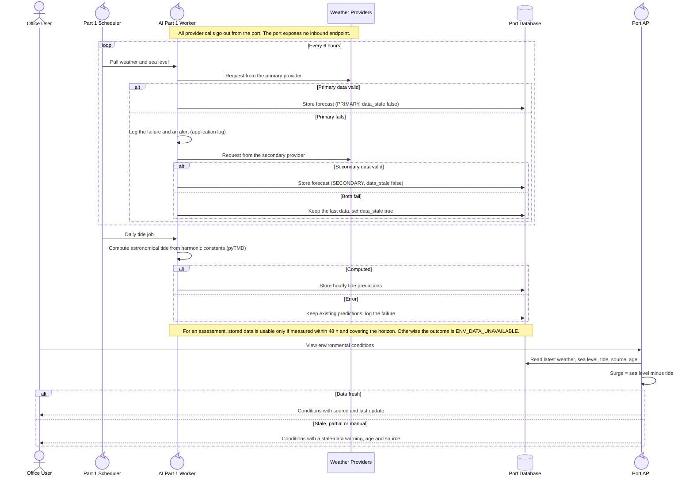

<!-- Generated from docs/reference/uml/ATLANTECH_Sequence_Diagrams.md lines 1487-1534 by build-index.mjs. Do not edit: edit the source and rebuild. -->
### 2.12 Weather and environmental data

```mermaid
sequenceDiagram
    actor OU as Office User
    participant SCH@{ "type": "control" } as Part 1 Scheduler
    participant P1@{ "type": "control" } as AI Part 1 Worker
    participant WX as Weather Providers
    participant DB@{ "type": "database" } as Port Database
    participant API@{ "type": "control" } as Port API

    Note over P1,WX: All provider calls go out from the port. The port exposes no inbound endpoint.

    loop Every 6 hours
        SCH->>P1: Pull weather and sea level
        P1->>WX: Request from the primary provider
        alt Primary data valid
            P1->>DB: Store forecast (PRIMARY, data_stale false)
        else Primary fails
            P1->>P1: Log the failure and an alert (application log)
            P1->>WX: Request from the secondary provider
            alt Secondary data valid
                P1->>DB: Store forecast (SECONDARY, data_stale false)
            else Both fail
                P1->>DB: Keep the last data, set data_stale true
            end
        end
    end

    SCH->>P1: Daily tide job
    P1->>P1: Compute astronomical tide from harmonic constants (pyTMD)
    alt Computed
        P1->>DB: Store hourly tide predictions
    else Error
        P1->>DB: Keep existing predictions, log the failure
    end

    Note over P1,DB: For an assessment, stored data is usable only if measured within 48 h and covering the horizon. Otherwise the outcome is ENV_DATA_UNAVAILABLE.

    OU->>API: View environmental conditions
    API->>DB: Read latest weather, sea level, tide, source, age
    API->>API: Surge = sea level minus tide
    alt Data fresh
        API-->>OU: Conditions with source and last update
    else Stale, partial or manual
        API-->>OU: Conditions with a stale-data warning, age and source
    end
```
