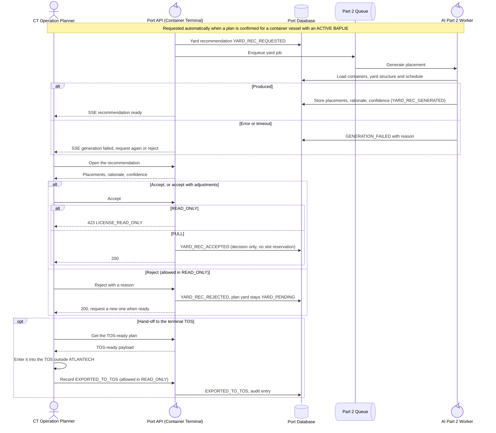

<!-- Generated from docs/reference/uml/ATLANTECH_Sequence_Diagrams.md lines 1713-1761 by build-index.mjs. Do not edit: edit the source and rebuild. -->
### 2.16 Yard placement and TOS hand-off

```mermaid
sequenceDiagram
    actor CTP as CT Operation Planner
    participant API@{ "type": "control" } as Port API (Container Terminal)
    participant DB@{ "type": "database" } as Port Database
    participant Q@{ "type": "queue" } as Part 2 Queue
    participant P2@{ "type": "control" } as AI Part 2 Worker

    Note over CTP,P2: Requested automatically when a plan is confirmed for a container vessel with an ACTIVE BAPLIE

    API->>DB: Yard recommendation YARD_REC_REQUESTED
    API->>Q: Enqueue yard job
    Q->>P2: Generate placement
    P2->>DB: Load containers, yard structure and schedule
    alt Produced
        P2->>DB: Store placements, rationale, confidence (YARD_REC_GENERATED)
        API-->>CTP: SSE recommendation ready
    else Error or timeout
        P2->>DB: GENERATION_FAILED with reason
        API-->>CTP: SSE generation failed, request again or reject
    end

    CTP->>API: Open the recommendation
    API-->>CTP: Placements, rationale, confidence

    alt Accept, or accept with adjustments
        CTP->>API: Accept
        alt READ_ONLY
            API-->>CTP: 423 LICENSE_READ_ONLY
        else FULL
            API->>DB: YARD_REC_ACCEPTED (decision only, no slot reservation)
            API-->>CTP: 200
        end
    else Reject (allowed in READ_ONLY)
        CTP->>API: Reject with a reason
        API->>DB: YARD_REC_REJECTED, plan yard stays YARD_PENDING
        API-->>CTP: 200, request a new one when ready
    end

    opt Hand-off to the terminal TOS
        CTP->>API: Get the TOS-ready plan
        API-->>CTP: TOS-ready payload
        CTP->>CTP: Enter it into the TOS outside ATLANTECH
        CTP->>API: Record EXPORTED_TO_TOS (allowed in READ_ONLY)
        API->>DB: EXPORTED_TO_TOS, audit entry
    end
```
