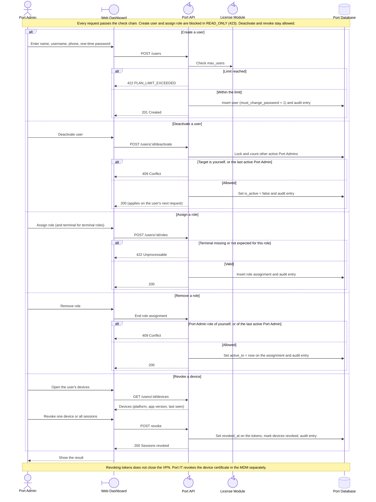

<!-- Generated from docs/reference/uml/ATLANTECH_Sequence_Diagrams.md lines 945-1011 by build-index.mjs. Do not edit: edit the source and rebuild. -->
### 2.3 Users, roles and devices

```mermaid
sequenceDiagram
    actor PA as Port Admin
    participant WEB@{ "type": "boundary" } as Web Dashboard
    participant API@{ "type": "control" } as Port API
    participant LM@{ "type": "control" } as License Module
    participant DB@{ "type": "database" } as Port Database

    Note over PA,DB: Every request passes the check chain. Create user and assign role are blocked in READ_ONLY (423). Deactivate and revoke stay allowed.

    alt Create a user
        PA->>WEB: Enter name, username, phone, one-time password
        WEB->>API: POST /users
        API->>LM: Check max_users
        alt Limit reached
            API-->>WEB: 422 PLAN_LIMIT_EXCEEDED
        else Within the limit
            API->>DB: Insert user (must_change_password = 1) and audit entry
            API-->>WEB: 201 Created
        end

    else Deactivate a user
        PA->>WEB: Deactivate user
        WEB->>API: POST /users/:id/deactivate
        API->>DB: Lock and count other active Port Admins
        alt Target is yourself, or the last active Port Admin
            API-->>WEB: 409 Conflict
        else Allowed
            API->>DB: Set is_active = false and audit entry
            API-->>WEB: 200 (applies on the user's next request)
        end

    else Assign a role
        PA->>WEB: Assign role (and terminal for terminal roles)
        WEB->>API: POST /users/:id/roles
        alt Terminal missing or not expected for this role
            API-->>WEB: 422 Unprocessable
        else Valid
            API->>DB: Insert role assignment and audit entry
            API-->>WEB: 200
        end

    else Remove a role
        PA->>WEB: Remove role
        WEB->>API: End role assignment
        alt Port Admin role of yourself, or of the last active Port Admin
            API-->>WEB: 409 Conflict
        else Allowed
            API->>DB: Set active_to = now on the assignment and audit entry
            API-->>WEB: 200
        end

    else Revoke a device
        PA->>WEB: Open the user's devices
        WEB->>API: GET /users/:id/devices
        API-->>WEB: Devices (platform, app version, last seen)
        PA->>WEB: Revoke one device or all sessions
        WEB->>API: POST revoke
        API->>DB: Set revoked_at on the tokens, mark devices revoked, audit entry
        API-->>WEB: 200 Sessions revoked
    end

    WEB-->>PA: Show the result
    Note over PA,DB: Revoking tokens does not close the VPN. Port IT revokes the device certificate in the MDM separately.
```
