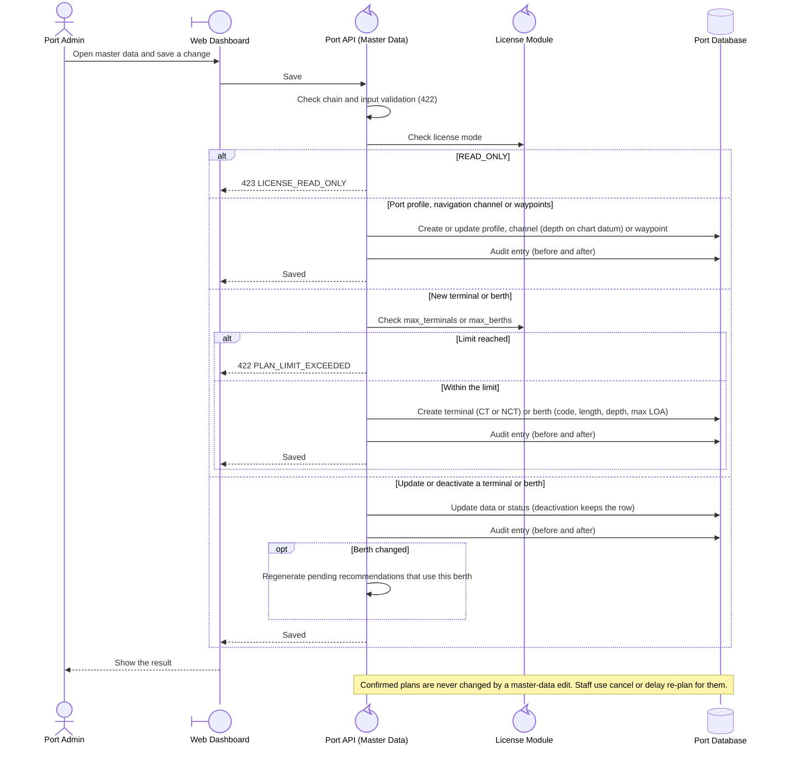

<!-- Generated from docs/reference/uml/ATLANTECH_Sequence_Diagrams.md lines 1013-1056 by build-index.mjs. Do not edit: edit the source and rebuild. -->
### 2.4 Port profile, terminals and berths

```mermaid
sequenceDiagram
    actor PA as Port Admin
    participant WEB@{ "type": "boundary" } as Web Dashboard
    participant API@{ "type": "control" } as Port API (Master Data)
    participant LM@{ "type": "control" } as License Module
    participant DB@{ "type": "database" } as Port Database

    PA->>WEB: Open master data and save a change
    WEB->>API: Save
    API->>API: Check chain and input validation (422)
    API->>LM: Check license mode
    alt READ_ONLY
        API-->>WEB: 423 LICENSE_READ_ONLY

    else Port profile, navigation channel or waypoints
        API->>DB: Create or update profile, channel (depth on chart datum) or waypoint
        API->>DB: Audit entry (before and after)
        API-->>WEB: Saved

    else New terminal or berth
        API->>LM: Check max_terminals or max_berths
        alt Limit reached
            API-->>WEB: 422 PLAN_LIMIT_EXCEEDED
        else Within the limit
            API->>DB: Create terminal (CT or NCT) or berth (code, length, depth, max LOA)
            API->>DB: Audit entry (before and after)
            API-->>WEB: Saved
        end

    else Update or deactivate a terminal or berth
        API->>DB: Update data or status (deactivation keeps the row)
        API->>DB: Audit entry (before and after)
        opt Berth changed
            API->>API: Regenerate pending recommendations that use this berth
        end
        API-->>WEB: Saved
    end

    WEB-->>PA: Show the result
    Note over API,DB: Confirmed plans are never changed by a master-data edit. Staff use cancel or delay re-plan for them.
```
