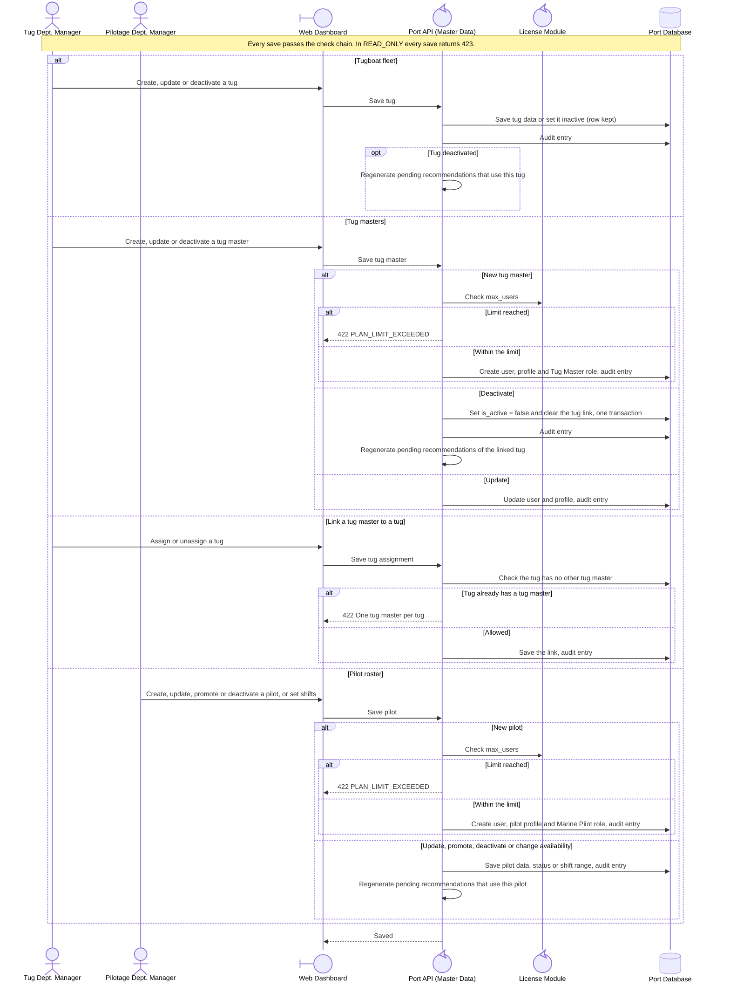

<!-- Generated from docs/reference/uml/ATLANTECH_Sequence_Diagrams.md lines 1058-1125 by build-index.mjs. Do not edit: edit the source and rebuild. -->
### 2.5 Tugs, tug masters and pilots

```mermaid
sequenceDiagram
    actor TM as Tug Dept. Manager
    actor PM as Pilotage Dept. Manager
    participant WEB@{ "type": "boundary" } as Web Dashboard
    participant API@{ "type": "control" } as Port API (Master Data)
    participant LM@{ "type": "control" } as License Module
    participant DB@{ "type": "database" } as Port Database

    Note over TM,DB: Every save passes the check chain. In READ_ONLY every save returns 423.

    alt Tugboat fleet
        TM->>WEB: Create, update or deactivate a tug
        WEB->>API: Save tug
        API->>DB: Save tug data or set it inactive (row kept)
        API->>DB: Audit entry
        opt Tug deactivated
            API->>API: Regenerate pending recommendations that use this tug
        end

    else Tug masters
        TM->>WEB: Create, update or deactivate a tug master
        WEB->>API: Save tug master
        alt New tug master
            API->>LM: Check max_users
            alt Limit reached
                API-->>WEB: 422 PLAN_LIMIT_EXCEEDED
            else Within the limit
                API->>DB: Create user, profile and Tug Master role, audit entry
            end
        else Deactivate
            API->>DB: Set is_active = false and clear the tug link, one transaction
            API->>DB: Audit entry
            API->>API: Regenerate pending recommendations of the linked tug
        else Update
            API->>DB: Update user and profile, audit entry
        end

    else Link a tug master to a tug
        TM->>WEB: Assign or unassign a tug
        WEB->>API: Save tug assignment
        API->>DB: Check the tug has no other tug master
        alt Tug already has a tug master
            API-->>WEB: 422 One tug master per tug
        else Allowed
            API->>DB: Save the link, audit entry
        end

    else Pilot roster
        PM->>WEB: Create, update, promote or deactivate a pilot, or set shifts
        WEB->>API: Save pilot
        alt New pilot
            API->>LM: Check max_users
            alt Limit reached
                API-->>WEB: 422 PLAN_LIMIT_EXCEEDED
            else Within the limit
                API->>DB: Create user, pilot profile and Marine Pilot role, audit entry
            end
        else Update, promote, deactivate or change availability
            API->>DB: Save pilot data, status or shift range, audit entry
            API->>API: Regenerate pending recommendations that use this pilot
        end
    end

    API-->>WEB: Saved
```
