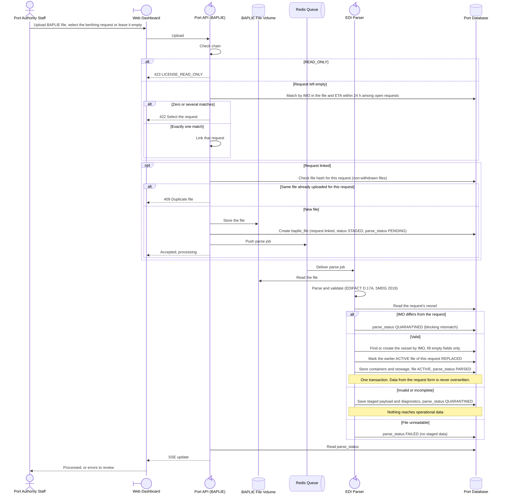

<!-- Generated from docs/reference/uml/ATLANTECH_Sequence_Diagrams.md lines 1175-1234 by build-index.mjs. Do not edit: edit the source and rebuild. -->
### 2.7 BAPLIE upload and parsing

```mermaid
sequenceDiagram
    actor ST as Port Authority Staff
    participant WEB@{ "type": "boundary" } as Web Dashboard
    participant API@{ "type": "control" } as Port API (BAPLIE)
    participant FS@{ "type": "database" } as BAPLIE File Volume
    participant Q@{ "type": "queue" } as Redis Queue
    participant PR@{ "type": "control" } as EDI Parser
    participant DB@{ "type": "database" } as Port Database

    ST->>WEB: Upload BAPLIE file, select the berthing request or leave it empty
    WEB->>API: Upload
    API->>API: Check chain
    alt READ_ONLY
        API-->>WEB: 423 LICENSE_READ_ONLY
    else Request left empty
        API->>DB: Match by IMO in the file and ETA within 24 h among open requests
        alt Zero or several matches
            API-->>WEB: 422 Select the request
        else Exactly one match
            API->>API: Link that request
        end
    end

    opt Request linked
        API->>DB: Check file hash for this request (non-withdrawn files)
        alt Same file already uploaded for this request
            API-->>WEB: 409 Duplicate file
        else New file
            API->>FS: Store the file
            API->>DB: Create baplie_file (request linked, status STAGED, parse_status PENDING)
            API->>Q: Push parse job
            API-->>WEB: Accepted, processing
        end
    end

    Q->>PR: Deliver parse job
    PR->>FS: Read the file
    PR->>PR: Parse and validate (EDIFACT D.17A, SMDG 2019)
    PR->>DB: Read the request's vessel
    alt IMO differs from the request
        PR->>DB: parse_status QUARANTINED (blocking mismatch)
    else Valid
        PR->>DB: Find or create the vessel by IMO, fill empty fields only
        PR->>DB: Mark the earlier ACTIVE file of this request REPLACED
        PR->>DB: Store containers and stowage, file ACTIVE, parse_status PARSED
        Note over PR,DB: One transaction. Data from the request form is never overwritten.
    else Invalid or incomplete
        PR->>DB: Save staged payload and diagnostics, parse_status QUARANTINED
        Note over PR,DB: Nothing reaches operational data
    else File unreadable
        PR->>DB: parse_status FAILED (no staged data)
    end

    API->>DB: Read parse_status
    API-->>WEB: SSE update
    WEB-->>ST: Processed, or errors to review
```
