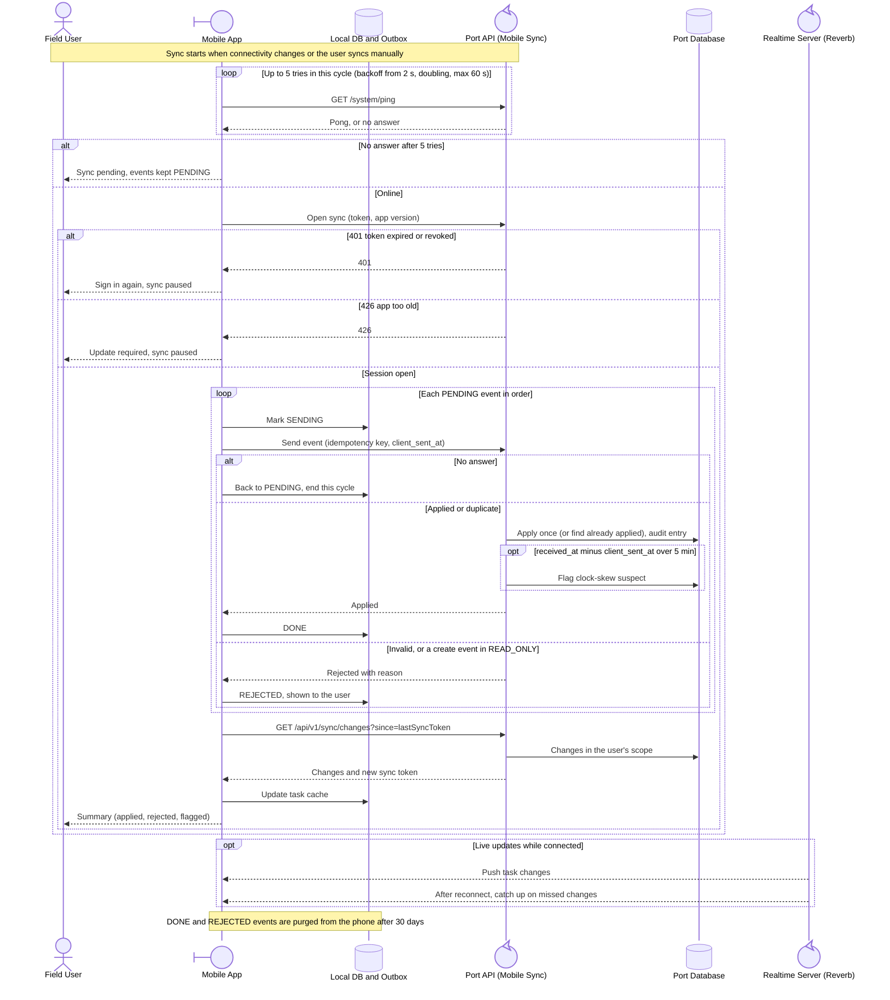

<!-- Generated from docs/reference/uml/ATLANTECH_Sequence_Diagrams.md lines 1858-1916 by build-index.mjs. Do not edit: edit the source and rebuild. -->
### 3.2 Outbox synchronization and catch-up

```mermaid
sequenceDiagram
    actor FU as Field User
    participant APP@{ "type": "boundary" } as Mobile App
    participant LDB@{ "type": "database" } as Local DB and Outbox
    participant API@{ "type": "control" } as Port API (Mobile Sync)
    participant DB@{ "type": "database" } as Port Database
    participant RT@{ "type": "control" } as Realtime Server (Reverb)

    Note over FU,API: Sync starts when connectivity changes or the user syncs manually

    loop Up to 5 tries in this cycle (backoff from 2 s, doubling, max 60 s)
        APP->>API: GET /system/ping
        API-->>APP: Pong, or no answer
    end
    alt No answer after 5 tries
        APP-->>FU: Sync pending, events kept PENDING
    else Online
        APP->>API: Open sync (token, app version)
        alt 401 token expired or revoked
            API-->>APP: 401
            APP-->>FU: Sign in again, sync paused
        else 426 app too old
            API-->>APP: 426
            APP-->>FU: Update required, sync paused
        else Session open
            loop Each PENDING event in order
                APP->>LDB: Mark SENDING
                APP->>API: Send event (idempotency key, client_sent_at)
                alt No answer
                    APP->>LDB: Back to PENDING, end this cycle
                else Applied or duplicate
                    API->>DB: Apply once (or find already applied), audit entry
                    opt received_at minus client_sent_at over 5 min
                        API->>DB: Flag clock-skew suspect
                    end
                    API-->>APP: Applied
                    APP->>LDB: DONE
                else Invalid, or a create event in READ_ONLY
                    API-->>APP: Rejected with reason
                    APP->>LDB: REJECTED, shown to the user
                end
            end
            APP->>API: GET /api/v1/sync/changes?since=lastSyncToken
            API->>DB: Changes in the user's scope
            API-->>APP: Changes and new sync token
            APP->>LDB: Update task cache
            APP-->>FU: Summary (applied, rejected, flagged)
        end
    end

    opt Live updates while connected
        RT-->>APP: Push task changes
        RT-->>APP: After reconnect, catch up on missed changes
    end
    Note over APP,LDB: DONE and REJECTED events are purged from the phone after 30 days
```
