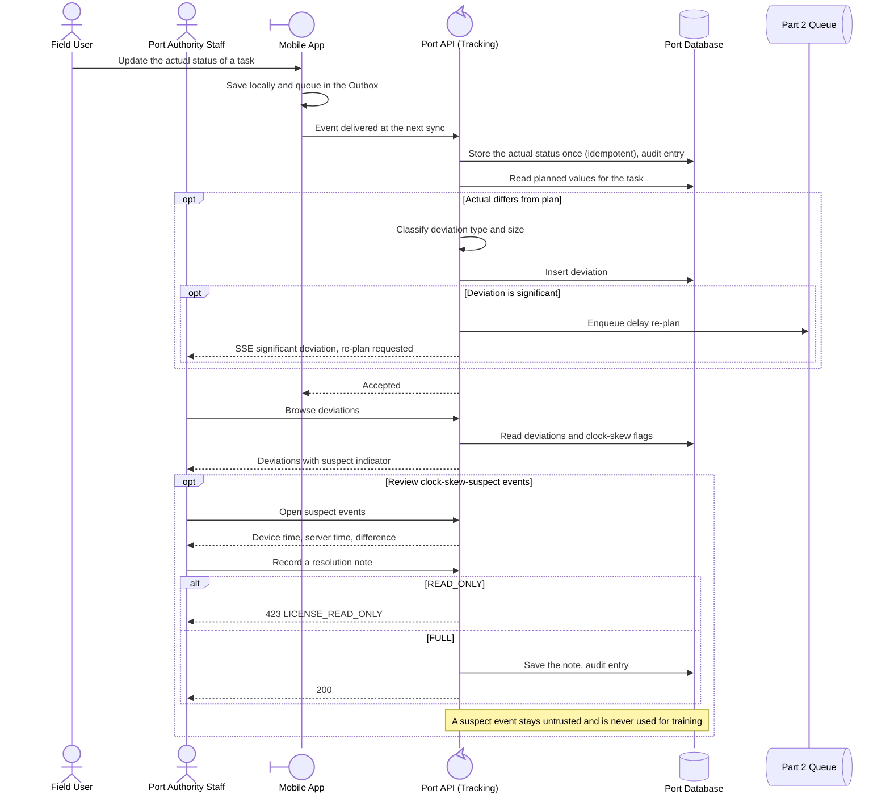

<!-- Generated from docs/reference/uml/ATLANTECH_Sequence_Diagrams.md lines 1918-1960 by build-index.mjs. Do not edit: edit the source and rebuild. -->
### 3.3 Execution tracking and deviations

```mermaid
sequenceDiagram
    actor FU as Field User
    actor ST as Port Authority Staff
    participant APP@{ "type": "boundary" } as Mobile App
    participant API@{ "type": "control" } as Port API (Tracking)
    participant DB@{ "type": "database" } as Port Database
    participant Q@{ "type": "queue" } as Part 2 Queue

    FU->>APP: Update the actual status of a task
    APP->>APP: Save locally and queue in the Outbox
    APP->>API: Event delivered at the next sync
    API->>DB: Store the actual status once (idempotent), audit entry
    API->>DB: Read planned values for the task
    opt Actual differs from plan
        API->>API: Classify deviation type and size
        API->>DB: Insert deviation
        opt Deviation is significant
            API->>Q: Enqueue delay re-plan
            API-->>ST: SSE significant deviation, re-plan requested
        end
    end
    API-->>APP: Accepted

    ST->>API: Browse deviations
    API->>DB: Read deviations and clock-skew flags
    API-->>ST: Deviations with suspect indicator

    opt Review clock-skew-suspect events
        ST->>API: Open suspect events
        API-->>ST: Device time, server time, difference
        ST->>API: Record a resolution note
        alt READ_ONLY
            API-->>ST: 423 LICENSE_READ_ONLY
        else FULL
            API->>DB: Save the note, audit entry
            API-->>ST: 200
        end
        Note over API,DB: A suspect event stays untrusted and is never used for training
    end
```
