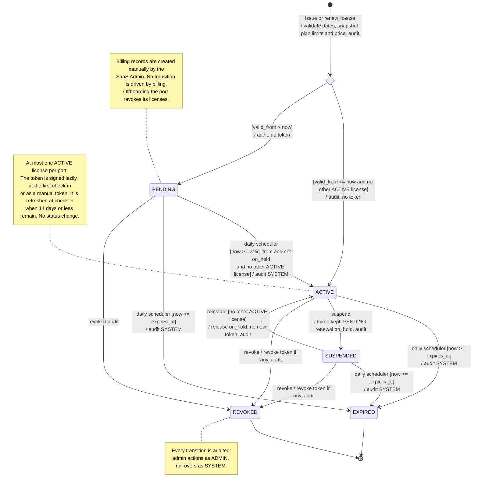

<!-- Generated from docs/reference/uml/ATLANTECH_State_Diagrams.md lines 7-51 by build-index.mjs. Do not edit: edit the source and rebuild. -->
### SM-1 — License (central SaaS)

```mermaid
stateDiagram-v2
    direction TB

    state license_choice <<choice>>
    [*] --> license_choice : Issue or renew license<br/>/ validate dates, snapshot plan limits and price, audit

    license_choice --> ACTIVE : [valid_from <= now and no other ACTIVE license]<br/>/ audit, no token
    license_choice --> PENDING : [valid_from > now]<br/>/ audit, no token

    PENDING --> ACTIVE : daily scheduler<br/>[now >= valid_from and not on_hold<br/>and no other ACTIVE license] / audit SYSTEM
    PENDING --> EXPIRED : daily scheduler [now >= expires_at]<br/>/ audit SYSTEM
    PENDING --> REVOKED : revoke / audit

    ACTIVE --> EXPIRED : daily scheduler [now >= expires_at]<br/>/ audit SYSTEM
    ACTIVE --> SUSPENDED : suspend<br/>/ token kept, PENDING renewal on_hold, audit
    ACTIVE --> REVOKED : revoke / revoke token if any, audit

    SUSPENDED --> ACTIVE : reinstate [no other ACTIVE license]<br/>/ release on_hold, no new token, audit
    SUSPENDED --> EXPIRED : daily scheduler [now >= expires_at]<br/>/ audit SYSTEM
    SUSPENDED --> REVOKED : revoke / revoke token if any, audit

    EXPIRED --> [*]
    REVOKED --> [*]

    note left of ACTIVE
        At most one ACTIVE license per port.
        The token is signed lazily, at the first check-in
        or as a manual token. It is refreshed at check-in
        when 14 days or less remain. No status change.
    end note

    note left of PENDING
        Billing records are created manually by the
        SaaS Admin. No transition is driven by billing.
        Offboarding the port revokes its licenses.
    end note

    note right of REVOKED
        Every transition is audited:
        admin actions as ADMIN, roll-overs as SYSTEM.
    end note
```
