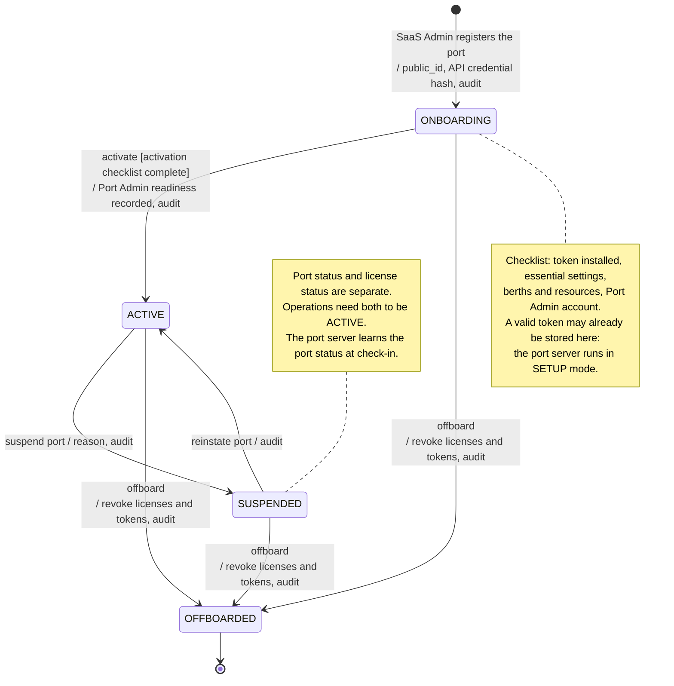

<!-- Generated from docs/reference/uml/ATLANTECH_State_Diagrams.md lines 53-83 by build-index.mjs. Do not edit: edit the source and rebuild. -->
### SM-2 — Port lifecycle (central SaaS)

```mermaid
stateDiagram-v2
    direction TB

    [*] --> ONBOARDING : SaaS Admin registers the port<br/>/ public_id, API credential hash, audit

    ONBOARDING --> ACTIVE : activate [activation checklist complete]<br/>/ Port Admin readiness recorded, audit
    ACTIVE --> SUSPENDED : suspend port / reason, audit
    SUSPENDED --> ACTIVE : reinstate port / audit

    ONBOARDING --> OFFBOARDED : offboard<br/>/ revoke licenses and tokens, audit
    ACTIVE --> OFFBOARDED : offboard<br/>/ revoke licenses and tokens, audit
    SUSPENDED --> OFFBOARDED : offboard<br/>/ revoke licenses and tokens, audit

    OFFBOARDED --> [*]

    note right of ONBOARDING
        Checklist: token installed, essential settings,
        berths and resources, Port Admin account.
        A valid token may already be stored here:
        the port server runs in SETUP mode.
    end note

    note left of SUSPENDED
        Port status and license status are separate.
        Operations need both to be ACTIVE.
        The port server learns the port status at check-in.
    end note
```
