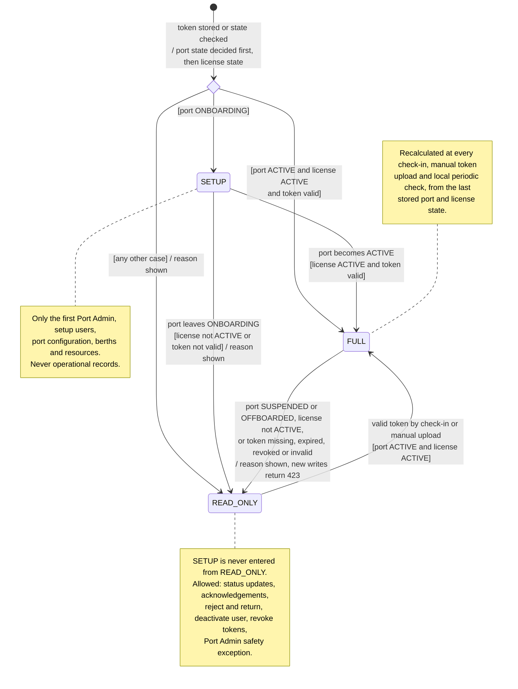

<!-- Generated from docs/reference/uml/ATLANTECH_State_Diagrams.md lines 85-122 by build-index.mjs. Do not edit: edit the source and rebuild. -->
### SM-3 — Port-side license mode

```mermaid
stateDiagram-v2
    direction TB

    state mode_choice <<choice>>
    [*] --> mode_choice : token stored or state checked<br/>/ port state decided first, then license state

    mode_choice --> SETUP : [port ONBOARDING]
    mode_choice --> FULL : [port ACTIVE and license ACTIVE<br/>and token valid]
    mode_choice --> READ_ONLY : [any other case] / reason shown

    SETUP --> FULL : port becomes ACTIVE<br/>[license ACTIVE and token valid]
    SETUP --> READ_ONLY : port leaves ONBOARDING<br/>[license not ACTIVE or token not valid] / reason shown

    FULL --> READ_ONLY : port SUSPENDED or OFFBOARDED, license not ACTIVE,<br/>or token missing, expired, revoked or invalid<br/>/ reason shown, new writes return 423
    READ_ONLY --> FULL : valid token by check-in or manual upload<br/>[port ACTIVE and license ACTIVE]

    note right of SETUP
        Only the first Port Admin, setup users,
        port configuration, berths and resources.
        Never operational records.
    end note

    note right of READ_ONLY
        SETUP is never entered from READ_ONLY.
        Allowed: status updates, acknowledgements,
        reject and return, deactivate user, revoke tokens,
        Port Admin safety exception.
    end note

    note left of FULL
        Recalculated at every check-in, manual token
        upload and local periodic check, from the last
        stored port and license state.
    end note
```
