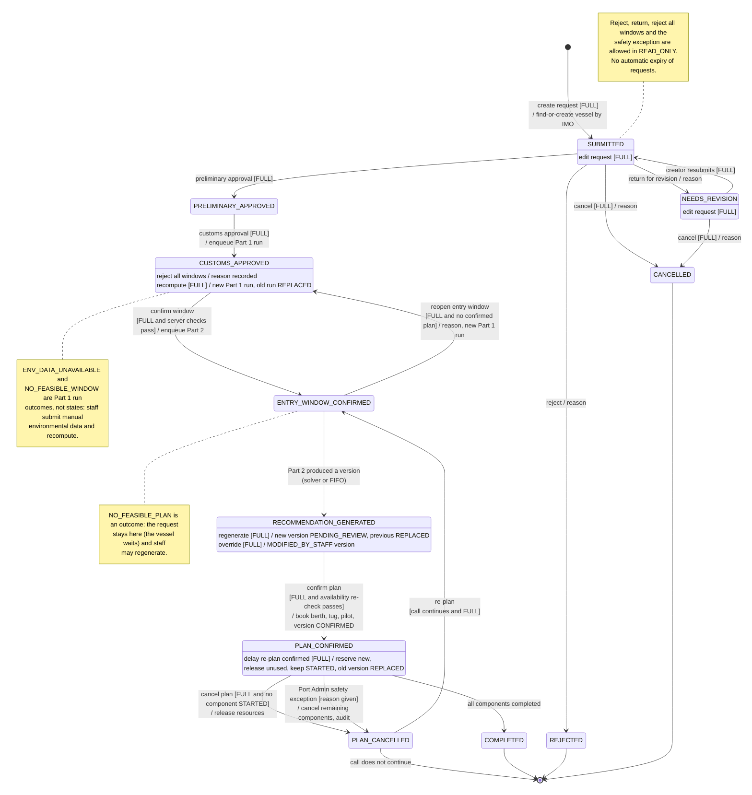

<!-- Generated from docs/reference/uml/ATLANTECH_State_Diagrams.md lines 126-193 by build-index.mjs. Do not edit: edit the source and rebuild. -->
### SM-4 — Berthing request

```mermaid
stateDiagram-v2
    direction TB

    [*] --> SUBMITTED : create request [FULL]<br/>/ find-or-create vessel by IMO

    SUBMITTED : SUBMITTED
    SUBMITTED : edit request [FULL]
    SUBMITTED --> PRELIMINARY_APPROVED : preliminary approval [FULL]
    SUBMITTED --> NEEDS_REVISION : return for revision / reason
    SUBMITTED --> REJECTED : reject / reason
    SUBMITTED --> CANCELLED : cancel [FULL] / reason

    NEEDS_REVISION : NEEDS_REVISION
    NEEDS_REVISION : edit request [FULL]
    NEEDS_REVISION --> SUBMITTED : creator resubmits [FULL]
    NEEDS_REVISION --> CANCELLED : cancel [FULL] / reason

    PRELIMINARY_APPROVED --> CUSTOMS_APPROVED : customs approval [FULL]<br/>/ enqueue Part 1 run

    CUSTOMS_APPROVED : CUSTOMS_APPROVED
    CUSTOMS_APPROVED : reject all windows / reason recorded
    CUSTOMS_APPROVED : recompute [FULL] / new Part 1 run, old run REPLACED
    CUSTOMS_APPROVED --> ENTRY_WINDOW_CONFIRMED : confirm window<br/>[FULL and server checks pass] / enqueue Part 2

    ENTRY_WINDOW_CONFIRMED --> CUSTOMS_APPROVED : reopen entry window<br/>[FULL and no confirmed plan] / reason, new Part 1 run
    ENTRY_WINDOW_CONFIRMED --> RECOMMENDATION_GENERATED : Part 2 produced a version<br/>(solver or FIFO)

    RECOMMENDATION_GENERATED : RECOMMENDATION_GENERATED
    RECOMMENDATION_GENERATED : regenerate [FULL] / new version PENDING_REVIEW, previous REPLACED
    RECOMMENDATION_GENERATED : override [FULL] / MODIFIED_BY_STAFF version
    RECOMMENDATION_GENERATED --> PLAN_CONFIRMED : confirm plan<br/>[FULL and availability re-check passes]<br/>/ book berth, tug, pilot, version CONFIRMED

    PLAN_CONFIRMED : PLAN_CONFIRMED
    PLAN_CONFIRMED : delay re-plan confirmed [FULL] / reserve new,
    PLAN_CONFIRMED : release unused, keep STARTED, old version REPLACED
    PLAN_CONFIRMED --> PLAN_CANCELLED : cancel plan [FULL and no component STARTED]<br/>/ release resources
    PLAN_CONFIRMED --> PLAN_CANCELLED : Port Admin safety exception [reason given]<br/>/ cancel remaining components, audit
    PLAN_CONFIRMED --> COMPLETED : all components completed

    PLAN_CANCELLED --> ENTRY_WINDOW_CONFIRMED : re-plan<br/>[call continues and FULL]
    PLAN_CANCELLED --> [*] : call does not continue

    COMPLETED --> [*]
    REJECTED --> [*]
    CANCELLED --> [*]

    note right of CUSTOMS_APPROVED
        ENV_DATA_UNAVAILABLE and
        NO_FEASIBLE_WINDOW are Part 1 run
        outcomes, not states: staff submit manual
        environmental data and recompute.
    end note

    note right of ENTRY_WINDOW_CONFIRMED
        NO_FEASIBLE_PLAN is an outcome: the request
        stays here (the vessel waits) and staff
        may regenerate.
    end note

    note left of SUBMITTED
        Reject, return, reject all windows and the
        safety exception are allowed in READ_ONLY.
        No automatic expiry of requests.
    end note
```
