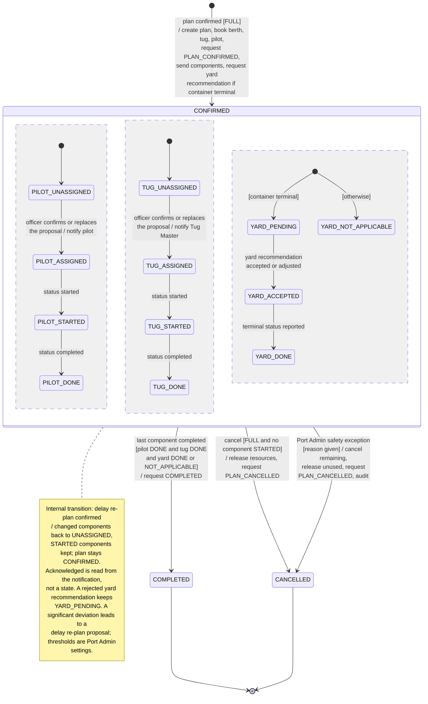

<!-- Generated from docs/reference/uml/ATLANTECH_State_Diagrams.md lines 195-241 by build-index.mjs. Do not edit: edit the source and rebuild. -->
### SM-5 — Operational plan

```mermaid
stateDiagram-v2
    direction TB

    [*] --> CONFIRMED : plan confirmed [FULL]<br/>/ create plan, book berth, tug, pilot,<br/>request PLAN_CONFIRMED,<br/>send components, request yard<br/>recommendation if container terminal

    state CONFIRMED {
        [*] --> PILOT_UNASSIGNED
        PILOT_UNASSIGNED --> PILOT_ASSIGNED : officer confirms or replaces<br/>the proposal / notify pilot
        PILOT_ASSIGNED --> PILOT_STARTED : status started
        PILOT_STARTED --> PILOT_DONE : status completed

        --

        [*] --> TUG_UNASSIGNED
        TUG_UNASSIGNED --> TUG_ASSIGNED : officer confirms or replaces<br/>the proposal / notify Tug Master
        TUG_ASSIGNED --> TUG_STARTED : status started
        TUG_STARTED --> TUG_DONE : status completed

        --

        [*] --> YARD_PENDING : [container terminal]
        [*] --> YARD_NOT_APPLICABLE : [otherwise]
        YARD_PENDING --> YARD_ACCEPTED : yard recommendation<br/>accepted or adjusted
        YARD_ACCEPTED --> YARD_DONE : terminal status reported
    }

    CONFIRMED --> COMPLETED : last component completed<br/>[pilot DONE and tug DONE<br/>and yard DONE or NOT_APPLICABLE]<br/>/ request COMPLETED
    CONFIRMED --> CANCELLED : cancel [FULL and no component STARTED]<br/>/ release resources, request PLAN_CANCELLED
    CONFIRMED --> CANCELLED : Port Admin safety exception<br/>[reason given] / cancel remaining,<br/>release unused, request<br/>PLAN_CANCELLED, audit

    COMPLETED --> [*]
    CANCELLED --> [*]

    note right of CONFIRMED
        Internal transition: delay re-plan confirmed
        / changed components back to UNASSIGNED,
        STARTED components kept; plan stays CONFIRMED.
        Acknowledged is read from the notification,
        not a state. A rejected yard recommendation keeps
        YARD_PENDING. A significant deviation leads to a
        delay re-plan proposal; thresholds are Port Admin
        settings.
    end note
```
