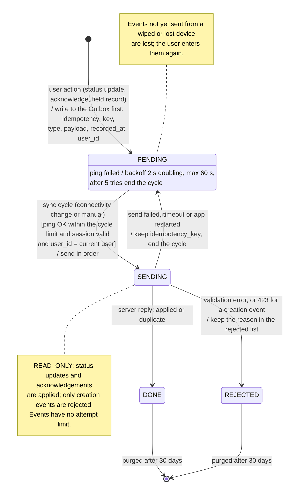

<!-- Generated from docs/reference/uml/ATLANTECH_State_Diagrams.md lines 245-275 by build-index.mjs. Do not edit: edit the source and rebuild. -->
### SM-6 — Outbox event (mobile app)

```mermaid
stateDiagram-v2
    direction TB

    [*] --> PENDING : user action (status update, acknowledge, field record)<br/>/ write to the Outbox first: idempotency_key,<br/>type, payload, recorded_at, user_id

    PENDING --> SENDING : sync cycle (connectivity change or manual)<br/>[ping OK within the cycle limit and session valid<br/>and user_id = current user] / send in order
    PENDING : PENDING
    PENDING : ping failed / backoff 2 s doubling, max 60 s,
    PENDING : after 5 tries end the cycle

    SENDING --> DONE : server reply: applied or duplicate
    SENDING --> REJECTED : validation error, or 423 for a creation event<br/>/ keep the reason in the rejected list
    SENDING --> PENDING : send failed, timeout or app restarted<br/>/ keep idempotency_key, end the cycle

    DONE --> [*] : purged after 30 days
    REJECTED --> [*] : purged after 30 days

    note right of SENDING
        READ_ONLY: status updates and acknowledgements
        are applied; only creation events are rejected.
        Events have no attempt limit.
    end note

    note left of PENDING
        Events not yet sent from a wiped or lost device
        are lost; the user enters them again.
    end note
```
