# ATLANTECH — Activity Diagrams

Mermaid code only, in three categories. Rendering needs Mermaid 11.7 or later (fork, sm-circ and fr-circ shapes).

## Category 1 — Central SaaS, Licensing and Billing

### AD-1 — Port onboarding and provisioning

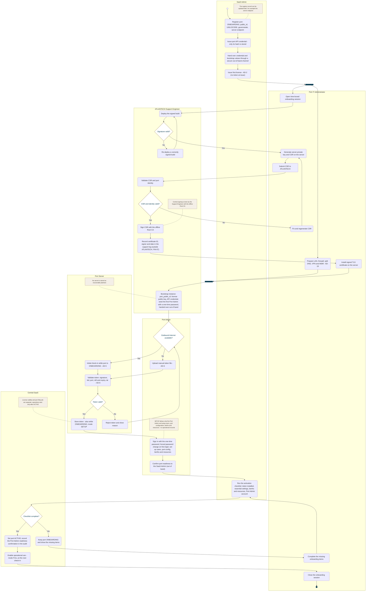
```mermaid
flowchart TD
    subgraph L_SA["SaaS Admin"]
        direction TB
        START@{ shape: sm-circ }
        A1("Register port: ONBOARDING, public_id, UN/LOCODE, governorate, server endpoint")
        A2("Issue port API credential - only its hash is stored")
        A12("Hand over credential and bootstrap values through a secure out-of-band channel")
        A3("Issue first license - AD-2 (no token at issue)")
        R4("Run the activation checklist: token installed, essential settings, berths and resources, Port Admin account")
        N1["The registry record can be updated later, for example the server endpoint"]
    end
    subgraph L_SE["ATLANTECH Support Engineer"]
        direction TB
        P0("Deploy the signed build")
        DS{"Signature valid?"}
        P8("Re-deploy a correctly signed build")
        V1("Validate CSR and port identity")
        DV{"CSR and identity valid?"}
        E2("Sign CSR with the offline Root CA")
        E4("Record certificate ID, signer and date in the support log (outside ATLANTECH, FW-07)")
        E3("Bootstrap instance: port_public_id, license public key, API credential; seed the first Port Admin with a one-time password, handed over out of band")
        N2["Central signing is done by the Support Engineer with the offline Root CA"]
    end
    subgraph L_PIT["Port IT Administrator"]
        direction TB
        P1("Prepare LAN, firewall, split DNS, VPN and MDM - AD-19")
        P7("Open time-boxed onboarding session")
        P2("Generate server private key and CSR on the server")
        P4("Submit CSR to ATLANTECH")
        P5("Fix and regenerate CSR")
        P3("Install signed TLS certificate on the server")
        P6("Complete the missing onboarding items")
        P9("Close the onboarding session")
        STOP1@{ shape: fr-circ }
    end
    subgraph L_PAD["Port Admin"]
        direction TB
        D1{"Outbound internet available?"}
        A5("Upload manual token file - AD-6")
        A8("Sign in with the one-time password; forced password change on first login; set up users, port config, berths and resources")
        N5["SETUP allows only first Port Admin and setup users, port configuration, berths and resources - no operational records"]
        R3("Confirm port readiness to the SaaS Admin (out of band)")
    end
    subgraph L_SRV["Port Server"]
        direction TB
        A4("Initial check-in while port is ONBOARDING - AD-5")
        A6("Validate token: signature, kid, port, nbf and expiry, iat - AD-6")
        D2{"Token valid?"}
        A7("Store token - also while ONBOARDING; mode SETUP")
        A10("Reject token and show reason")
        N3["No secret is stored as recoverable plaintext"]
    end
    subgraph L_SAAS["Central SaaS"]
        direction TB
        D8{"Checklist complete?"}
        A11("Keep port ONBOARDING and show the missing items")
        A9("Set port ACTIVE; record the Port Admin readiness confirmation in the audit")
        A13("Enable operational use - mode FULL at the next check-in")
        N4["License validity and port lifecycle are separate: operations start only after ACTIVE"]
    end
    START --> A1 --> A2 --> A12 --> A3 --> FK1@{ shape: fork }
    FK1 --> P1 --> JN1@{ shape: fork }
    FK1 --> P7 --> P0 --> DS
    DS -->|"No"| P8 --> P0
    DS -->|"Yes"| P2 --> P4 --> V1 --> DV
    DV -->|"No"| P5 --> P2
    DV -->|"Yes"| E2 --> E4 --> P3 --> JN1
    JN1 --> E3 --> D1
    D1 -->|"Yes"| A4 --> A6
    D1 -->|"No"| A5 --> A6
    A6 --> D2
    D2 -->|"No"| A10 --> D1
    D2 -->|"Yes"| A7 --> A8 --> R3 --> R4 --> D8
    D8 -->|"No"| A11 --> P6 --> R4
    D8 -->|"Yes"| A9 --> A13 --> P9 --> STOP1
    N1 -.- A1
    N2 -.- E2
    N3 -.- E3
    N4 -.- A7
    N5 -.- A8
    classDef term fill:#083A4F,stroke:#083A4F,color:#083A4F
    classDef bar fill:#083A4F,stroke:#083A4F
    classDef dec fill:#FFFFFF,stroke:#A58D66,stroke-width:2px,color:#083A4F
    classDef note fill:#F4EFE7,stroke:#A58D66,color:#3B3326,font-size:13px
    class START,STOP1 term
    class FK1,JN1 bar
    class D1,D2,D8,DS,DV dec
    class N1,N2,N3,N4,N5 note
```

### AD-2 — License issue, renewal and token signing

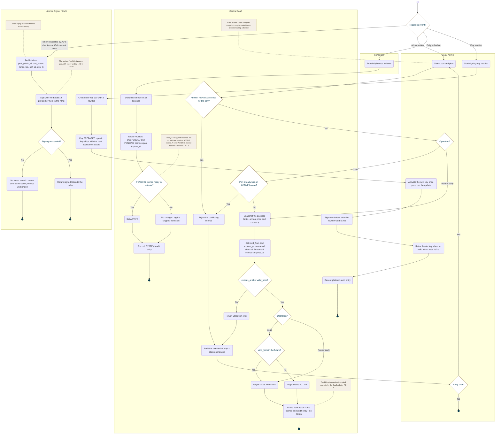
```mermaid
flowchart TD
    START@{ shape: sm-circ }
    D0{"Triggering event?"}
    subgraph L_SA["SaaS Admin"]
        direction TB
        A1("Select port and plan")
        D1{"Operation?"}
        D9{"Retry later?"}
        STOP2@{ shape: fr-circ }
        R1("Start signing-key rotation")
        R6("Activate the new key once ports run the update")
        R7("Retire the old key when no valid token uses its kid")
    end
    subgraph L_SAAS["Central SaaS"]
        direction TB
        D8{"Another PENDING license for the port?"}
        D2{"Port already has an ACTIVE license?"}
        A2("Reject the conflicting license")
        A3("Snapshot the package limits, annual price and currency")
        A4("Set valid_from and expires_at; a renewal starts at the current license's expires_at")
        D3{"expires_at after valid_from?"}
        A5("Return validation error")
        D4{"Operation?"}
        D5{"valid_from in the future?"}
        A6("Target status PENDING")
        A7("Target status ACTIVE")
        A11("In one transaction: save license and audit entry - no token")
        STOP1@{ shape: fr-circ }
        A15("Audit the rejected attempt - state unchanged")
        C1("Daily date check on all licenses")
        C3("Expire ACTIVE, SUSPENDED and PENDING licenses past expires_at")
        D10{"PENDING license ready to activate?"}
        C2("Set ACTIVE")
        C5("No change - log the skipped transition")
        C4("Record SYSTEM audit entry")
        STOP5@{ shape: fr-circ }
        N5["Ready = valid_from reached, not on hold and no other ACTIVE license. A held PENDING license waits for Reinstate - AD-3"]
        R2("Sign new tokens with the new key and its kid")
        R3("Record platform audit entry")
        STOP6@{ shape: fr-circ }
        N3["Each licence keeps one plan snapshot - no plan switching or proration during a licence"]
        N6["The billing transaction is created manually by the SaaS Admin - AD-4"]
    end
    subgraph L_KMS["License Signer / KMS"]
        direction TB
        K1("Build claims: port_public_id, port_status, limits, kid, nbf, iat, exp, jti")
        K2("Sign with the Ed25519 private key held in the KMS")
        D6{"Signing succeeded?"}
        K3("No token issued - return error to the caller; license unchanged")
        STOP3@{ shape: fr-circ }
        K4("Return signed token to the caller")
        STOP4@{ shape: fr-circ }
        R5("Create new key pair with a new kid")
        R4("Key PREPARED - public key ships with the next application update")
        N2["Token expiry is never after the license expiry"]
        N4["The port verifies kid, signature, port, nbf, expiry and iat - AD-5, AD-6"]
    end
    subgraph L_SCH["Scheduler"]
        direction TB
        S1("Run daily license roll-over")
    end
    START --> D0
    D0 -->|"Admin action"| A1 --> D8
    D8 -->|"Yes"| A2
    D8 -->|"No"| D1
    D1 -->|"Issue"| D2
    D2 -->|"Yes"| A2
    D2 -->|"No"| A3
    D1 -->|"Renew early"| A3
    A3 --> A4 --> D3
    D3 -->|"No"| A5
    D3 -->|"Yes"| D4
    D4 -->|"Issue"| D5
    D4 -->|"Renew early"| A6
    D5 -->|"Yes"| A6
    D5 -->|"No"| A7
    A6 --> A11
    A7 --> A11
    A11 --> STOP1
    A2 --> A15
    A5 --> A15
    A15 --> D9
    D9 -->|"Yes"| A1
    D9 -->|"No"| STOP2
    D0 -->|"Token requested by AD-5 check-in or AD-6 manual token"| K1 --> K2 --> D6
    D6 -->|"No"| K3 --> STOP3
    D6 -->|"Yes"| K4 --> STOP4
    D0 -->|"Daily schedule"| S1 --> C1 --> C3 --> D10
    D10 -->|"Yes"| C2 --> C4
    D10 -->|"No"| C5 --> C4
    C4 --> STOP5
    D0 -->|"Key rotation"| R1 --> R5 --> R4 --> R6 --> R2 --> R7 --> R3 --> STOP6
    N2 -.- K1
    N3 -.- A1
    N4 -.- K2
    N5 -.- D10
    N6 -.- A11
    classDef term fill:#083A4F,stroke:#083A4F,color:#083A4F
    classDef bar fill:#083A4F,stroke:#083A4F
    classDef dec fill:#FFFFFF,stroke:#A58D66,stroke-width:2px,color:#083A4F
    classDef note fill:#F4EFE7,stroke:#A58D66,color:#3B3326,font-size:13px
    class START,STOP1,STOP2,STOP3,STOP4,STOP5,STOP6 term
    class D0,D1,D10,D2,D3,D4,D5,D6,D8,D9 dec
    class N2,N3,N4,N5,N6 note
```

### AD-3 — License and port status changes

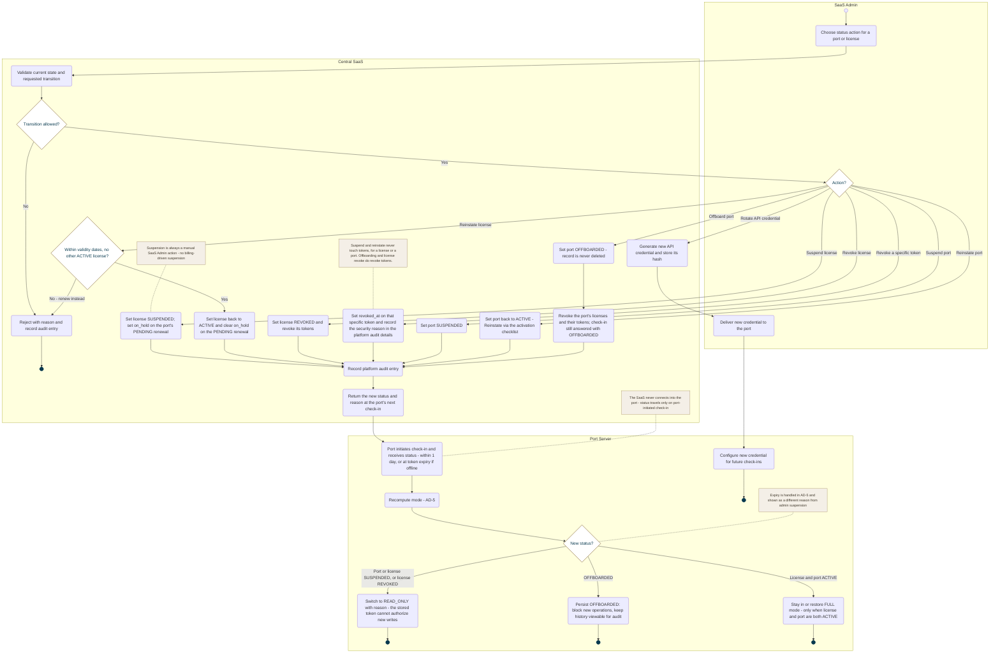
```mermaid
flowchart TD
    subgraph L_SA["SaaS Admin"]
        direction TB
        START@{ shape: sm-circ }
        A1("Choose status action for a port or license")
        D1{"Action?"}
        A12("Deliver new credential to the port")
    end
    subgraph L_SAAS["Central SaaS"]
        direction TB
        S0("Validate current state and requested transition")
        D4{"Transition allowed?"}
        A13("Reject with reason and record audit entry")
        STOP1@{ shape: fr-circ }
        D5{"Within validity dates, no other ACTIVE license?"}
        A2("Set license SUSPENDED; set on_hold on the port's PENDING renewal")
        A3("Set license back to ACTIVE and clear on_hold on the PENDING renewal")
        A4("Set license REVOKED and revoke its tokens")
        A5("Set revoked_at on that specific token and record the security reason in the platform audit details")
        A6("Set port SUSPENDED")
        A15("Set port back to ACTIVE - Reinstate via the activation checklist")
        A7("Set port OFFBOARDED - record is never deleted")
        A14("Revoke the port's licenses and their tokens; check-in still answered with OFFBOARDED")
        A8("Generate new API credential and store its hash")
        A9("Record platform audit entry")
        A10("Return the new status and reason at the port's next check-in")
        N6["Suspend and reinstate never touch tokens, for a license or a port. Offboarding and license revoke do revoke tokens."]
        N2["Suspension is always a manual SaaS Admin action - no billing-driven suspension"]
        N4["The SaaS never connects into the port - status travels only on port-initiated check-in"]
    end
    subgraph L_SRV["Port Server"]
        direction TB
        P1("Port initiates check-in and receives status - within 1 day, or at token expiry if offline")
        P2("Recompute mode - AD-5")
        D3{"New status?"}
        P3("Switch to READ_ONLY with reason - the stored token cannot authorize new writes")
        STOP3@{ shape: fr-circ }
        P6("Persist OFFBOARDED: block new operations, keep history viewable for audit")
        STOP4@{ shape: fr-circ }
        P4("Stay in or restore FULL mode - only when license and port are both ACTIVE")
        STOP5@{ shape: fr-circ }
        P5("Configure new credential for future check-ins")
        STOP2@{ shape: fr-circ }
        N3["Expiry is handled in AD-5 and shown as a different reason from admin suspension"]
    end
    START --> A1 --> S0 --> D4
    D4 -->|"No"| A13 --> STOP1
    D4 -->|"Yes"| D1
    D1 -->|"Suspend license"| A2 --> A9
    D1 -->|"Reinstate license"| D5
    D5 -->|"No - renew instead"| A13
    D5 -->|"Yes"| A3 --> A9
    D1 -->|"Revoke license"| A4 --> A9
    D1 -->|"Revoke a specific token"| A5 --> A9
    D1 -->|"Suspend port"| A6 --> A9
    D1 -->|"Reinstate port"| A15 --> A9
    D1 -->|"Offboard port"| A7 --> A14 --> A9
    D1 -->|"Rotate API credential"| A8 --> A12 --> P5 --> STOP2
    A9 --> A10 --> P1 --> P2 --> D3
    D3 -->|"Port or license SUSPENDED, or license REVOKED"| P3 --> STOP3
    D3 -->|"OFFBOARDED"| P6 --> STOP4
    D3 -->|"License and port ACTIVE"| P4 --> STOP5
    N6 -.- A5
    N2 -.- A2
    N3 -.- D3
    N4 -.- P1
    classDef term fill:#083A4F,stroke:#083A4F,color:#083A4F
    classDef bar fill:#083A4F,stroke:#083A4F
    classDef dec fill:#FFFFFF,stroke:#A58D66,stroke-width:2px,color:#083A4F
    classDef note fill:#F4EFE7,stroke:#A58D66,color:#3B3326,font-size:13px
    class START,STOP1,STOP2,STOP3,STOP4,STOP5 term
    class D1,D3,D4,D5 dec
    class N2,N3,N4,N6 note
```

### AD-4 — Annual subscription billing

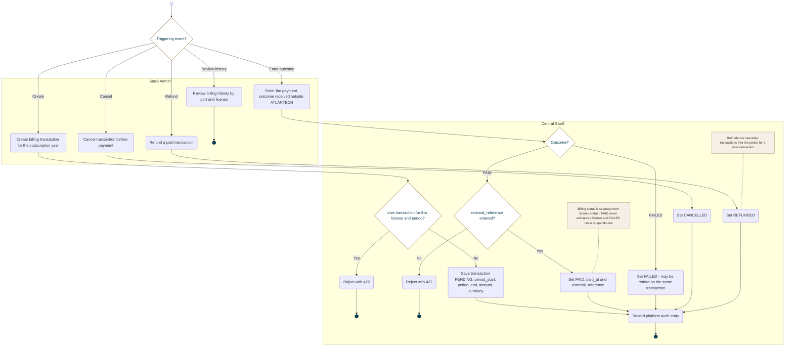
```mermaid
flowchart TD
    START@{ shape: sm-circ }
    D0{"Triggering event?"}
    subgraph L_SA["SaaS Admin"]
        direction TB
        A1("Create billing transaction for the subscription year")
        A4("Enter the payment outcome received outside ATLANTECH")
        A8("Cancel transaction before payment")
        A7("Refund a paid transaction")
        A10("Review billing history by port and license")
        STOP3@{ shape: fr-circ }
    end
    subgraph L_SAAS["Central SaaS"]
        direction TB
        D1{"Live transaction for this license and period?"}
        A2("Reject with 422")
        STOP1@{ shape: fr-circ }
        A3("Save transaction PENDING: period_start, period_end, amount, currency")
        D2{"Outcome?"}
        D12{"external_reference entered?"}
        A20("Reject with 422")
        STOP2@{ shape: fr-circ }
        A6("Set PAID, paid_at and external_reference")
        A11("Set FAILED - may be retried on the same transaction")
        A9("Set REFUNDED")
        A12("Set CANCELLED")
        A14("Record platform audit entry")
        STOP4@{ shape: fr-circ }
        N1["Billing status is separate from license status - PAID never activates a license and FAILED never suspends one"]
        N4["Refunded or cancelled transactions free the period for a new transaction"]
    end
    START --> D0
    D0 -->|"Create"| A1 --> D1
    D1 -->|"Yes"| A2 --> STOP1
    D1 -->|"No"| A3 --> A14
    D0 -->|"Enter outcome"| A4 --> D2
    D2 -->|"PAID"| D12
    D12 -->|"No"| A20 --> STOP2
    D12 -->|"Yes"| A6 --> A14
    D2 -->|"FAILED"| A11 --> A14
    D0 -->|"Cancel"| A8 --> A12 --> A14
    D0 -->|"Refund"| A7 --> A9 --> A14
    D0 -->|"Review history"| A10 --> STOP3
    A14 --> STOP4
    N1 -.- A6
    N4 -.- A9
    classDef term fill:#083A4F,stroke:#083A4F,color:#083A4F
    classDef bar fill:#083A4F,stroke:#083A4F
    classDef dec fill:#FFFFFF,stroke:#A58D66,stroke-width:2px,color:#083A4F
    classDef note fill:#F4EFE7,stroke:#A58D66,color:#3B3326,font-size:13px
    class START,STOP1,STOP2,STOP3,STOP4 term
    class D0,D1,D12,D2 dec
    class N1,N4 note
```

### AD-5 — Daily license check-in and license mode

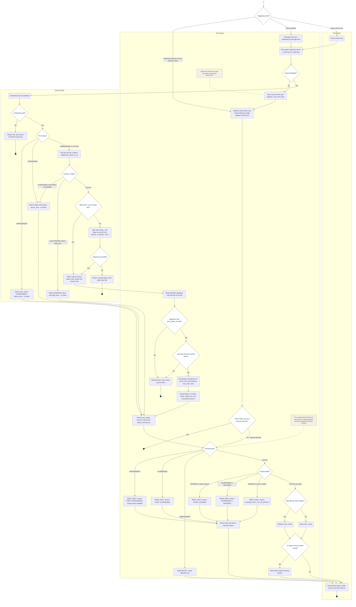
```mermaid
flowchart TD
    START@{ shape: sm-circ }
    D0{"Triggering event?"}
    subgraph L_PAD["Port Admin"]
        direction TB
        A1("Press Check now")
        A20("View license status, mode, reason and last check-in")
        STOP5@{ shape: fr-circ }
    end
    subgraph L_SRV["Port Server"]
        direction TB
        L1("Validate stored token and stored statuses locally against trusted time")
        D10{"Token valid, port and license ACTIVE?"}
        STOP1@{ shape: fr-circ }
        A2("Scheduler fires at a randomised overnight time")
        A3("Port sends outbound check-in with its API credential")
        D1{"SaaS reachable?"}
        A4("Keep current token and statuses, retry next cycle")
        A9("Verify Ed25519 signature with the key for its kid")
        D4{"Signature and port_public_id valid?"}
        D9{"iat newer than the stored token?"}
        A10("Discard token, log it, keep current token")
        STOP4@{ shape: fr-circ }
        A12("Re-baseline trusted time to server_time and advance max_seen_time")
        A23("Persist port_status, license_status and status_received_at")
        A13("Persist token, iat, limits, token_expires_at, last successful check-in")
        D13{"Port lifecycle?"}
        A25("READ_ONLY, reason PORT_OFFBOARDED; history stays viewable")
        A29("READ_ONLY, reason PORT_SUSPENDED")
        A26("Mode SETUP - setup allowlist only")
        D6{"License state?"}
        A14("READ_ONLY, reason TOKEN_EXPIRED")
        A21("READ_ONLY, reason SUSPENDED or REVOKED")
        A27("READ_ONLY, reason LICENSE_NOT_YET_IN_EFFECT")
        D7{"Was READ_ONLY before?"}
        A15("Restore FULL mode")
        A16("Keep FULL mode")
        D8{"14 days or less to token expiry?"}
        A17("Show token-expiry warning banner")
        A18("Show read-only banner with the reason")
        N3["Internet loss alone never stops work; token expiry forces READ_ONLY"]
        N4["FULL needs license ACTIVE and port ACTIVE; a suspended port is reinstated through the activation checklist"]
    end
    subgraph L_SAAS["Central SaaS"]
        direction TB
        A5("Authenticate port credential")
        D2{"Credential valid?"}
        A6("Return 401 and record SYSTEM audit entry")
        STOP2@{ shape: fr-circ }
        D12{"Port status?"}
        A24("Return port_status OFFBOARDED, server_time - no token")
        A22("Return status and reason, server_time - no token")
        A7("Find the license in effect; update last_check_in_at")
        D11{"License in effect?"}
        A28("Return PENDING status and valid_from - no token")
        D3{"Valid token, over 14 days left?"}
        A8("Sign token lazily - first token of an ACTIVE license, or refresh - AD-2")
        D14{"Signing succeeded?"}
        A30("Return existing token if still valid, else 503")
        STOP3@{ shape: fr-circ }
        A19("Return token, license status, port_status and server_time")
    end
    START --> D0
    D0 -->|"Protected request or local periodic check"| L1 --> D10
    D10 -->|"Yes"| STOP1
    D10 -->|"No - request blocked"| D13
    D0 -->|"Daily schedule"| A2 --> A3
    D0 -->|"Admin check now"| A1 --> A3
    A3 --> D1
    D1 -->|"No"| A4 --> L1
    D1 -->|"Yes"| A5 --> D2
    D2 -->|"No"| A6 --> STOP2
    D2 -->|"Yes"| D12
    D12 -->|"OFFBOARDED"| A24 --> A23
    D12 -->|"SUSPENDED"| A22
    D12 -->|"ONBOARDING or ACTIVE"| A7 --> D11
    D11 -->|"SUSPENDED, REVOKED or EXPIRED"| A22 --> A23
    D11 -->|"Only PENDING before valid_from"| A28 --> A23
    D11 -->|"ACTIVE"| D3
    D3 -->|"Yes"| A19
    D3 -->|"No"| A8 --> D14
    D14 -->|"Yes"| A19
    D14 -->|"No"| A30 --> STOP3
    A19 --> A9 --> D4
    D4 -->|"No"| A10
    D4 -->|"Yes"| D9
    D9 -->|"No"| A10
    A10 --> STOP4
    D9 -->|"Yes"| A12 --> A13 --> A23
    A23 --> D13
    D13 -->|"OFFBOARDED"| A25 --> A18
    D13 -->|"SUSPENDED"| A29 --> A18
    D13 -->|"ONBOARDING"| A26 --> A20
    D13 -->|"ACTIVE"| D6
    D6 -->|"EXPIRED or token expired"| A14 --> A18
    D6 -->|"SUSPENDED or REVOKED"| A21 --> A18
    D6 -->|"PENDING not yet in effect"| A27 --> A18
    D6 -->|"ACTIVE and valid"| D7
    D7 -->|"Yes"| A15 --> D8
    D7 -->|"No"| A16 --> D8
    D8 -->|"Yes"| A17 --> A20
    D8 -->|"No"| A20
    A18 --> A20
    A20 --> STOP5
    N3 -.- A4
    N4 -.- D13
    classDef term fill:#083A4F,stroke:#083A4F,color:#083A4F
    classDef bar fill:#083A4F,stroke:#083A4F
    classDef dec fill:#FFFFFF,stroke:#A58D66,stroke-width:2px,color:#083A4F
    classDef note fill:#F4EFE7,stroke:#A58D66,color:#3B3326,font-size:13px
    class START,STOP1,STOP2,STOP3,STOP4,STOP5 term
    class D0,D1,D10,D11,D12,D13,D14,D2,D3,D4,D6,D7,D8,D9 dec
    class N3,N4 note
```

### AD-6 — Manual license token and read-only enforcement

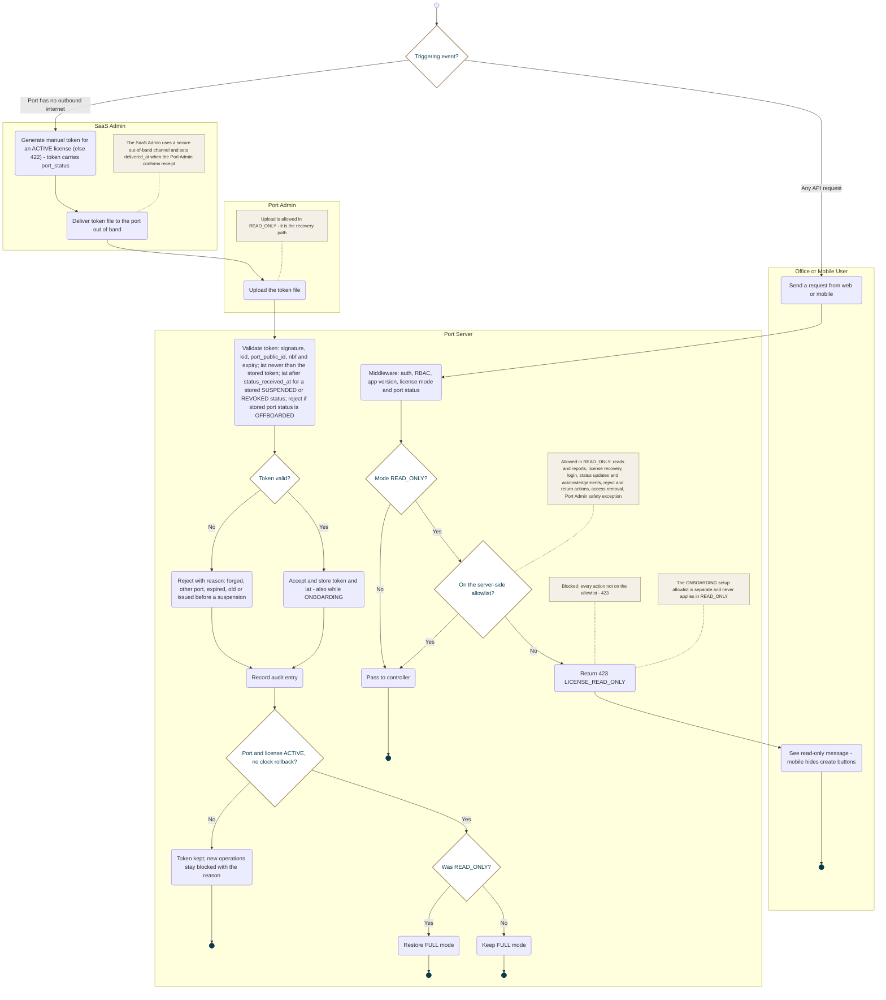
```mermaid
flowchart TD
    START@{ shape: sm-circ }
    D0{"Triggering event?"}
    subgraph L_SA["SaaS Admin"]
        direction TB
        A1("Generate manual token for an ACTIVE license (else 422) - token carries port_status")
        A2("Deliver token file to the port out of band")
        N1["The SaaS Admin uses a secure out-of-band channel and sets delivered_at when the Port Admin confirms receipt"]
    end
    subgraph L_PAD["Port Admin"]
        direction TB
        A3("Upload the token file")
        N2["Upload is allowed in READ_ONLY - it is the recovery path"]
    end
    subgraph L_USR["Office or Mobile User"]
        direction TB
        U1("Send a request from web or mobile")
        U2("See read-only message - mobile hides create buttons")
        STOP5@{ shape: fr-circ }
    end
    subgraph L_SRV["Port Server"]
        direction TB
        A4("Validate token: signature, kid, port_public_id, nbf and expiry; iat newer than the stored token; iat after status_received_at for a stored SUSPENDED or REVOKED status; reject if stored port status is OFFBOARDED")
        D1{"Token valid?"}
        A5("Reject with reason: forged, other port, expired, old or issued before a suspension")
        A9("Record audit entry")
        A6("Accept and store token and iat - also while ONBOARDING")
        D5{"Port and license ACTIVE, no clock rollback?"}
        A10("Token kept; new operations stay blocked with the reason")
        STOP1@{ shape: fr-circ }
        D2{"Was READ_ONLY?"}
        A7("Restore FULL mode")
        STOP2@{ shape: fr-circ }
        A8("Keep FULL mode")
        STOP3@{ shape: fr-circ }
        M1("Middleware: auth, RBAC, app version, license mode and port status")
        D3{"Mode READ_ONLY?"}
        D4{"On the server-side allowlist?"}
        M2("Pass to controller")
        STOP4@{ shape: fr-circ }
        M3("Return 423 LICENSE_READ_ONLY")
        N3["Allowed in READ_ONLY: reads and reports, license recovery, login, status updates and acknowledgements, reject and return actions, access removal, Port Admin safety exception"]
        N4["Blocked: every action not on the allowlist - 423"]
        N6["The ONBOARDING setup allowlist is separate and never applies in READ_ONLY"]
    end
    START --> D0
    D0 -->|"Port has no outbound internet"| A1 --> A2 --> A3 --> A4 --> D1
    D1 -->|"No"| A5 --> A9
    D1 -->|"Yes"| A6 --> A9 --> D5
    D5 -->|"No"| A10 --> STOP1
    D5 -->|"Yes"| D2
    D2 -->|"Yes"| A7 --> STOP2
    D2 -->|"No"| A8 --> STOP3
    D0 -->|"Any API request"| U1 --> M1 --> D3
    D3 -->|"No"| M2 --> STOP4
    D3 -->|"Yes"| D4
    D4 -->|"Yes"| M2
    D4 -->|"No"| M3 --> U2 --> STOP5
    N1 -.- A2
    N2 -.- A3
    N3 -.- D4
    N4 -.- M3
    N6 -.- M3
    classDef term fill:#083A4F,stroke:#083A4F,color:#083A4F
    classDef bar fill:#083A4F,stroke:#083A4F
    classDef dec fill:#FFFFFF,stroke:#A58D66,stroke-width:2px,color:#083A4F
    classDef note fill:#F4EFE7,stroke:#A58D66,color:#3B3326,font-size:13px
    class START,STOP1,STOP2,STOP3,STOP4,STOP5 term
    class D0,D1,D2,D3,D4,D5 dec
    class N1,N2,N3,N4,N6 note
```

### AD-7 — SaaS platform administration

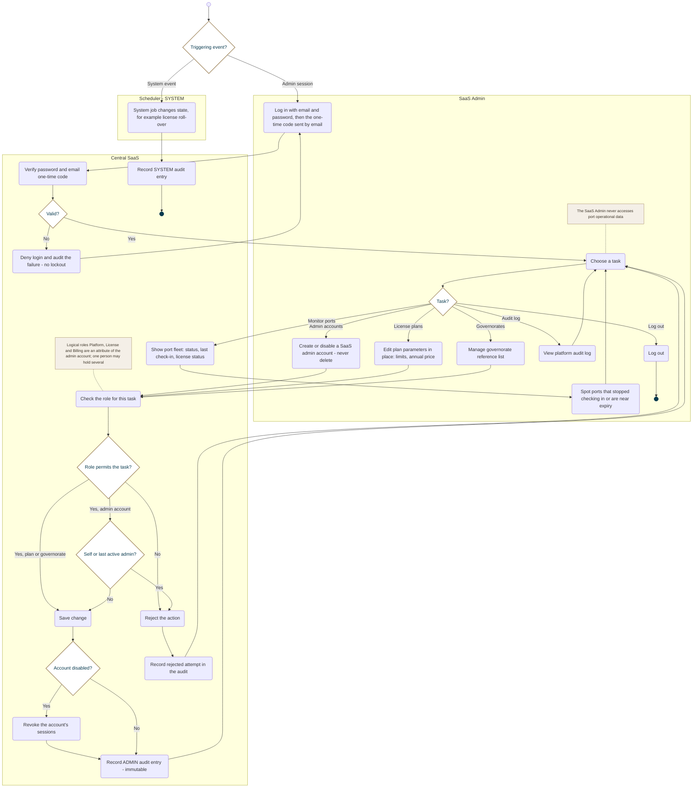
```mermaid
flowchart TD
    START@{ shape: sm-circ }
    D0{"Triggering event?"}
    subgraph L_SA["SaaS Admin"]
        direction TB
        A1("Log in with email and password, then the one-time code sent by email")
        A2("Choose a task")
        D2{"Task?"}
        A3("Create or disable a SaaS admin account - never delete")
        A4("Edit plan parameters in place: limits, annual price")
        A5("Manage governorate reference list")
        A6("View platform audit log")
        A8("Spot ports that stopped checking in or are near expiry")
        A9("Log out")
        STOP1@{ shape: fr-circ }
        N1["The SaaS Admin never accesses port operational data"]
    end
    subgraph L_SAAS["Central SaaS"]
        direction TB
        S1("Verify password and email one-time code")
        D1{"Valid?"}
        S2("Deny login and audit the failure - no lockout")
        S7("Check the role for this task")
        D3{"Role permits the task?"}
        S8("Reject the action")
        D4{"Self or last active admin?"}
        S3("Save change")
        D6{"Account disabled?"}
        S10("Revoke the account's sessions")
        S4("Record ADMIN audit entry - immutable")
        S11("Record rejected attempt in the audit")
        S5("Show port fleet: status, last check-in, license status")
        S6("Record SYSTEM audit entry")
        STOP2@{ shape: fr-circ }
        N2["Logical roles Platform, License and Billing are an attribute of the admin account; one person may hold several"]
    end
    subgraph L_SCH["Scheduler - SYSTEM"]
        direction TB
        J1("System job changes state, for example license roll-over")
    end
    START --> D0
    D0 -->|"Admin session"| A1 --> S1 --> D1
    D1 -->|"No"| S2 --> A1
    D1 -->|"Yes"| A2 --> D2
    D2 -->|"Admin accounts"| A3 --> S7
    D2 -->|"License plans"| A4 --> S7
    D2 -->|"Governorates"| A5 --> S7
    D2 -->|"Audit log"| A6 --> A2
    D2 -->|"Monitor ports"| S5 --> A8 --> A2
    D2 -->|"Log out"| A9 --> STOP1
    S7 --> D3
    D3 -->|"No"| S8 --> S11 --> A2
    D3 -->|"Yes, admin account"| D4
    D3 -->|"Yes, plan or governorate"| S3
    D4 -->|"Yes"| S8
    D4 -->|"No"| S3
    S3 --> D6
    D6 -->|"Yes"| S10 --> S4
    D6 -->|"No"| S4
    S4 --> A2
    D0 -->|"System event"| J1 --> S6 --> STOP2
    N1 -.- A2
    N2 -.- S7
    classDef term fill:#083A4F,stroke:#083A4F,color:#083A4F
    classDef bar fill:#083A4F,stroke:#083A4F
    classDef dec fill:#FFFFFF,stroke:#A58D66,stroke-width:2px,color:#083A4F
    classDef note fill:#F4EFE7,stroke:#A58D66,color:#3B3326,font-size:13px
    class START,STOP1,STOP2 term
    class D0,D1,D2,D3,D4,D6 dec
    class N1,N2 note
```

### AD-20 — TLS certificate renewal and remote support

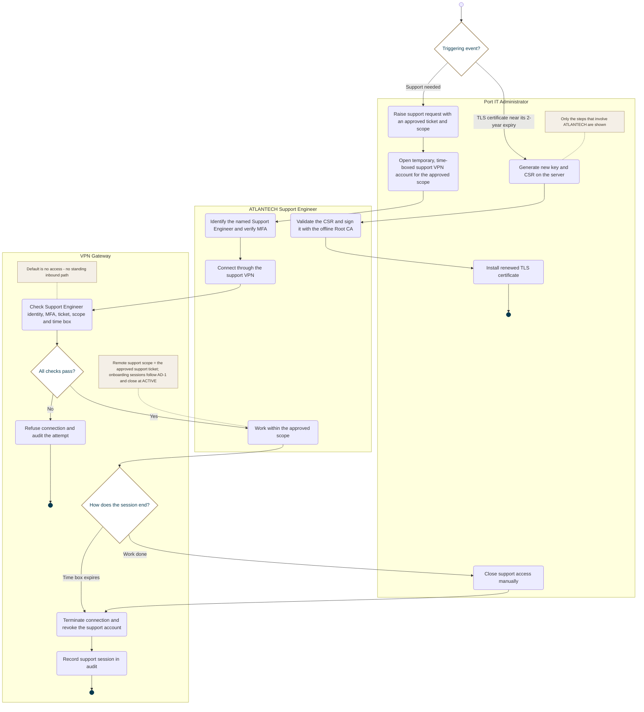
```mermaid
flowchart TD
    START@{ shape: sm-circ }
    D0{"Triggering event?"}
    subgraph L_PIT["Port IT Administrator"]
        direction TB
        C1("Generate new key and CSR on the server")
        C3("Install renewed TLS certificate")
        STOP1@{ shape: fr-circ }
        S1("Raise support request with an approved ticket and scope")
        S2("Open temporary, time-boxed support VPN account for the approved scope")
        S7("Close support access manually")
        N1["Only the steps that involve ATLANTECH are shown"]
    end
    subgraph L_SE["ATLANTECH Support Engineer"]
        direction TB
        C2("Validate the CSR and sign it with the offline Root CA")
        S10("Identify the named Support Engineer and verify MFA")
        S3("Connect through the support VPN")
        S5("Work within the approved scope")
    end
    subgraph L_VPN["VPN Gateway"]
        direction TB
        S4("Check Support Engineer identity, MFA, ticket, scope and time box")
        D2{"All checks pass?"}
        S6("Refuse connection and audit the attempt")
        STOP2@{ shape: fr-circ }
        D3{"How does the session end?"}
        S8("Terminate connection and revoke the support account")
        S9("Record support session in audit")
        STOP3@{ shape: fr-circ }
        N2["Default is no access - no standing inbound path"]
        N3["Remote support scope = the approved support ticket; onboarding sessions follow AD-1 and close at ACTIVE"]
    end
    START --> D0
    D0 -->|"TLS certificate near its 2-year expiry"| C1 --> C2 --> C3 --> STOP1
    D0 -->|"Support needed"| S1 --> S2 --> S10 --> S3 --> S4 --> D2
    D2 -->|"No"| S6 --> STOP2
    D2 -->|"Yes"| S5 --> D3
    D3 -->|"Time box expires"| S8
    D3 -->|"Work done"| S7 --> S8
    S8 --> S9 --> STOP3
    N1 -.- C1
    N2 -.- S4
    N3 -.- S5
    classDef term fill:#083A4F,stroke:#083A4F,color:#083A4F
    classDef bar fill:#083A4F,stroke:#083A4F
    classDef dec fill:#FFFFFF,stroke:#A58D66,stroke-width:2px,color:#083A4F
    classDef note fill:#F4EFE7,stroke:#A58D66,color:#3B3326,font-size:13px
    class START,STOP1,STOP2,STOP3 term
    class D0,D2,D3 dec
    class N1,N2,N3 note
```

## Category 2 — Port Setup, Operations and Recommendation

### AD-8 — BAPLIE upload, parsing and correction

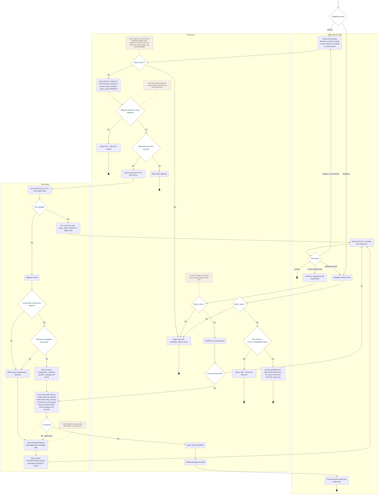
```mermaid
flowchart TD
    START@{ shape: sm-circ }
    D0{"Triggering event?"}
    subgraph L_STAFF["Port Authority Staff"]
        direction TB
        A1("Select the Berthing Request, or leave it empty for auto-match, and upload the BAPLIE file")
        A10("Review the error message and diagnostics")
        D5{"Next step?"}
        STOP4@{ shape: fr-circ }
        A15("Correct or supplement the staged data")
        W0("Withdraw a BAPLIE file")
        A14("Review parsed vessel and cargo data")
        STOP5@{ shape: fr-circ }
    end
    subgraph L_SRV["Port Server"]
        direction TB
        D1{"READ_ONLY?"}
        A2("Reject with 423 LICENSE_READ_ONLY")
        STOP1@{ shape: fr-circ }
        A3("Store the file, compute its SHA-256 hash, create the record: status STAGED, parse_status PENDING")
        DM{"Request selected or auto-matched?"}
        AM("Reject 422 - select the request")
        STOP2@{ shape: fr-circ }
        D2{"Duplicate file for this request?"}
        A4("Reject 409 duplicate")
        STOP3@{ shape: fr-circ }
        A5("Queue parse job for the EDI Parser")
        DC{"READ_ONLY?"}
        V1("Validate the corrected data")
        DV{"Corrected data valid?"}
        A20("parse_status PARSED")
        A13("Notify dashboard via SSE")
        DWR{"READ_ONLY?"}
        DW{"File used by a PLAN_CONFIRMED plan?"}
        W3("Return 409 - cancel the plan first")
        STOP6@{ shape: fr-circ }
        W2("Set WITHDRAWN; the latest REPLACED file of the request becomes ACTIVE; audit entry")
        STOP7@{ shape: fr-circ }
        N1["BAPLIE upload is a new write and is blocked in READ_ONLY. Duplicate = same SHA-256 hash for the same request, earlier copy not WITHDRAWN"]
        N4["Correction, withdraw and vessel edit are blocked in READ_ONLY (423)"]
        N5["Auto-match needs exactly one request with the same IMO and an ETA within 24 h"]
    end
    subgraph L_EDI["EDI Parser"]
        direction TB
        A6("Parse BAPLIE per D.17A and SMDG 2019")
        DR{"File readable?"}
        A21("File cannot be read - parse_status FAILED, no staged data")
        A7("Validate content")
        DI{"Vessel IMO matches the request?"}
        D3{"Parsing and validation successful?"}
        A8("Write specific diagnostics - blocking")
        A9("Save extracted payload and diagnostics as staged data")
        A19("parse_status QUARANTINED (staged data kept) and log the reason")
        A11("Extract vessel configuration, container manifest, stowage and timing")
        A12("In one transaction: find-or-create vessel by IMO (fill empty fields only), previous ACTIVE file of the request becomes REPLACED, save containers, file ACTIVE")
        D7{"Committed?"}
        N3["A failed import is never published downstream as a partial result"]
    end
    START --> D0
    D0 -->|"Upload"| A1 --> D1
    D1 -->|"Yes"| A2 --> STOP1
    D1 -->|"No"| A3 --> DM
    DM -->|"No"| AM --> STOP2
    DM -->|"Yes"| D2
    D2 -->|"Yes"| A4 --> STOP3
    D2 -->|"No"| A5 --> A6 --> DR
    DR -->|"No"| A21 --> A10
    DR -->|"Yes"| A7 --> DI
    DI -->|"No"| A8
    DI -->|"Yes"| D3
    D3 -->|"No"| A8 --> A9 --> A19 --> A10 --> D5
    D5 -->|"Correct staged data"| A15 --> DC
    DC -->|"Yes"| A2
    DC -->|"No"| V1 --> DV
    DV -->|"No"| A10
    DV -->|"Yes"| A12
    D5 -->|"Upload a corrected file"| A1
    D5 -->|"Withdraw the file"| W0
    D5 -->|"Leave it"| STOP4
    D3 -->|"Yes"| A11 --> A12 --> D7
    D7 -->|"No - rolled back"| A9
    D7 -->|"Yes"| A20 --> A13 --> A14 --> STOP5
    D0 -->|"Withdraw"| W0 --> DWR
    DWR -->|"Yes"| A2
    DWR -->|"No"| DW
    DW -->|"Yes"| W3 --> STOP6
    DW -->|"No"| W2 --> STOP7
    N1 -.- D1
    N4 -.- DC
    N3 -.- A9
    N5 -.- DM
    classDef term fill:#083A4F,stroke:#083A4F,color:#083A4F
    classDef bar fill:#083A4F,stroke:#083A4F
    classDef dec fill:#FFFFFF,stroke:#A58D66,stroke-width:2px,color:#083A4F
    classDef note fill:#F4EFE7,stroke:#A58D66,color:#3B3326,font-size:13px
    class START,STOP1,STOP2,STOP3,STOP4,STOP5,STOP6,STOP7 term
    class D0,D1,D2,D3,D5,D7,DC,DI,DM,DR,DV,DW,DWR dec
    class N1,N3,N4,N5 note
```

### AD-9 — Berthing request lifecycle

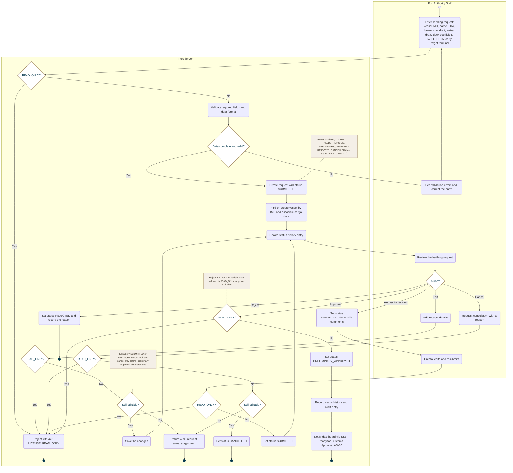
```mermaid
flowchart TD
    subgraph L_STAFF["Port Authority Staff"]
        direction TB
        START@{ shape: sm-circ }
        A1("Enter berthing request: vessel IMO, name, LOA, beam, max draft, arrival draft, block coefficient, DWT, GT, ETA, cargo, target terminal")
        A20("See validation errors and correct the entry")
        A8("Review the berthing request")
        D3{"Action?"}
        A9("Edit request details")
        AC("Request cancellation with a reason")
        AR("Creator edits and resubmits")
    end
    subgraph L_SRV["Port Server"]
        direction TB
        D2{"READ_ONLY?"}
        A2("Reject with 423 LICENSE_READ_ONLY")
        STOP1@{ shape: fr-circ }
        A19("Validate required fields and data format")
        D8{"Data complete and valid?"}
        A5("Create request with status SUBMITTED")
        A6("Find-or-create vessel by IMO and associate cargo data")
        A7("Record status history entry")
        DE1{"READ_ONLY?"}
        DE2{"Still editable?"}
        AS("Save the changes")
        DC1{"READ_ONLY?"}
        DC2{"Still editable?"}
        A409("Return 409 - request already approved")
        STOP2@{ shape: fr-circ }
        A10("Set status CANCELLED")
        STOP3@{ shape: fr-circ }
        A11("Set status NEEDS_REVISION with comments")
        DR1{"READ_ONLY?"}
        AR2("Set status SUBMITTED")
        A12("Set status REJECTED and record the reason")
        STOP4@{ shape: fr-circ }
        D4{"READ_ONLY?"}
        A15("Set status PRELIMINARY_APPROVED")
        A16("Record status history and audit entry")
        A17("Notify dashboard via SSE - ready for Customs Approval, AD-10")
        STOP5@{ shape: fr-circ }
        N1["Status vocabulary: SUBMITTED, NEEDS_REVISION, PRELIMINARY_APPROVED, REJECTED, CANCELLED (later states in AD-10 to AD-12)"]
        N2["Editable = SUBMITTED or NEEDS_REVISION. Edit and cancel only before Preliminary Approval; afterwards 409"]
        N3["Reject and return for revision stay allowed in READ_ONLY; approve is blocked"]
    end
    START --> A1 --> D2
    D2 -->|"Yes"| A2 --> STOP1
    D2 -->|"No"| A19 --> D8
    D8 -->|"No"| A20 --> A1
    D8 -->|"Yes"| A5 --> A6 --> A7 --> A8 --> D3
    D3 -->|"Edit"| A9 --> DE1
    DE1 -->|"Yes"| A2
    DE1 -->|"No"| DE2
    DE2 -->|"No"| A409
    DE2 -->|"Yes"| AS --> A7
    D3 -->|"Cancel"| AC --> DC1
    DC1 -->|"Yes"| A2
    DC1 -->|"No"| DC2
    DC2 -->|"No"| A409 --> STOP2
    DC2 -->|"Yes"| A10 --> STOP3
    D3 -->|"Return for revision"| A11 --> AR --> DR1
    DR1 -->|"Yes"| A2
    DR1 -->|"No"| AR2 --> A7
    D3 -->|"Reject"| A12 --> STOP4
    D3 -->|"Approve"| D4
    D4 -->|"Yes"| A2
    D4 -->|"No"| A15 --> A16 --> A17 --> STOP5
    N1 -.- A5
    N2 -.- DE2
    N3 -.- D4
    classDef term fill:#083A4F,stroke:#083A4F,color:#083A4F
    classDef bar fill:#083A4F,stroke:#083A4F
    classDef dec fill:#FFFFFF,stroke:#A58D66,stroke-width:2px,color:#083A4F
    classDef note fill:#F4EFE7,stroke:#A58D66,color:#3B3326,font-size:13px
    class START,STOP1,STOP2,STOP3,STOP4,STOP5 term
    class D2,D3,D4,D8,DC1,DC2,DE1,DE2,DR1 dec
    class N1,N2,N3 note
```

### AD-10 — Customs approval, entry window and environmental data

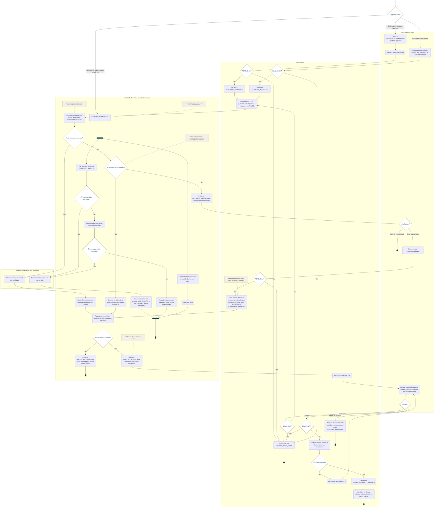
```mermaid
flowchart TD
    START@{ shape: sm-circ }
    D0{"Triggering event?"}
    subgraph L_STAFF["Port Authority Staff"]
        direction TB
        A1("Open a PRELIMINARY_APPROVED berthing request")
        A2("Record Customs Approval")
        D8{"Staff action?"}
        STOP3@{ shape: fr-circ }
        A28("Enter manual environmental data")
        A17("Review proposed windows, blocked periods, conditions and data timestamp")
        D5{"Decision?"}
        RO1("Reopen a confirmed entry window with a reason - no confirmed plan yet")
    end
    subgraph L_SRV["Port Server"]
        direction TB
        D1{"READ_ONLY?"}
        A3("Reject with 423 LICENSE_READ_ONLY")
        STOP2@{ shape: fr-circ }
        A4("Set status CUSTOMS_APPROVED")
        A5("Create a Part 1 run QUEUED and enqueue it - 3 retries, then FAILED")
        DM{"READ_ONLY?"}
        A29("Store manual data as a forecast run with pull_type MANUAL, provider_rank MANUAL and submitted_by; audit entry")
        A16("Notify dashboard via SSE")
        D11{"READ_ONLY?"}
        A20("Confirm window - server re-checks status and constraints")
        DX{"Re-check passed?"}
        A409("Return 409 with the reason")
        A21("Set status ENTRY_WINDOW_CONFIRMED")
        A22("Hand the confirmed window and constraints to Part 2 - AD-11")
        STOP5@{ shape: fr-circ }
        AR("Proposal REJECTED with rejection_reason; request stays CUSTOMS_APPROVED")
        STOP6@{ shape: fr-circ }
        DRC{"READ_ONLY?"}
        DRO{"READ_ONLY?"}
        RO2("Set status CUSTOMS_APPROVED")
        N6["Manual data passes the same safety constraints - no bypass"]
    end
    subgraph L_AI1["AI Part 1 - Predictive and Environmental"]
        direction TB
        A6("Fetch environmental data for this request and compute tide in-house")
        D2{"Fresh retrieval successful?"}
        A8("Attach the retrieved data and its timestamp to this request")
        D7{"Stored data recent enough?"}
        A9("Use stored data with a stale-data warning and its timestamp")
        A24("Outcome ENV_DATA_UNAVAILABLE - staff submit manual data")
        A14("Aggregate demand and peak congestion from open requests")
        D9{"All constraints satisfied?"}
        A18("Outcome NO_FEASIBLE_WINDOW: show blocked periods and limiting factors")
        STOP4@{ shape: fr-circ }
        A15("Outcome WINDOWS_FOUND: write feasible windows and constraints")
        N1["Each request uses its own data - never another request's result"]
        N2["Part 1 never allocates berth, tug or pilot"]
        N5["Stored data counts only if measured within 48 h and covering the request horizon"]
        S1("Scheduled job fires in Part 1")
        FK2@{ shape: fork }
        S2("Pull weather, wave and surge data - every 6 h")
        D6{"Primary provider reachable?"}
        S8("Raise an alert and try the secondary provider")
        D6b{"Secondary provider reachable?"}
        S4("Store forecast run with provider_rank PRIMARY or SECONDARY and its timestamp")
        S5("Keep last stored data, mark data_stale, log the source failure")
        S6("Compute astronomical tide for a multi-day horizon - daily")
        S7("Store tide data")
        JN2@{ shape: fork }
        STOP1@{ shape: fr-circ }
        N4["The scheduler runs in Part 1, not in the web application"]
    end
    subgraph L_WX["Weather and Marine Data Providers"]
        direction TB
        A7("Return weather, wave and sea-level data")
        S3("Return weather, wave and surge data")
    end
    START --> D0
    D0 -->|"Schedule: 6-hourly weather or daily tide"| S1 --> FK2
    FK2 --> S2 --> D6
    D6 -->|"Yes"| S3 --> S4 --> JN2
    D6 -->|"No"| S8 --> D6b
    D6b -->|"Yes"| S3
    D6b -->|"No"| S5 --> JN2
    FK2 --> S6 --> S7 --> JN2
    JN2 --> STOP1
    D0 -->|"Staff records Customs Approval"| A1 --> A2 --> D1
    D1 -->|"Yes"| A3 --> STOP2
    D1 -->|"No"| A4 --> A5 --> A6 --> D2
    D2 -->|"Yes"| A7 --> A8 --> A14
    D2 -->|"No"| D7
    D7 -->|"Yes"| A9 --> A14
    D7 -->|"No"| A24 --> D8
    D8 -->|"Enter manual data"| A28 --> DM
    DM -->|"Yes"| A3
    DM -->|"No"| A29 --> A14
    D8 -->|"Not yet - request held"| STOP3
    A14 --> D9
    D9 -->|"No"| A18 --> STOP4
    D9 -->|"Yes"| A15 --> A16 --> A17 --> D5
    D5 -->|"Confirm"| D11
    D11 -->|"Yes"| A3
    D11 -->|"No"| A20 --> DX
    DX -->|"No"| A409 --> A17
    DX -->|"Yes"| A21 --> A22 --> STOP5
    D5 -->|"Reject all windows"| AR --> STOP6
    D5 -->|"Recompute"| DRC
    DRC -->|"Yes"| A3
    DRC -->|"No"| A5
    D0 -->|"Staff reopens the window"| RO1 --> DRO
    DRO -->|"Yes"| A3
    DRO -->|"No"| RO2 --> A5
    N1 -.- A6
    N2 -.- A15
    N4 -.- S1
    N5 -.- D7
    N6 -.- A29
    classDef term fill:#083A4F,stroke:#083A4F,color:#083A4F
    classDef bar fill:#083A4F,stroke:#083A4F
    classDef dec fill:#FFFFFF,stroke:#A58D66,stroke-width:2px,color:#083A4F
    classDef note fill:#F4EFE7,stroke:#A58D66,color:#3B3326,font-size:13px
    class START,STOP1,STOP2,STOP3,STOP4,STOP5,STOP6 term
    class FK2,JN2 bar
    class D0,D1,D11,D2,D5,D6,D6b,D7,D8,D9,DM,DRC,DRO,DX dec
    class N1,N2,N4,N5,N6 note
```

### AD-11 — Recommendation to confirmed operational plan

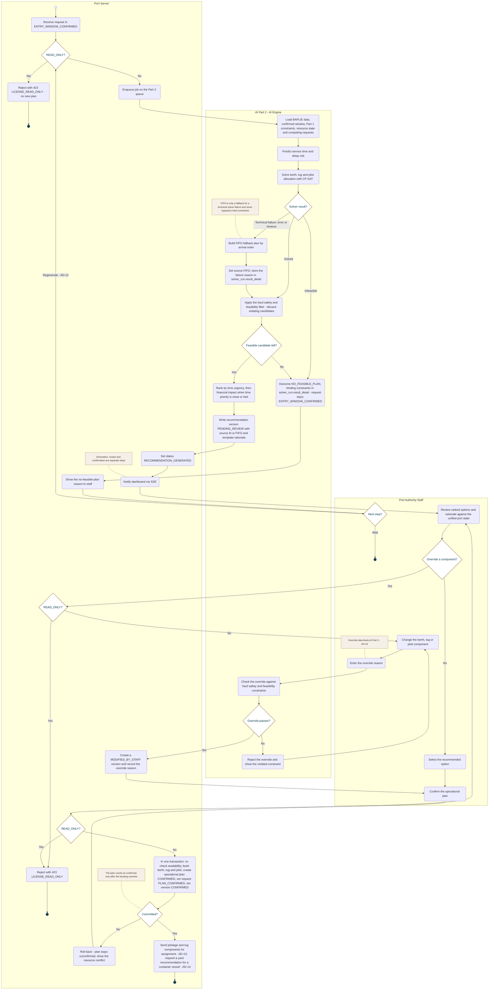
```mermaid
flowchart TD
    subgraph L_SRV["Port Server"]
        direction TB
        START@{ shape: sm-circ }
        A1("Receive request in ENTRY_WINDOW_CONFIRMED")
        D0{"READ_ONLY?"}
        A34("Reject with 423 LICENSE_READ_ONLY - no new plan")
        STOP1@{ shape: fr-circ }
        A2("Enqueue job on the Part 2 queue")
        A11("Set status RECOMMENDATION_GENERATED")
        A12("Notify dashboard via SSE")
        A24("Show the no-feasible-plan reason to staff")
        DO{"READ_ONLY?"}
        A16("Create a MODIFIED_BY_STAFF version and record the override reason")
        D4{"READ_ONLY?"}
        A19("Reject with 423 LICENSE_READ_ONLY")
        STOP3@{ shape: fr-circ }
        A20("In one transaction: re-check availability, book berth, tug and pilot, create operational plan CONFIRMED, set request PLAN_CONFIRMED, set version CONFIRMED")
        D7{"Committed?"}
        A35("Roll back - plan stays unconfirmed, show the resource conflict")
        A23("Send pilotage and tug components for assignment - AD-13; request a yard recommendation for a container vessel - AD-14")
        STOP4@{ shape: fr-circ }
        N3["Generation, review and confirmation are separate steps"]
        N4["The plan counts as confirmed only after the booking commits"]
    end
    subgraph L_AI2["AI Part 2 - AI Engine"]
        direction TB
        A3("Load BAPLIE data, confirmed window, Part 1 constraints, resource state and competing requests")
        A5("Predict service time and delay risk")
        A6("Solve berth, tug and pilot allocation with CP-SAT")
        D1{"Solver result?"}
        A30("Build FIFO fallback plan by arrival order")
        A31("Set source FIFO; store the failure reason in solver_run.result_detail")
        A4("Apply the hard safety and feasibility filter - discard violating candidates")
        D3{"Feasible candidate left?"}
        A7("Outcome NO_FEASIBLE_PLAN, binding constraints in solver_run.result_detail - request stays ENTRY_WINDOW_CONFIRMED")
        A8("Rank by time urgency, then financial impact when time priority is close or tied")
        A9("Write recommendation version PENDING_REVIEW with source AI or FIFO and template rationale")
        A32("Check the override against hard safety and feasibility constraints")
        D5{"Override passes?"}
        A33("Reject the override and show the violated constraint")
        N1["FIFO is only a fallback for a technical solver failure and never bypasses hard constraints"]
    end
    subgraph L_STAFF["Port Authority Staff"]
        direction TB
        D6{"Next step?"}
        STOP2@{ shape: fr-circ }
        A13("Review ranked options and rationale against the unified port state")
        D2{"Override a component?"}
        A14("Change the berth, tug or pilot component")
        A15("Enter the override reason")
        A17("Select the recommended option")
        A18("Confirm the operational plan")
        N2["Override data feeds AI Part 3 - AD-16"]
    end
    START --> A1 --> D0
    D0 -->|"Yes"| A34 --> STOP1
    D0 -->|"No"| A2 --> A3 --> A5 --> A6 --> D1
    D1 -->|"Solved"| A4
    D1 -->|"Technical failure: error or timeout"| A30 --> A31 --> A4
    D1 -->|"Infeasible"| A7
    A4 --> D3
    D3 -->|"No"| A7 --> A24 --> D6
    D6 -->|"Regenerate - AD-12"| D0
    D6 -->|"Wait"| STOP2
    D3 -->|"Yes"| A8 --> A9 --> A11 --> A12 --> A13 --> D2
    D2 -->|"Yes"| DO
    DO -->|"Yes"| A19
    DO -->|"No"| A14 --> A15 --> A32 --> D5
    D5 -->|"No"| A33 --> A14
    D5 -->|"Yes"| A16 --> A18
    D2 -->|"No"| A17 --> A18
    A18 --> D4
    D4 -->|"Yes"| A19 --> STOP3
    D4 -->|"No"| A20 --> D7
    D7 -->|"No"| A35 --> A13
    D7 -->|"Yes"| A23 --> STOP4
    N1 -.- A30
    N2 -.- A15
    N3 -.- A12
    N4 -.- D7
    classDef term fill:#083A4F,stroke:#083A4F,color:#083A4F
    classDef bar fill:#083A4F,stroke:#083A4F
    classDef dec fill:#FFFFFF,stroke:#A58D66,stroke-width:2px,color:#083A4F
    classDef note fill:#F4EFE7,stroke:#A58D66,color:#3B3326,font-size:13px
    class START,STOP1,STOP2,STOP3,STOP4 term
    class D0,D1,D2,D3,D4,D5,D6,D7,DO dec
    class N1,N2,N3,N4 note
```

### AD-12 — Regenerate recommendation, delay re-plan and cancel plan

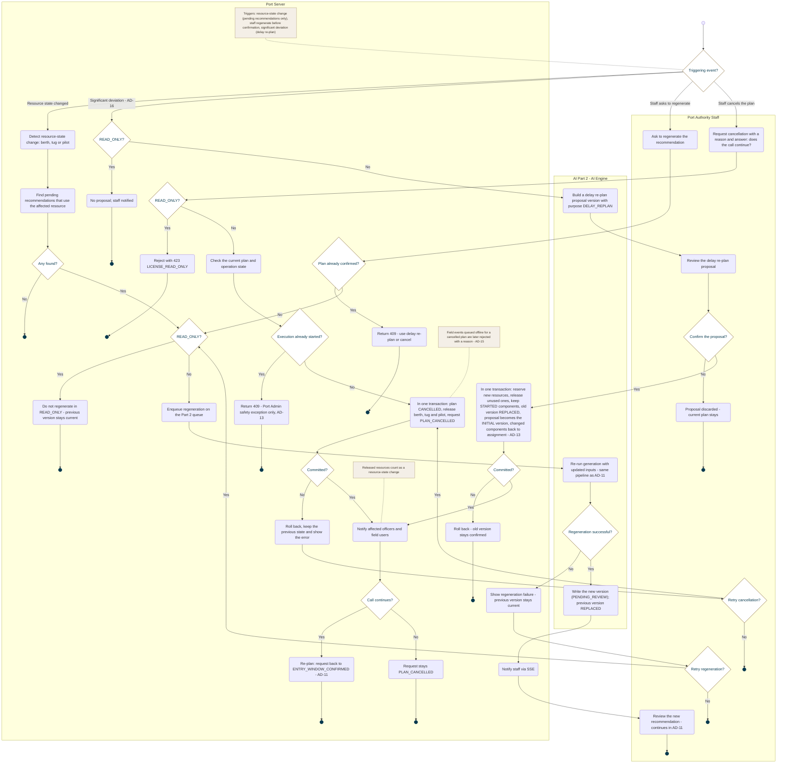
```mermaid
flowchart TD
    START@{ shape: sm-circ }
    D1{"Triggering event?"}
    subgraph L_SRV["Port Server"]
        direction TB
        A1("Detect resource-state change: berth, tug or pilot")
        A2("Find pending recommendations that use the affected resource")
        D2{"Any found?"}
        STOP1@{ shape: fr-circ }
        D8{"READ_ONLY?"}
        A21("Do not regenerate in READ_ONLY - previous version stays current")
        STOP2@{ shape: fr-circ }
        A4("Enqueue regeneration on the Part 2 queue")
        A6("Show regeneration failure - previous version stays current")
        A8("Notify staff via SSE")
        DG{"Plan already confirmed?"}
        G2("Return 409 - use delay re-plan or cancel")
        STOP5@{ shape: fr-circ }
        DR1{"READ_ONLY?"}
        R0("No proposal; staff notified")
        STOP6@{ shape: fr-circ }
        R3("In one transaction: reserve new resources, release unused ones, keep STARTED components, old version REPLACED, proposal becomes the INITIAL version, changed components back to assignment - AD-13")
        DR3{"Committed?"}
        R4("Roll back - old version stays confirmed")
        STOP8@{ shape: fr-circ }
        DC2{"READ_ONLY?"}
        A423("Reject with 423 LICENSE_READ_ONLY")
        STOP9@{ shape: fr-circ }
        A17("Check the current plan and operation state")
        D4{"Execution already started?"}
        A18("Return 409 - Port Admin safety exception only, AD-13")
        STOP10@{ shape: fr-circ }
        A11("In one transaction: plan CANCELLED, release berth, tug and pilot, request PLAN_CANCELLED")
        D5{"Committed?"}
        A19("Roll back, keep the previous state and show the error")
        A16("Notify affected officers and field users")
        DC{"Call continues?"}
        C1("Re-plan: request back to ENTRY_WINDOW_CONFIRMED - AD-11")
        STOP12@{ shape: fr-circ }
        C2("Request stays PLAN_CANCELLED")
        STOP13@{ shape: fr-circ }
        N1["Triggers: resource-state change (pending recommendations only), staff regenerate before confirmation, significant deviation (delay re-plan)"]
        N3["Released resources count as a resource-state change"]
        N4["Field events queued offline for a cancelled plan are later rejected with a reason - AD-15"]
    end
    subgraph L_AI2["AI Part 2 - AI Engine"]
        direction TB
        A5("Re-run generation with updated inputs - same pipeline as AD-11")
        D3{"Regeneration successful?"}
        A7("Write the new version (PENDING_REVIEW); previous version REPLACED")
        R1("Build a delay re-plan proposal version with purpose DELAY_REPLAN")
    end
    subgraph L_STAFF["Port Authority Staff"]
        direction TB
        A9("Review the new recommendation - continues in AD-11")
        STOP4@{ shape: fr-circ }
        D6{"Retry regeneration?"}
        STOP3@{ shape: fr-circ }
        G1("Ask to regenerate the recommendation")
        R2("Review the delay re-plan proposal")
        DR2{"Confirm the proposal?"}
        R5("Proposal discarded - current plan stays")
        STOP7@{ shape: fr-circ }
        A10("Request cancellation with a reason and answer: does the call continue?")
        D7{"Retry cancellation?"}
        STOP11@{ shape: fr-circ }
    end
    START --> D1
    D1 -->|"Resource state changed"| A1 --> A2 --> D2
    D2 -->|"No"| STOP1
    D2 -->|"Yes"| D8
    D8 -->|"Yes"| A21 --> STOP2
    D8 -->|"No"| A4 --> A5 --> D3
    D3 -->|"No"| A6 --> D6
    D6 -->|"Yes"| D8
    D6 -->|"No"| STOP3
    D3 -->|"Yes"| A7 --> A8 --> A9 --> STOP4
    D1 -->|"Staff asks to regenerate"| G1 --> DG
    DG -->|"Yes"| G2 --> STOP5
    DG -->|"No"| D8
    D1 -->|"Significant deviation - AD-16"| DR1
    DR1 -->|"Yes"| R0 --> STOP6
    DR1 -->|"No"| R1 --> R2 --> DR2
    DR2 -->|"No"| R5 --> STOP7
    DR2 -->|"Yes"| R3 --> DR3
    DR3 -->|"No"| R4 --> STOP8
    DR3 -->|"Yes"| A16
    D1 -->|"Staff cancels the plan"| A10 --> DC2
    DC2 -->|"Yes"| A423 --> STOP9
    DC2 -->|"No"| A17 --> D4
    D4 -->|"Yes"| A18 --> STOP10
    D4 -->|"No"| A11 --> D5
    D5 -->|"No"| A19 --> D7
    D7 -->|"Yes"| A11
    D7 -->|"No"| STOP11
    D5 -->|"Yes"| A16 --> DC
    DC -->|"Yes"| C1 --> STOP12
    DC -->|"No"| C2 --> STOP13
    N1 -.- D1
    N3 -.- A16
    N4 -.- A11
    classDef term fill:#083A4F,stroke:#083A4F,color:#083A4F
    classDef bar fill:#083A4F,stroke:#083A4F
    classDef dec fill:#FFFFFF,stroke:#A58D66,stroke-width:2px,color:#083A4F
    classDef note fill:#F4EFE7,stroke:#A58D66,color:#3B3326,font-size:13px
    class START,STOP1,STOP2,STOP3,STOP4,STOP5,STOP6,STOP7,STOP8,STOP9,STOP10,STOP11,STOP12,STOP13 term
    class D1,D2,D3,D4,D5,D6,D7,D8,DC,DC2,DG,DR1,DR2,DR3 dec
    class N1,N3,N4 note
```

### AD-13 — Dispatch, notification and acknowledgement

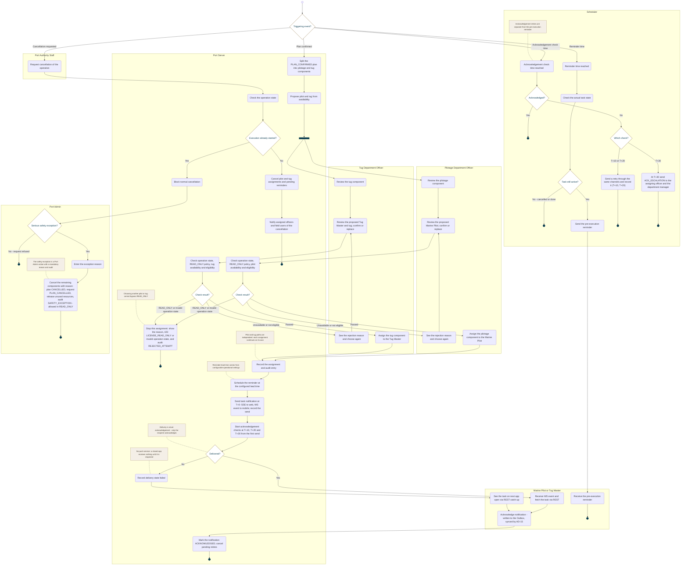
```mermaid
flowchart TD
    START@{ shape: sm-circ }
    D0{"Triggering event?"}
    subgraph L_SRV["Port Server"]
        direction TB
        A1("Split the PLAN_CONFIRMED plan into pilotage and tug components")
        A0("Propose pilot and tug from availability")
        FK1@{ shape: fork }
        V1("Check operation state, READ_ONLY policy, pilot availability and eligibility")
        DV1{"Check result?"}
        V2("Check operation state, READ_ONLY policy, tug availability and eligibility")
        DV2{"Check result?"}
        A26("Stop this assignment: show the reason, 423 LICENSE_READ_ONLY or invalid operation state, and audit REJECTED_ATTEMPT")
        STOP2@{ shape: fr-circ }
        A2("Record the assignment and audit entry")
        A24("Schedule the reminder at the configured lead time")
        A3("Send task notification at T+0: SSE to web, WS event to mobile; record the send")
        A25("Start acknowledgement checks at T+10, T+20 and T+30 from the first send")
        D1{"Delivered?"}
        A4("Record delivery state failed")
        A5("Mark the notification ACKNOWLEDGED; cancel pending retries")
        STOP1@{ shape: fr-circ }
        C1("Check the operation state")
        D5{"Execution already started?"}
        C2("Cancel pilot and tug assignments and pending reminders")
        C3("Notify assigned officers and field users of the cancellation")
        STOP8@{ shape: fr-circ }
        C4("Block normal cancellation")
        N1["No push service: a closed app receives nothing until it is reopened"]
        N6["Delivery is never acknowledgement - only the recipient acknowledges"]
        N3["Pilot and tug paths are independent: each assignment continues on its own"]
        N7["Choosing another pilot or tug cannot bypass READ_ONLY"]
        N2["Reminder lead time comes from configurable operational settings"]
    end
    subgraph L_STAFF["Port Authority Staff"]
        direction TB
        K1("Request cancellation of the operation")
    end
    subgraph L_PDO["Pilotage Department Officer"]
        direction TB
        P1("Review the pilotage component")
        P2("Review the proposed Marine Pilot; confirm or replace")
        P4("See the rejection reason and choose again")
        P3("Assign the pilotage component to the Marine Pilot")
    end
    subgraph L_TDO["Tug Department Officer"]
        direction TB
        T1("Review the tug component")
        T2("Review the proposed Tug Master and tug; confirm or replace")
        T4("See the rejection reason and choose again")
        T3("Assign the tug component to the Tug Master")
    end
    subgraph L_MU["Marine Pilot or Tug Master"]
        direction TB
        M1("Receive WS event and fetch the task via REST")
        M2("See the task on next app open via REST catch-up")
        M3("Acknowledge notification - written to the Outbox, synced by AD-15")
        M4("Receive the pre-execution reminder")
        STOP6@{ shape: fr-circ }
    end
    subgraph L_SCH["Scheduler"]
        direction TB
        S1("Reminder time reached")
        S3("Check the actual task state")
        D7{"Task still active?"}
        STOP7@{ shape: fr-circ }
        S2("Send the pre-execution reminder")
        Q1("Acknowledgement check time reached")
        D8{"Acknowledged?"}
        STOP3@{ shape: fr-circ }
        D9{"Which check?"}
        Q2("Send a retry through the same channels and record it (T+10, T+20)")
        STOP4@{ shape: fr-circ }
        Q3("At T+30 send ACK_ESCALATION to the assigning officer and the department manager")
        STOP5@{ shape: fr-circ }
        N5["Acknowledgement retries are separate from the pre-execution reminder"]
    end
    subgraph L_PAD["Port Admin"]
        direction TB
        D6{"Serious safety exception?"}
        STOP9@{ shape: fr-circ }
        K2("Enter the exception reason")
        C5("Cancel the remaining components with reason: plan CANCELLED, request PLAN_CANCELLED, release unused resources, audit SAFETY_EXCEPTION - allowed in READ_ONLY")
        STOP10@{ shape: fr-circ }
        N4["The safety exception is a Port Admin action with a mandatory reason and audit"]
    end
    START --> D0
    D0 -->|"Plan confirmed"| A1 --> A0 --> FK1
    FK1 --> P1 --> P2 --> V1 --> DV1
    DV1 -->|"Unavailable or not eligible"| P4 --> P2
    DV1 -->|"READ_ONLY or invalid operation state"| A26
    DV1 -->|"Passed"| P3 --> A2
    FK1 --> T1 --> T2 --> V2 --> DV2
    DV2 -->|"Unavailable or not eligible"| T4 --> T2
    DV2 -->|"READ_ONLY or invalid operation state"| A26
    DV2 -->|"Passed"| T3 --> A2
    A2 --> A24 --> A3 --> A25 --> D1
    D1 -->|"Yes"| M1 --> M3
    D1 -->|"No"| A4 --> M2 --> M3
    M3 --> A5 --> STOP1
    A26 --> STOP2
    D0 -->|"Acknowledgement check time"| Q1 --> D8
    D8 -->|"Yes"| STOP3
    D8 -->|"No"| D9
    D9 -->|"T+10 or T+20"| Q2 --> STOP4
    D9 -->|"T+30"| Q3 --> STOP5
    D0 -->|"Reminder time"| S1 --> S3 --> D7
    D7 -->|"Yes"| S2 --> M4 --> STOP6
    D7 -->|"No - cancelled or done"| STOP7
    D0 -->|"Cancellation requested"| K1 --> C1 --> D5
    D5 -->|"No"| C2 --> C3 --> STOP8
    D5 -->|"Yes"| C4 --> D6
    D6 -->|"No - request refused"| STOP9
    D6 -->|"Yes"| K2 --> C5 --> STOP10
    N1 -.- A4
    N2 -.- A24
    N3 -.- A2
    N4 -.- C5
    N5 -.- Q1
    N6 -.- D1
    N7 -.- A26
    classDef term fill:#083A4F,stroke:#083A4F,color:#083A4F
    classDef bar fill:#083A4F,stroke:#083A4F
    classDef dec fill:#FFFFFF,stroke:#A58D66,stroke-width:2px,color:#083A4F
    classDef note fill:#F4EFE7,stroke:#A58D66,color:#3B3326,font-size:13px
    class START,STOP1,STOP2,STOP3,STOP4,STOP5,STOP6,STOP7,STOP8,STOP9,STOP10 term
    class FK1 bar
    class D0,D1,D5,D6,D7,D8,D9,DV1,DV2 dec
    class N1,N2,N3,N4,N5,N6,N7 note
```

### AD-14 — Yard placement recommendation

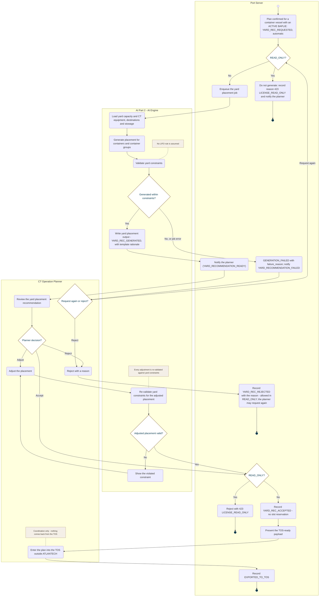
```mermaid
flowchart TD
    subgraph L_SRV["Port Server"]
        direction TB
        START@{ shape: sm-circ }
        A1("Plan confirmed for a container vessel with an ACTIVE BAPLIE: YARD_REC_REQUESTED, automatic")
        D6{"READ_ONLY?"}
        A21("Do not generate: record reason 423 LICENSE_READ_ONLY and notify the planner")
        STOP1@{ shape: fr-circ }
        A2("Enqueue the yard placement job")
        AG("GENERATION_FAILED with failure_reason; notify YARD_RECOMMENDATION_FAILED")
        A6("Notify the planner (YARD_RECOMMENDATION_READY)")
        DA{"READ_ONLY?"}
        A22("Reject with 423 LICENSE_READ_ONLY")
        STOP2@{ shape: fr-circ }
        AC("Record YARD_REC_ACCEPTED - no slot reservation")
        AP("Present the TOS-ready payload")
        AE("Record EXPORTED_TO_TOS")
        STOP3@{ shape: fr-circ }
        A11("Record YARD_REC_REJECTED with the reason - allowed in READ_ONLY; the planner may request again")
        STOP4@{ shape: fr-circ }
    end
    subgraph L_AI2["AI Part 2 - AI Engine"]
        direction TB
        A3("Load yard capacity and CT equipment, destinations and stowage")
        A4("Generate placement for containers and container groups")
        V1("Validate yard constraints")
        D0{"Generated within constraints?"}
        A5("Write yard placement output - YARD_REC_GENERATED, with template rationale")
        A17("Re-validate yard constraints for the adjusted placement")
        D4{"Adjusted placement valid?"}
        A18("Show the violated constraint")
        N4["No LIFO rule is assumed"]
        N5["Every adjustment is re-validated against yard constraints"]
    end
    subgraph L_CTP["CT Operation Planner"]
        direction TB
        A7("Review the yard placement recommendation")
        D1{"Planner decision?"}
        A8("Adjust the placement")
        A10("Reject with a reason")
        D3{"Request again or reject?"}
        A15("Enter the plan into the TOS outside ATLANTECH")
        N2["Coordination only - nothing comes back from the TOS"]
    end
    START --> A1 --> D6
    D6 -->|"Yes"| A21 --> STOP1
    D6 -->|"No"| A2 --> A3 --> A4 --> V1 --> D0
    D0 -->|"No, or job error"| AG --> D3
    D3 -->|"Request again"| D6
    D3 -->|"Reject"| A10
    D0 -->|"Yes"| A5 --> A6 --> A7 --> D1
    D1 -->|"Accept"| DA
    D1 -->|"Adjust"| A8 --> A17 --> D4
    D4 -->|"No"| A18 --> A8
    D4 -->|"Yes"| DA
    DA -->|"Yes"| A22 --> STOP2
    DA -->|"No"| AC --> AP --> A15 --> AE --> STOP3
    D1 -->|"Reject"| A10 --> A11 --> STOP4
    N2 -.- A15
    N4 -.- V1
    N5 -.- A17
    classDef term fill:#083A4F,stroke:#083A4F,color:#083A4F
    classDef bar fill:#083A4F,stroke:#083A4F
    classDef dec fill:#FFFFFF,stroke:#A58D66,stroke-width:2px,color:#083A4F
    classDef note fill:#F4EFE7,stroke:#A58D66,color:#3B3326,font-size:13px
    class START,STOP1,STOP2,STOP3,STOP4 term
    class D0,D1,D3,D4,D6,DA dec
    class N2,N4,N5 note
```

### AD-18 — Web login, roles and port administration

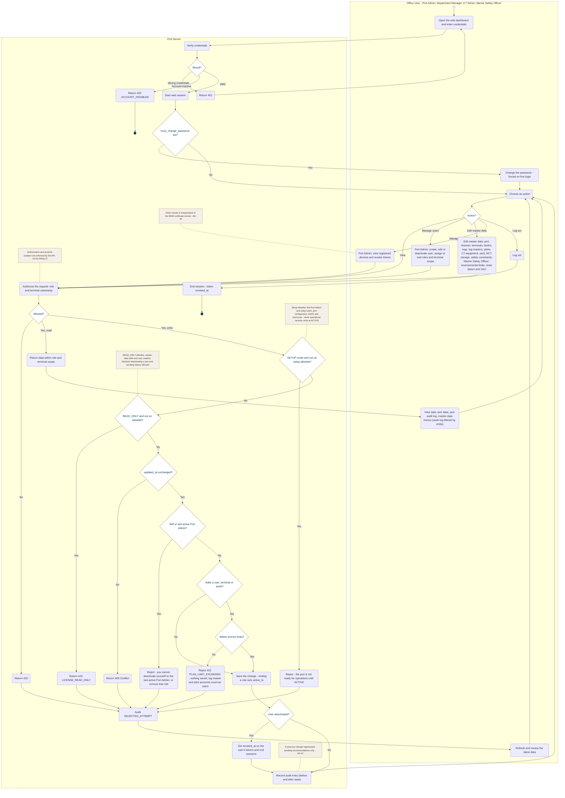
```mermaid
flowchart TD
    subgraph L_OU["Office User - Port Admin, Department Manager, CT Admin, Marine Safety Officer"]
        direction TB
        START@{ shape: sm-circ }
        U1("Open the web dashboard and enter credentials")
        UF("Change the password - forced on first login")
        U2("Choose an action")
        D1{"Action?"}
        U3("View data: port state, port audit log, master-data history (audit log filtered by entity)")
        U4("Port Admin: create, edit or deactivate user; assign or end roles and terminal scope")
        U5("Edit master data: port, channel, terminals, berths, tugs, tug masters, pilots, CT equipment, yard, NCT storage, safety constraints; Marine Safety Officer: environmental limits, chart datum and UKC")
        U6("Port Admin: view registered devices and revoke tokens")
        U8("Refresh and review the latest data")
        U7("Log out")
    end
    subgraph L_SRV["Port Server"]
        direction TB
        S1("Verify credentials")
        D2{"Result?"}
        S2("Return 401")
        S2b("Return 403 ACCOUNT_DISABLED")
        STOP1@{ shape: fr-circ }
        S3("Start web session")
        DF{"must_change_password set?"}
        S5("Authorize the request: role and terminal ownership")
        D3{"Allowed?"}
        S6("Return 403")
        S4("Return data within role and terminal scope")
        DB{"SETUP mode and not on setup allowlist?"}
        S16("Reject - the port is not ready for operations until ACTIVE")
        D4{"READ_ONLY and not on allowlist?"}
        S7("Return 423 LICENSE_READ_ONLY")
        D7{"updated_at unchanged?"}
        S12("Return 409 Conflict")
        D8{"Self or last active Port Admin?"}
        S13("Reject - you cannot deactivate yourself or the last active Port Admin, or remove that role")
        D5{"Adds a user, terminal or berth?"}
        D6{"Within license limits?"}
        S8("Reject 422 PLAN_LIMIT_EXCEEDED - nothing saved; tug master and pilot accounts count as users")
        S9("Save the change - ending a role sets active_to")
        D9{"User deactivated?"}
        S14("Set revoked_at on the user's tokens and end sessions")
        S10("Record audit entry (before and after state)")
        S15("Audit REJECTED_ATTEMPT")
        S11("End session - token revoked_at")
        STOP2@{ shape: fr-circ }
        N1["Authorization and terminal isolation are enforced by the API, not by hiding UI"]
        N4["READ_ONLY allowlist: master-data edits and user creation blocked; deactivating a user and revoking tokens allowed"]
        N5["Setup allowlist: first Port Admin and setup users, port configuration, berths and resources - never operational records; ends at ACTIVE"]
        N3["Token revoke is independent of the MDM certificate revoke - AD-19"]
        N6["A resource change regenerates pending recommendations only - AD-12"]
    end
    START --> U1 --> S1 --> D2
    D2 -->|"Wrong credentials"| S2 --> U1
    D2 -->|"Account inactive"| S2b --> STOP1
    D2 -->|"Valid"| S3 --> DF
    DF -->|"Yes"| UF --> U2
    DF -->|"No"| U2
    U2 --> D1
    D1 -->|"View"| S5
    D1 -->|"Manage users"| U4 --> S5
    D1 -->|"Edit master data"| U5 --> S5
    D1 -->|"Manage devices"| U6 --> S5
    D1 -->|"Log out"| U7 --> S11 --> STOP2
    S5 --> D3
    D3 -->|"No"| S6 --> S15
    D3 -->|"Yes, read"| S4 --> U3 --> U2
    D3 -->|"Yes, write"| DB
    DB -->|"Yes"| S16 --> S15
    DB -->|"No"| D4
    D4 -->|"Yes"| S7 --> S15
    D4 -->|"No"| D7
    D7 -->|"No"| S12 --> S15
    D7 -->|"Yes"| D8
    D8 -->|"Yes"| S13 --> S15
    D8 -->|"No"| D5
    D5 -->|"No"| S9
    D5 -->|"Yes"| D6
    D6 -->|"No"| S8 --> S15
    D6 -->|"Yes"| S9
    S9 --> D9
    D9 -->|"Yes"| S14 --> S10
    D9 -->|"No"| S10
    S10 --> U2
    S15 --> U8 --> U2
    N1 -.- S5
    N3 -.- U6
    N4 -.- D4
    N5 -.- DB
    N6 -.- S10
    classDef term fill:#083A4F,stroke:#083A4F,color:#083A4F
    classDef bar fill:#083A4F,stroke:#083A4F
    classDef dec fill:#FFFFFF,stroke:#A58D66,stroke-width:2px,color:#083A4F
    classDef note fill:#F4EFE7,stroke:#A58D66,color:#3B3326,font-size:13px
    class START,STOP1,STOP2 term
    class D1,D2,D3,D4,D5,D6,D7,D8,D9,DB,DF dec
    class N1,N3,N4,N5,N6 note
```

### AD-19 — Device enrollment, VPN and device revocation

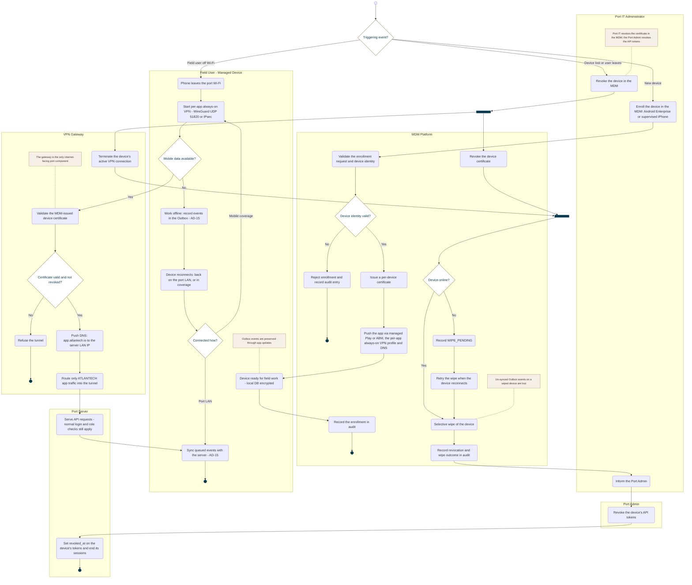
```mermaid
flowchart TD
    START@{ shape: sm-circ }
    D0{"Triggering event?"}
    subgraph L_PIT["Port IT Administrator"]
        direction TB
        A1("Enroll the device in the MDM: Android Enterprise or supervised iPhone")
        A10("Revoke the device in the MDM")
        PI1("Inform the Port Admin")
        N1["Port IT revokes the certificate in the MDM; the Port Admin revokes the API tokens"]
    end
    subgraph L_MDM["MDM Platform"]
        direction TB
        E1("Validate the enrollment request and device identity")
        DE{"Device identity valid?"}
        E2("Reject enrollment and record audit entry")
        STOP1@{ shape: fr-circ }
        A2("Issue a per-device certificate")
        A3("Push the app via managed Play or ABM, the per-app always-on VPN profile and DNS")
        A18("Record the enrollment in audit")
        STOP2@{ shape: fr-circ }
        A15("Revoke the device certificate")
        DW{"Device online?"}
        A11("Selective wipe of the device")
        A16("Record WIPE_PENDING")
        A17("Retry the wipe when the device reconnects")
        A18b("Record revocation and wipe outcome in audit")
        N2["Un-synced Outbox events on a wiped device are lost"]
    end
    subgraph L_DEV["Field User - Managed Device"]
        direction TB
        A4("Device ready for field work - local DB encrypted")
        A5("Phone leaves the port Wi-Fi")
        A6("Start per-app always-on VPN - WireGuard UDP 51820 or IPsec")
        D1{"Mobile data available?"}
        A7("Work offline: record events in the Outbox - AD-15")
        A21("Device reconnects: back on the port LAN, or in coverage")
        D3{"Connected how?"}
        A22("Sync queued events with the server - AD-15")
        STOP4@{ shape: fr-circ }
        N4["Outbox events are preserved through app updates"]
    end
    subgraph L_VPN["VPN Gateway"]
        direction TB
        A8("Validate the MDM-issued device certificate")
        D2{"Certificate valid and not revoked?"}
        A9("Refuse the tunnel")
        STOP3@{ shape: fr-circ }
        A12("Push DNS: app.atlantech.io to the server LAN IP")
        A13("Route only ATLANTECH app traffic into the tunnel")
        A19("Terminate the device's active VPN connection")
        N3["The gateway is the only internet-facing port component"]
    end
    subgraph L_PAD["Port Admin"]
        direction TB
        PA1("Revoke the device's API tokens")
    end
    subgraph L_SRV["Port Server"]
        direction TB
        A14("Serve API requests - normal login and role checks still apply")
        A20("Set revoked_at on the device's tokens and end its sessions")
        STOP5@{ shape: fr-circ }
    end
    START --> D0
    D0 -->|"New device"| A1 --> E1 --> DE
    DE -->|"No"| E2 --> STOP1
    DE -->|"Yes"| A2 --> A3 --> A4 --> A18 --> STOP2
    D0 -->|"Field user off Wi-Fi"| A5 --> A6 --> D1
    D1 -->|"No"| A7 --> A21 --> D3
    D3 -->|"Port LAN"| A22
    D3 -->|"Mobile coverage"| A6
    D1 -->|"Yes"| A8 --> D2
    D2 -->|"No"| A9 --> STOP3
    D2 -->|"Yes"| A12 --> A13 --> A14 --> A22 --> STOP4
    D0 -->|"Device lost or user leaves"| A10 --> FK1@{ shape: fork }
    FK1 --> A15 --> JN1@{ shape: fork }
    FK1 --> A19 --> JN1
    JN1 --> DW
    DW -->|"Yes"| A11 --> A18b
    DW -->|"No"| A16 --> A17 --> A11
    A18b --> PI1 --> PA1 --> A20 --> STOP5
    N1 -.- A10
    N2 -.- A11
    N3 -.- A8
    N4 -.- A4
    classDef term fill:#083A4F,stroke:#083A4F,color:#083A4F
    classDef bar fill:#083A4F,stroke:#083A4F
    classDef dec fill:#FFFFFF,stroke:#A58D66,stroke-width:2px,color:#083A4F
    classDef note fill:#F4EFE7,stroke:#A58D66,color:#3B3326,font-size:13px
    class START,STOP1,STOP2,STOP3,STOP4,STOP5 term
    class FK1,JN1 bar
    class D0,D1,D2,D3,DE,DW dec
    class N1,N2,N3,N4 note
```

## Category 3 — Execution Feedback and Model Learning

### AD-15 — Field status update, Outbox sync and realtime

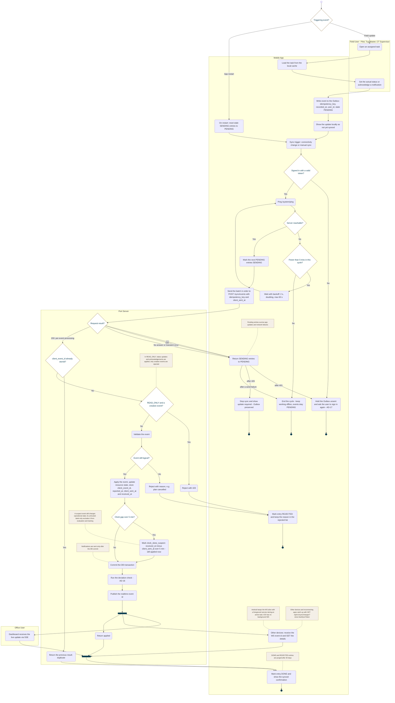
```mermaid
flowchart TD
    START@{ shape: sm-circ }
    D0{"Triggering event?"}
    subgraph L_FU["Field User - Pilot, Tug Master, CT Supervisor"]
        direction TB
        F1("Open an assigned task")
        F2("Set the actual status or acknowledge a notification")
    end
    subgraph L_APP["Mobile App"]
        direction TB
        A0("On restart: reset stale SENDING entries to PENDING")
        A1("Load the task from the local cache")
        A2("Write event to the Outbox: idempotency_key, recorded_at, user_id, state PENDING")
        A3("Show the update locally as not yet synced")
        A4("Sync trigger: connectivity change or manual sync")
        D8{"Signed in with a valid token?"}
        A8("Hold the Outbox unsent and ask the user to sign in again - AD-17")
        STOP1@{ shape: fr-circ }
        A5("Ping /system/ping")
        D1{"Server reachable?"}
        DT{"Fewer than 5 tries in this cycle?"}
        A10("Wait with backoff: 2 s, doubling, max 60 s")
        A6("End the cycle - keep working offline, events stay PENDING")
        STOP2@{ shape: fr-circ }
        A13("Mark the next PENDING entries SENDING")
        A7("Send the batch in order to POST /sync/events with idempotency_key and client_sent_at")
        A21("Return SENDING entries to PENDING")
        A9("Stop sync and show update required - Outbox preserved")
        STOP3@{ shape: fr-circ }
        A11("Mark entry DONE and show the synced confirmation")
        STOP4@{ shape: fr-circ }
        A12("Mark entry REJECTED and keep the reason in the rejected list")
        STOP5@{ shape: fr-circ }
        W1("Other devices: receive the WS event id and GET the details")
        N1["Android keeps the WS alive with a foreground service during an active task; iOS has no background WS"]
        N2["Pending entries survive app updates and network failures"]
        N7["DONE and REJECTED entries are purged after 30 days"]
        N6["Other devices and reconnecting apps catch up with GET /api/v1/sync/changes?since=lastSyncToken"]
    end
    subgraph L_SRV["Port Server"]
        direction TB
        D2{"Request result?"}
        D3{"client_event_id already stored?"}
        S1("Return the previous result: duplicate")
        DR{"READ_ONLY and a creation event?"}
        S3r("Reject with 423")
        S2("Validate the event")
        D4{"Event still logical?"}
        S3("Reject with reason, e.g. plan cancelled")
        S4("Apply the event, update resource state, store client_event_id, reported_at, client_sent_at and received_at")
        D5{"Clock gap over 5 min?"}
        S5("Mark clock_skew_suspect: received_at minus client_sent_at over 5 min - still applied now")
        S9("Commit the DB transaction")
        S6("Run the deviation check - AD-16")
        S7("Publish the realtime event id")
        FK1@{ shape: fork }
        S8("Return applied")
        JN1@{ shape: fork }
        N3["In READ_ONLY, status updates and acknowledgements are applied; only creation events are rejected"]
        N5["A suspect event still changes operational state; its untrusted label only excludes it from evaluation and training"]
        N4["Notifications are sent only after the DB commit"]
    end
    subgraph L_OU["Office User"]
        direction TB
        O1("Dashboard receives the live update via SSE")
    end
    START --> D0
    D0 -->|"Field update"| F1 --> A1 --> F2 --> A2 --> A3 --> A4
    D0 -->|"App restart"| A0 --> A4
    A4 --> D8
    D8 -->|"No"| A8 --> STOP1
    D8 -->|"Yes"| A5 --> D1
    D1 -->|"No"| DT
    DT -->|"Yes"| A10 --> A5
    DT -->|"No"| A6 --> STOP2
    D1 -->|"Yes"| A13 --> A7 --> D2
    D2 -->|"401"| A21
    D2 -->|"426"| A21
    D2 -->|"No answer or transient error"| A21
    A21 -->|"after 401"| A8
    A21 -->|"after 426"| A9 --> STOP3
    A21 -->|"after a send failure"| A6
    D2 -->|"200: per-event processing"| D3
    D3 -->|"Yes"| S1 --> A11
    D3 -->|"No"| DR
    DR -->|"Yes"| S3r --> A12
    DR -->|"No"| S2 --> D4
    D4 -->|"No"| S3 --> A12
    D4 -->|"Yes"| S4 --> D5
    D5 -->|"Yes"| S5 --> S9
    D5 -->|"No"| S9
    S9 --> S6 --> S7 --> FK1
    FK1 --> O1 --> JN1
    FK1 --> W1 --> JN1
    FK1 --> S8 --> JN1
    JN1 --> A11 --> STOP4
    A12 --> STOP5
    N1 -.- W1
    N2 -.- A21
    N3 -.- DR
    N4 -.- S9
    N5 -.- S5
    N6 -.- W1
    N7 -.- A11
    classDef term fill:#083A4F,stroke:#083A4F,color:#083A4F
    classDef bar fill:#083A4F,stroke:#083A4F
    classDef dec fill:#FFFFFF,stroke:#A58D66,stroke-width:2px,color:#083A4F
    classDef note fill:#F4EFE7,stroke:#A58D66,color:#3B3326,font-size:13px
    class START,STOP1,STOP2,STOP3,STOP4,STOP5 term
    class FK1,JN1 bar
    class D0,D1,D2,D3,D4,D5,D8,DR,DT dec
    class N1,N2,N3,N4,N5,N6,N7 note
```

### AD-16 — Deviation detection and AI feedback loop

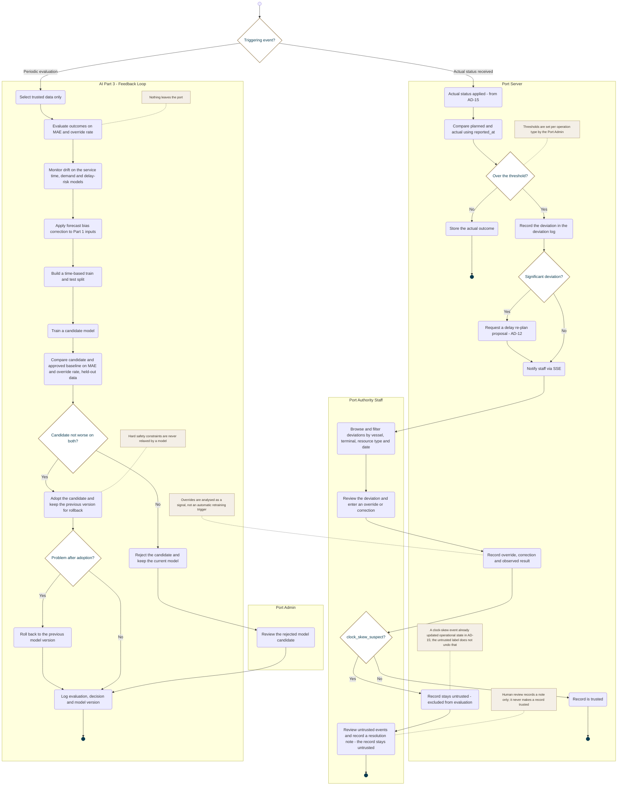
```mermaid
flowchart TD
    START@{ shape: sm-circ }
    D0{"Triggering event?"}
    subgraph L_SRV["Port Server"]
        direction TB
        A1("Actual status applied - from AD-15")
        A2("Compare planned and actual using reported_at")
        D1{"Over the threshold?"}
        A3("Store the actual outcome")
        STOP1@{ shape: fr-circ }
        A4("Record the deviation in the deviation log")
        DS{"Significant deviation?"}
        AR("Request a delay re-plan proposal - AD-12")
        A5("Notify staff via SSE")
        A7("Record override, correction and observed result")
        A8("Record stays untrusted - excluded from evaluation")
        A9("Record is trusted")
        STOP2@{ shape: fr-circ }
        N6["Human review records a note only; it never makes a record trusted"]
        N7["A clock-skew event already updated operational state in AD-15; the untrusted label does not undo that"]
        N1["Thresholds are set per operation type by the Port Admin"]
    end
    subgraph L_STAFF["Port Authority Staff"]
        direction TB
        S1("Browse and filter deviations by vessel, terminal, resource type and date")
        S3("Review the deviation and enter an override or correction")
        D2{"clock_skew_suspect?"}
        S2("Review untrusted events and record a resolution note - the record stays untrusted")
        STOP3@{ shape: fr-circ }
    end
    subgraph L_AI3["AI Part 3 - Feedback Loop"]
        direction TB
        P0("Select trusted data only")
        P1("Evaluate outcomes on MAE and override rate")
        P2("Monitor drift on the service time, demand and delay-risk models")
        P3("Apply forecast bias correction to Part 1 inputs")
        P4("Build a time-based train and test split")
        P5("Train a candidate model")
        P6("Compare candidate and approved baseline on MAE and override rate, held-out data")
        D3{"Candidate not worse on both?"}
        P7("Adopt the candidate and keep the previous version for rollback")
        D4{"Problem after adoption?"}
        P10("Roll back to the previous model version")
        P8("Reject the candidate and keep the current model")
        P9("Log evaluation, decision and model version")
        STOP4@{ shape: fr-circ }
        N2["Nothing leaves the port"]
        N3["Hard safety constraints are never relaxed by a model"]
        N4["Overrides are analysed as a signal, not an automatic retraining trigger"]
    end
    subgraph L_PAD["Port Admin"]
        direction TB
        R1("Review the rejected model candidate")
    end
    START --> D0
    D0 -->|"Actual status received"| A1 --> A2 --> D1
    D1 -->|"No"| A3 --> STOP1
    D1 -->|"Yes"| A4 --> DS
    DS -->|"Yes"| AR --> A5
    DS -->|"No"| A5
    A5 --> S1 --> S3 --> A7 --> D2
    D2 -->|"Yes"| A8
    D2 -->|"No"| A9 --> STOP2
    A8 --> S2 --> STOP3
    D0 -->|"Periodic evaluation"| P0 --> P1 --> P2 --> P3 --> P4 --> P5 --> P6 --> D3
    D3 -->|"Yes"| P7 --> D4
    D4 -->|"Yes"| P10 --> P9
    D4 -->|"No"| P9
    D3 -->|"No"| P8 --> R1 --> P9
    P9 --> STOP4
    N1 -.- D1
    N6 -.- S2
    N7 -.- A8
    N2 -.- P1
    N3 -.- P7
    N4 -.- A7
    classDef term fill:#083A4F,stroke:#083A4F,color:#083A4F
    classDef bar fill:#083A4F,stroke:#083A4F
    classDef dec fill:#FFFFFF,stroke:#A58D66,stroke-width:2px,color:#083A4F
    classDef note fill:#F4EFE7,stroke:#A58D66,color:#3B3326,font-size:13px
    class START,STOP1,STOP2,STOP3,STOP4 term
    class D0,D1,D2,D3,D4,DS dec
    class N1,N2,N3,N4,N6,N7 note
```

### AD-17 — Mobile first launch, login and re-authentication

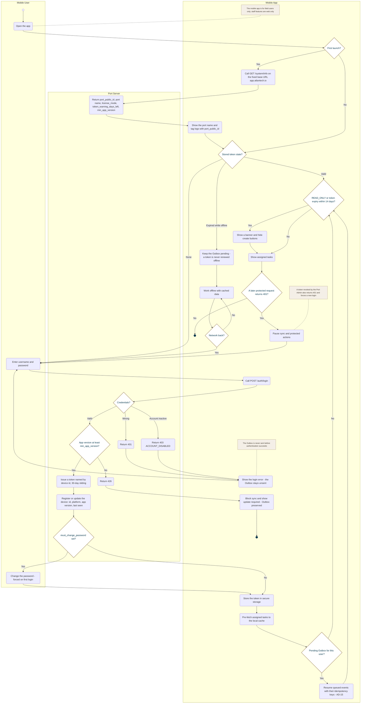
```mermaid
flowchart TD
    subgraph L_MU["Mobile User"]
        direction TB
        START@{ shape: sm-circ }
        U1("Open the app")
        U2("Enter username and password")
        UF("Change the password - forced on first login")
    end
    subgraph L_APP["Mobile App"]
        direction TB
        D0{"First launch?"}
        A1("Call GET /system/info on the fixed base URL app.atlantech.io")
        A2("Show the port name and tag logs with port_public_id")
        D2{"Stored token state?"}
        A3("Keep the Outbox pending - a token is never renewed offline")
        A4("Work offline with cached data")
        D3{"Network back?"}
        A5("Call POST /auth/login")
        A6("Show the login error - the Outbox stays unsent")
        A7("Block sync and show update required - Outbox preserved")
        STOP1@{ shape: fr-circ }
        A8("Store the token in secure storage")
        A9("Pre-fetch assigned tasks to the local cache")
        D6{"Pending Outbox for this user?"}
        A10("Resume queued events with their idempotency keys - AD-15")
        D7{"READ_ONLY or token expiry within 14 days?"}
        A11("Show a banner and hide create buttons")
        A12("Show assigned tasks")
        D8{"A later protected request returns 401?"}
        STOP2@{ shape: fr-circ }
        A13("Pause sync and protected actions")
        N1["The Outbox is never sent before authentication succeeds"]
        N2["A token revoked by the Port Admin also returns 401 and forces a new login"]
        N3["The mobile app is for field users only; staff features are web only"]
    end
    subgraph L_SRV["Port Server"]
        direction TB
        S1("Return port_public_id, port name, license_mode, token_warning_days_left, min_app_version")
        D4{"Credentials?"}
        S2("Return 401")
        S2b("Return 403 ACCOUNT_DISABLED")
        D5{"App version at least min_app_version?"}
        S3("Return 426")
        S4("Issue a token named by device id, 30-day sliding")
        S5("Register or update the device: id, platform, app version, last seen")
        DF{"must_change_password set?"}
    end
    START --> U1 --> D0
    D0 -->|"Yes"| A1 --> S1 --> A2 --> D2
    D0 -->|"No"| D2
    D2 -->|"Valid"| D7
    D2 -->|"None"| U2
    D2 -->|"Expired while offline"| A3 --> A4 --> D3
    D3 -->|"No"| A4
    D3 -->|"Yes"| U2
    U2 --> A5 --> D4
    D4 -->|"Wrong"| S2 --> A6 --> U2
    D4 -->|"Account inactive"| S2b --> A6
    D4 -->|"Valid"| D5
    D5 -->|"No"| S3 --> A7 --> STOP1
    D5 -->|"Yes"| S4 --> S5 --> DF
    DF -->|"Yes"| UF --> A8
    DF -->|"No"| A8
    A8 --> A9 --> D6
    D6 -->|"Yes"| A10 --> D7
    D6 -->|"No"| D7
    D7 -->|"Yes"| A11 --> A12
    D7 -->|"No"| A12
    A12 --> D8
    D8 -->|"Yes"| A13 --> U2
    D8 -->|"No"| STOP2
    N1 -.- A6
    N2 -.- A13
    N3 -.- U1
    classDef term fill:#083A4F,stroke:#083A4F,color:#083A4F
    classDef bar fill:#083A4F,stroke:#083A4F
    classDef dec fill:#FFFFFF,stroke:#A58D66,stroke-width:2px,color:#083A4F
    classDef note fill:#F4EFE7,stroke:#A58D66,color:#3B3326,font-size:13px
    class START,STOP1,STOP2 term
    class D0,D2,D3,D4,D5,D6,D7,D8,DF dec
    class N1,N2,N3 note
```
