# ATLANTECH — Sequence Diagrams

## Category 1 — Central SaaS, Licensing and Billing

### 1.1 SaaS Admin sign-in

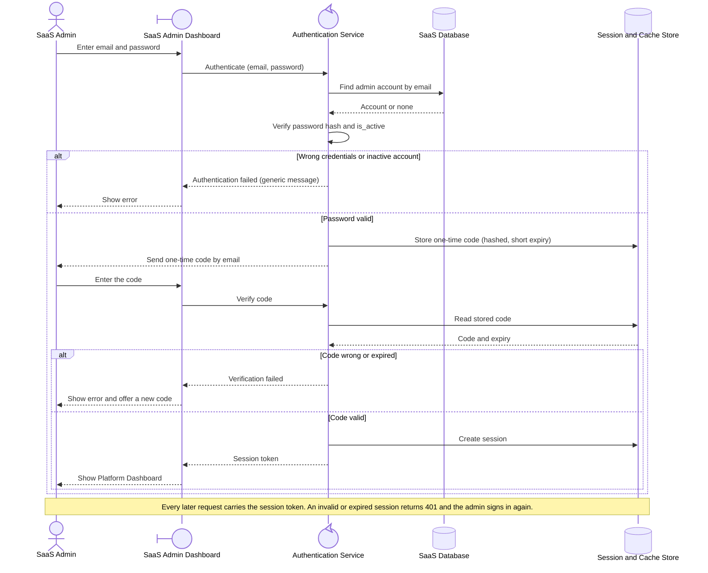
```mermaid
sequenceDiagram
    actor SA as SaaS Admin
    participant UI@{ "type": "boundary" } as SaaS Admin Dashboard
    participant AUTH@{ "type": "control" } as Authentication Service
    participant DB@{ "type": "database" } as SaaS Database
    participant CACHE@{ "type": "database" } as Session and Cache Store

    SA->>UI: Enter email and password
    UI->>AUTH: Authenticate (email, password)
    AUTH->>DB: Find admin account by email
    DB-->>AUTH: Account or none
    AUTH->>AUTH: Verify password hash and is_active

    alt Wrong credentials or inactive account
        AUTH-->>UI: Authentication failed (generic message)
        UI-->>SA: Show error
    else Password valid
        AUTH->>CACHE: Store one-time code (hashed, short expiry)
        AUTH-->>SA: Send one-time code by email
        SA->>UI: Enter the code
        UI->>AUTH: Verify code
        AUTH->>CACHE: Read stored code
        CACHE-->>AUTH: Code and expiry
        alt Code wrong or expired
            AUTH-->>UI: Verification failed
            UI-->>SA: Show error and offer a new code
        else Code valid
            AUTH->>CACHE: Create session
            AUTH-->>UI: Session token
            UI-->>SA: Show Platform Dashboard
        end
    end

    Note over SA,CACHE: Every later request carries the session token. An invalid or expired session returns 401 and the admin signs in again.
```

### 1.2 Platform administration

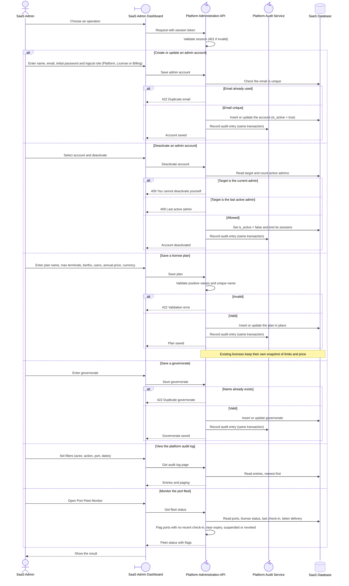
```mermaid
sequenceDiagram
    actor SA as SaaS Admin
    participant UI@{ "type": "boundary" } as SaaS Admin Dashboard
    participant API@{ "type": "control" } as Platform Administration API
    participant AUDIT@{ "type": "control" } as Platform Audit Service
    participant DB@{ "type": "database" } as SaaS Database

    SA->>UI: Choose an operation
    UI->>API: Request with session token
    API->>API: Validate session (401 if invalid)

    alt Create or update an admin account
        SA->>UI: Enter name, email, initial password and logical role (Platform, License or Billing)
        UI->>API: Save admin account
        API->>DB: Check the email is unique
        alt Email already used
            API-->>UI: 422 Duplicate email
        else Email unique
            API->>DB: Insert or update the account (is_active = true)
            API->>AUDIT: Record audit entry (same transaction)
            API-->>UI: Account saved
        end

    else Deactivate an admin account
        SA->>UI: Select account and deactivate
        UI->>API: Deactivate account
        API->>DB: Read target and count active admins
        alt Target is the current admin
            API-->>UI: 409 You cannot deactivate yourself
        else Target is the last active admin
            API-->>UI: 409 Last active admin
        else Allowed
            API->>DB: Set is_active = false and end its sessions
            API->>AUDIT: Record audit entry (same transaction)
            API-->>UI: Account deactivated
        end

    else Save a license plan
        SA->>UI: Enter plan name, max terminals, berths, users, annual price, currency
        UI->>API: Save plan
        API->>API: Validate positive values and unique name
        alt Invalid
            API-->>UI: 422 Validation error
        else Valid
            API->>DB: Insert or update the plan in place
            API->>AUDIT: Record audit entry (same transaction)
            API-->>UI: Plan saved
        end
        Note over API,DB: Existing licenses keep their own snapshot of limits and price

    else Save a governorate
        SA->>UI: Enter governorate
        UI->>API: Save governorate
        alt Name already exists
            API-->>UI: 422 Duplicate governorate
        else Valid
            API->>DB: Insert or update governorate
            API->>AUDIT: Record audit entry (same transaction)
            API-->>UI: Governorate saved
        end

    else View the platform audit log
        SA->>UI: Set filters (actor, action, port, dates)
        UI->>API: Get audit log page
        API->>DB: Read entries, newest first
        API-->>UI: Entries and paging

    else Monitor the port fleet
        SA->>UI: Open Port Fleet Monitor
        UI->>API: Get fleet status
        API->>DB: Read ports, license status, last check-in, token delivery
        API->>API: Flag ports with no recent check-in, near expiry, suspended or revoked
        API-->>UI: Fleet status with flags
    end

    UI-->>SA: Show the result
```

### 1.3 Port registry and API credential

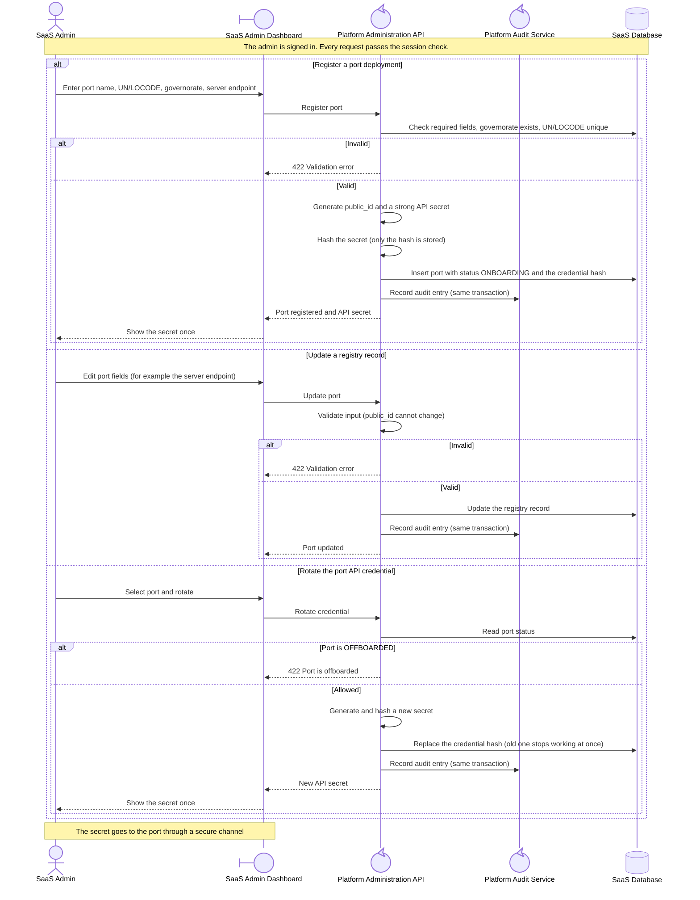
```mermaid
sequenceDiagram
    actor SA as SaaS Admin
    participant UI@{ "type": "boundary" } as SaaS Admin Dashboard
    participant API@{ "type": "control" } as Platform Administration API
    participant AUDIT@{ "type": "control" } as Platform Audit Service
    participant DB@{ "type": "database" } as SaaS Database

    Note over SA,DB: The admin is signed in. Every request passes the session check.

    alt Register a port deployment
        SA->>UI: Enter port name, UN/LOCODE, governorate, server endpoint
        UI->>API: Register port
        API->>DB: Check required fields, governorate exists, UN/LOCODE unique
        alt Invalid
            API-->>UI: 422 Validation error
        else Valid
            API->>API: Generate public_id and a strong API secret
            API->>API: Hash the secret (only the hash is stored)
            API->>DB: Insert port with status ONBOARDING and the credential hash
            API->>AUDIT: Record audit entry (same transaction)
            API-->>UI: Port registered and API secret
            UI-->>SA: Show the secret once
        end

    else Update a registry record
        SA->>UI: Edit port fields (for example the server endpoint)
        UI->>API: Update port
        API->>API: Validate input (public_id cannot change)
        alt Invalid
            API-->>UI: 422 Validation error
        else Valid
            API->>DB: Update the registry record
            API->>AUDIT: Record audit entry (same transaction)
            API-->>UI: Port updated
        end

    else Rotate the port API credential
        SA->>UI: Select port and rotate
        UI->>API: Rotate credential
        API->>DB: Read port status
        alt Port is OFFBOARDED
            API-->>UI: 422 Port is offboarded
        else Allowed
            API->>API: Generate and hash a new secret
            API->>DB: Replace the credential hash (old one stops working at once)
            API->>AUDIT: Record audit entry (same transaction)
            API-->>UI: New API secret
            UI-->>SA: Show the secret once
        end
    end

    Note over SA,UI: The secret goes to the port through a secure channel
```

### 1.4 Port status changes

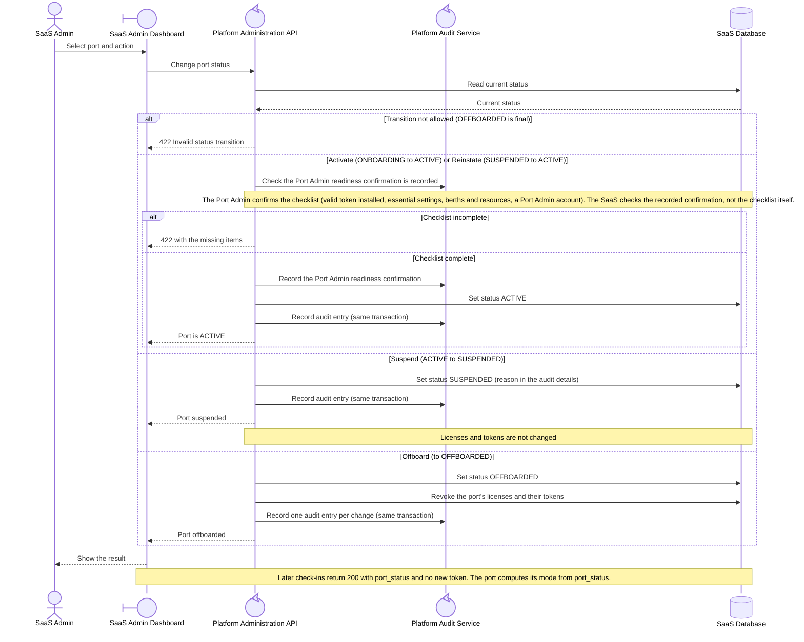
```mermaid
sequenceDiagram
    actor SA as SaaS Admin
    participant UI@{ "type": "boundary" } as SaaS Admin Dashboard
    participant API@{ "type": "control" } as Platform Administration API
    participant AUDIT@{ "type": "control" } as Platform Audit Service
    participant DB@{ "type": "database" } as SaaS Database

    SA->>UI: Select port and action
    UI->>API: Change port status
    API->>DB: Read current status
    DB-->>API: Current status

    alt Transition not allowed (OFFBOARDED is final)
        API-->>UI: 422 Invalid status transition

    else Activate (ONBOARDING to ACTIVE) or Reinstate (SUSPENDED to ACTIVE)
        API->>AUDIT: Check the Port Admin readiness confirmation is recorded
        Note over API,DB: The Port Admin confirms the checklist (valid token installed, essential settings, berths and resources, a Port Admin account). The SaaS checks the recorded confirmation, not the checklist itself.
        alt Checklist incomplete
            API-->>UI: 422 with the missing items
        else Checklist complete
            API->>AUDIT: Record the Port Admin readiness confirmation
            API->>DB: Set status ACTIVE
            API->>AUDIT: Record audit entry (same transaction)
            API-->>UI: Port is ACTIVE
        end

    else Suspend (ACTIVE to SUSPENDED)
        API->>DB: Set status SUSPENDED (reason in the audit details)
        API->>AUDIT: Record audit entry (same transaction)
        API-->>UI: Port suspended
        Note over API,DB: Licenses and tokens are not changed

    else Offboard (to OFFBOARDED)
        API->>DB: Set status OFFBOARDED
        API->>DB: Revoke the port's licenses and their tokens
        API->>AUDIT: Record one audit entry per change (same transaction)
        API-->>UI: Port offboarded
    end

    UI-->>SA: Show the result
    Note over UI,DB: Later check-ins return 200 with port_status and no new token. The port computes its mode from port_status.
```

### 1.5 Server provisioning and certificates

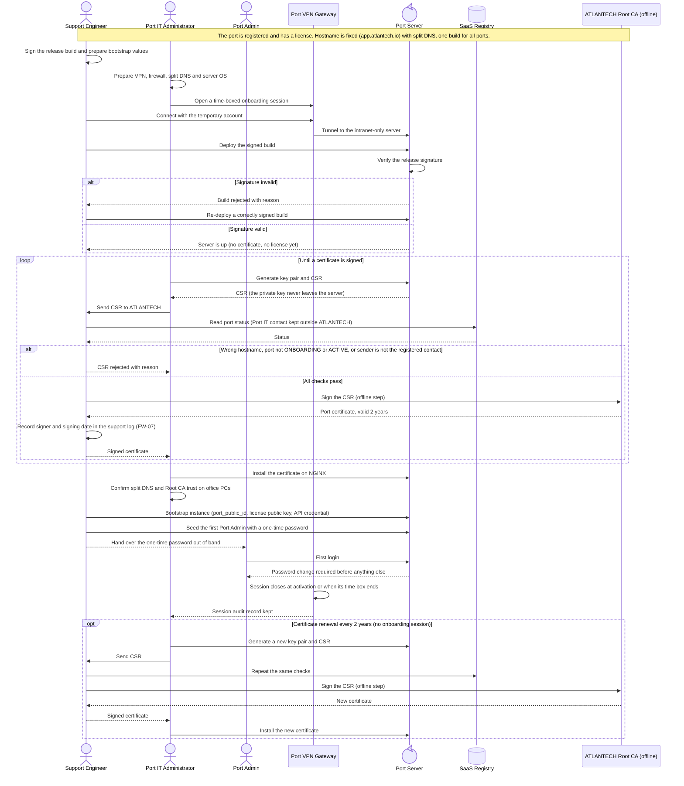
```mermaid
sequenceDiagram
    actor SE as Support Engineer
    actor PIT as Port IT Administrator
    actor PA as Port Admin
    participant VPN as Port VPN Gateway
    participant PS@{ "type": "control" } as Port Server
    participant REG@{ "type": "database" } as SaaS Registry
    participant CA as ATLANTECH Root CA (offline)

    Note over SE,CA: The port is registered and has a license. Hostname is fixed (app.atlantech.io) with split DNS, one build for all ports.

    SE->>SE: Sign the release build and prepare bootstrap values
    PIT->>PIT: Prepare VPN, firewall, split DNS and server OS
    PIT->>VPN: Open a time-boxed onboarding session
    SE->>VPN: Connect with the temporary account
    VPN->>PS: Tunnel to the intranet-only server
    SE->>PS: Deploy the signed build
    PS->>PS: Verify the release signature
    alt Signature invalid
        PS-->>SE: Build rejected with reason
        SE->>PS: Re-deploy a correctly signed build
    else Signature valid
        PS-->>SE: Server is up (no certificate, no license yet)
    end

    loop Until a certificate is signed
        PIT->>PS: Generate key pair and CSR
        PS-->>PIT: CSR (the private key never leaves the server)
        PIT->>SE: Send CSR to ATLANTECH
        SE->>REG: Read port status (Port IT contact kept outside ATLANTECH)
        REG-->>SE: Status
        alt Wrong hostname, port not ONBOARDING or ACTIVE, or sender is not the registered contact
            SE-->>PIT: CSR rejected with reason
        else All checks pass
            SE->>CA: Sign the CSR (offline step)
            CA-->>SE: Port certificate, valid 2 years
            SE->>SE: Record signer and signing date in the support log (FW-07)
            SE-->>PIT: Signed certificate
        end
    end

    PIT->>PS: Install the certificate on NGINX
    PIT->>PIT: Confirm split DNS and Root CA trust on office PCs
    SE->>PS: Bootstrap instance (port_public_id, license public key, API credential)
    SE->>PS: Seed the first Port Admin with a one-time password
    SE-->>PA: Hand over the one-time password out of band
    PA->>PS: First login
    PS-->>PA: Password change required before anything else

    VPN->>VPN: Session closes at activation or when its time box ends
    VPN-->>PIT: Session audit record kept

    opt Certificate renewal every 2 years (no onboarding session)
        PIT->>PS: Generate a new key pair and CSR
        PIT->>SE: Send CSR
        SE->>REG: Repeat the same checks
        SE->>CA: Sign the CSR (offline step)
        CA-->>SE: New certificate
        SE-->>PIT: Signed certificate
        PIT->>PS: Install the new certificate
    end
```

### 1.6 Initial license and activation

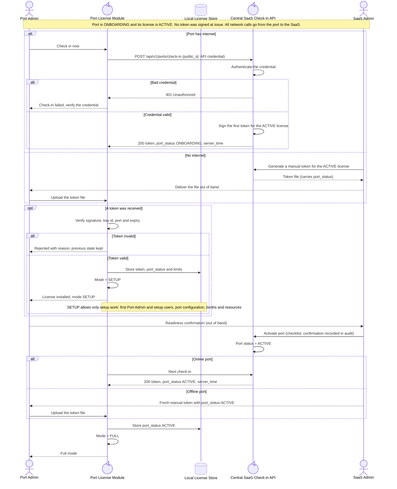
```mermaid
sequenceDiagram
    actor PA as Port Admin
    participant LM@{ "type": "control" } as Port License Module
    participant LS@{ "type": "database" } as Local License Store
    participant SAAS@{ "type": "control" } as Central SaaS Check-in API
    actor SA as SaaS Admin

    Note over PA,SA: Port is ONBOARDING and its license is ACTIVE. No token was signed at issue. All network calls go from the port to the SaaS.

    alt Port has internet
        PA->>LM: Check in now
        LM->>SAAS: POST /api/v1/ports/check-in (public_id, API credential)
        SAAS->>SAAS: Authenticate the credential
        alt Bad credential
            SAAS-->>LM: 401 Unauthorized
            LM-->>PA: Check-in failed, verify the credential
        else Credential valid
            SAAS->>SAAS: Sign the first token for the ACTIVE license
            SAAS-->>LM: 200 token, port_status ONBOARDING, server_time
        end
    else No internet
        SA->>SAAS: Generate a manual token for the ACTIVE license
        SAAS-->>SA: Token file (carries port_status)
        SA-->>PA: Deliver the file out of band
        PA->>LM: Upload the token file
    end

    opt A token was received
        LM->>LM: Verify signature, key id, port and expiry
        alt Token invalid
            LM-->>PA: Rejected with reason, previous state kept
        else Token valid
            LM->>LS: Store token, port_status and limits
            LM->>LM: Mode = SETUP
            LM-->>PA: License installed, mode SETUP
            Note over LM,LS: SETUP allows only setup work: first Port Admin and setup users, port configuration, berths and resources
        end
    end

    PA-->>SA: Readiness confirmation (out of band)
    SA->>SAAS: Activate port (checklist, confirmation recorded in audit)
    SAAS->>SAAS: Port status = ACTIVE

    alt Online port
        LM->>SAAS: Next check-in
        SAAS-->>LM: 200 token, port_status ACTIVE, server_time
    else Offline port
        SA-->>PA: Fresh manual token with port_status ACTIVE
        PA->>LM: Upload the token file
    end
    LM->>LS: Store port_status ACTIVE
    LM->>LM: Mode = FULL
    LM-->>PA: Full mode
```

### 1.7 Issue and renew a license

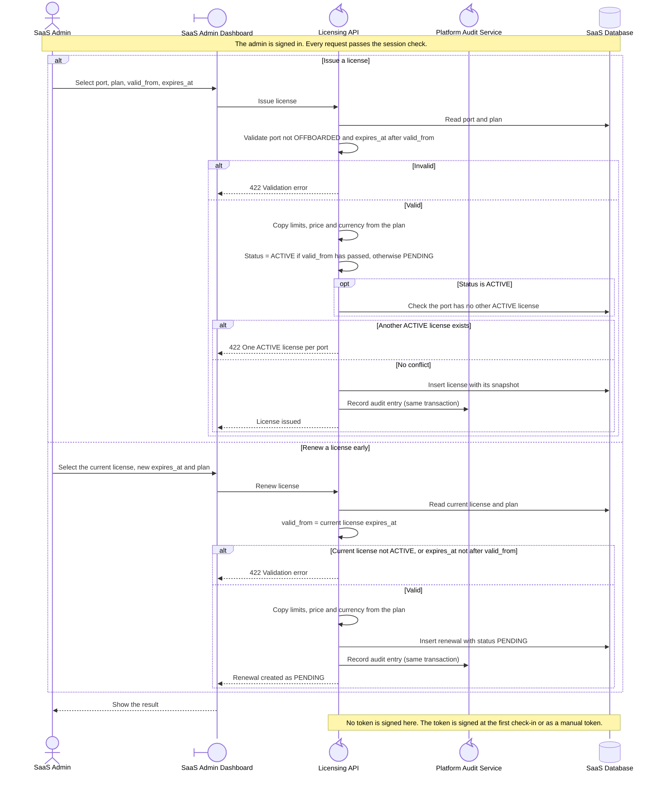
```mermaid
sequenceDiagram
    actor SA as SaaS Admin
    participant UI@{ "type": "boundary" } as SaaS Admin Dashboard
    participant API@{ "type": "control" } as Licensing API
    participant AUDIT@{ "type": "control" } as Platform Audit Service
    participant DB@{ "type": "database" } as SaaS Database

    Note over SA,DB: The admin is signed in. Every request passes the session check.

    alt Issue a license
        SA->>UI: Select port, plan, valid_from, expires_at
        UI->>API: Issue license
        API->>DB: Read port and plan
        API->>API: Validate port not OFFBOARDED and expires_at after valid_from
        alt Invalid
            API-->>UI: 422 Validation error
        else Valid
            API->>API: Copy limits, price and currency from the plan
            API->>API: Status = ACTIVE if valid_from has passed, otherwise PENDING
            opt Status is ACTIVE
                API->>DB: Check the port has no other ACTIVE license
            end
            alt Another ACTIVE license exists
                API-->>UI: 422 One ACTIVE license per port
            else No conflict
                API->>DB: Insert license with its snapshot
                API->>AUDIT: Record audit entry (same transaction)
                API-->>UI: License issued
            end
        end

    else Renew a license early
        SA->>UI: Select the current license, new expires_at and plan
        UI->>API: Renew license
        API->>DB: Read current license and plan
        API->>API: valid_from = current license expires_at
        alt Current license not ACTIVE, or expires_at not after valid_from
            API-->>UI: 422 Validation error
        else Valid
            API->>API: Copy limits, price and currency from the plan
            API->>DB: Insert renewal with status PENDING
            API->>AUDIT: Record audit entry (same transaction)
            API-->>UI: Renewal created as PENDING
        end
    end

    UI-->>SA: Show the result
    Note over API,DB: No token is signed here. The token is signed at the first check-in or as a manual token.
```

### 1.8 Suspend, reinstate and revoke a license

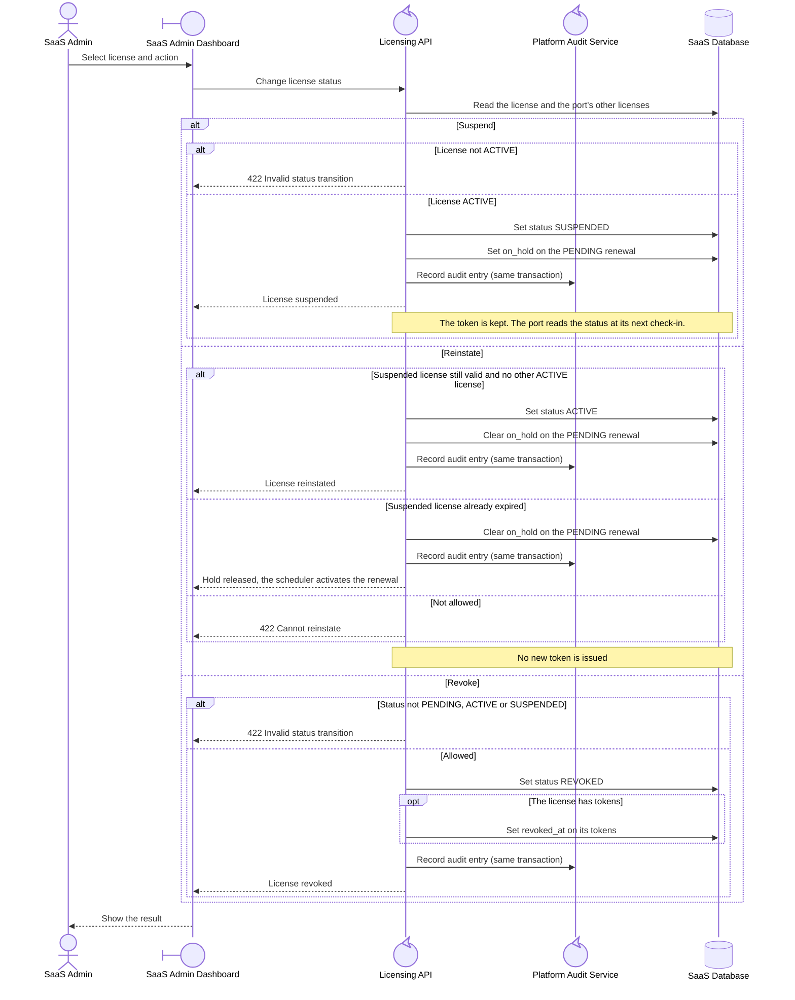
```mermaid
sequenceDiagram
    actor SA as SaaS Admin
    participant UI@{ "type": "boundary" } as SaaS Admin Dashboard
    participant API@{ "type": "control" } as Licensing API
    participant AUDIT@{ "type": "control" } as Platform Audit Service
    participant DB@{ "type": "database" } as SaaS Database

    SA->>UI: Select license and action
    UI->>API: Change license status
    API->>DB: Read the license and the port's other licenses

    alt Suspend
        alt License not ACTIVE
            API-->>UI: 422 Invalid status transition
        else License ACTIVE
            API->>DB: Set status SUSPENDED
            API->>DB: Set on_hold on the PENDING renewal
            API->>AUDIT: Record audit entry (same transaction)
            API-->>UI: License suspended
            Note over API,DB: The token is kept. The port reads the status at its next check-in.
        end

    else Reinstate
        alt Suspended license still valid and no other ACTIVE license
            API->>DB: Set status ACTIVE
            API->>DB: Clear on_hold on the PENDING renewal
            API->>AUDIT: Record audit entry (same transaction)
            API-->>UI: License reinstated
        else Suspended license already expired
            API->>DB: Clear on_hold on the PENDING renewal
            API->>AUDIT: Record audit entry (same transaction)
            API-->>UI: Hold released, the scheduler activates the renewal
        else Not allowed
            API-->>UI: 422 Cannot reinstate
        end
        Note over API,DB: No new token is issued

    else Revoke
        alt Status not PENDING, ACTIVE or SUSPENDED
            API-->>UI: 422 Invalid status transition
        else Allowed
            API->>DB: Set status REVOKED
            opt The license has tokens
                API->>DB: Set revoked_at on its tokens
            end
            API->>AUDIT: Record audit entry (same transaction)
            API-->>UI: License revoked
        end
    end

    UI-->>SA: Show the result
```

### 1.9 Manual token and signing key rotation

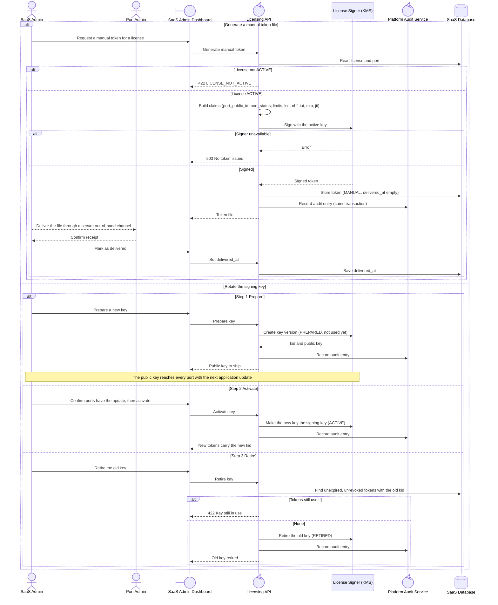
```mermaid
sequenceDiagram
    actor SA as SaaS Admin
    actor PA as Port Admin
    participant UI@{ "type": "boundary" } as SaaS Admin Dashboard
    participant API@{ "type": "control" } as Licensing API
    participant KMS as License Signer (KMS)
    participant AUDIT@{ "type": "control" } as Platform Audit Service
    participant DB@{ "type": "database" } as SaaS Database

    alt Generate a manual token file
        SA->>UI: Request a manual token for a license
        UI->>API: Generate manual token
        API->>DB: Read license and port
        alt License not ACTIVE
            API-->>UI: 422 LICENSE_NOT_ACTIVE
        else License ACTIVE
            API->>API: Build claims (port_public_id, port_status, limits, kid, nbf, iat, exp, jti)
            API->>KMS: Sign with the active key
            alt Signer unavailable
                KMS-->>API: Error
                API-->>UI: 503 No token issued
            else Signed
                KMS-->>API: Signed token
                API->>DB: Store token (MANUAL, delivered_at empty)
                API->>AUDIT: Record audit entry (same transaction)
                API-->>UI: Token file
                SA-->>PA: Deliver the file through a secure out-of-band channel
                PA-->>SA: Confirm receipt
                SA->>UI: Mark as delivered
                UI->>API: Set delivered_at
                API->>DB: Save delivered_at
            end
        end

    else Rotate the signing key
        alt Step 1 Prepare
            SA->>UI: Prepare a new key
            UI->>API: Prepare key
            API->>KMS: Create key version (PREPARED, not used yet)
            KMS-->>API: kid and public key
            API->>AUDIT: Record audit entry
            API-->>UI: Public key to ship
            Note over SA,KMS: The public key reaches every port with the next application update
        else Step 2 Activate
            SA->>UI: Confirm ports have the update, then activate
            UI->>API: Activate key
            API->>KMS: Make the new key the signing key (ACTIVE)
            API->>AUDIT: Record audit entry
            API-->>UI: New tokens carry the new kid
        else Step 3 Retire
            SA->>UI: Retire the old key
            UI->>API: Retire key
            API->>DB: Find unexpired, unrevoked tokens with the old kid
            alt Tokens still use it
                API-->>UI: 422 Key still in use
            else None
                API->>KMS: Retire the old key (RETIRED)
                API->>AUDIT: Record audit entry
                API-->>UI: Old key retired
            end
        end
    end
```

### 1.10 Port check-in on the SaaS side

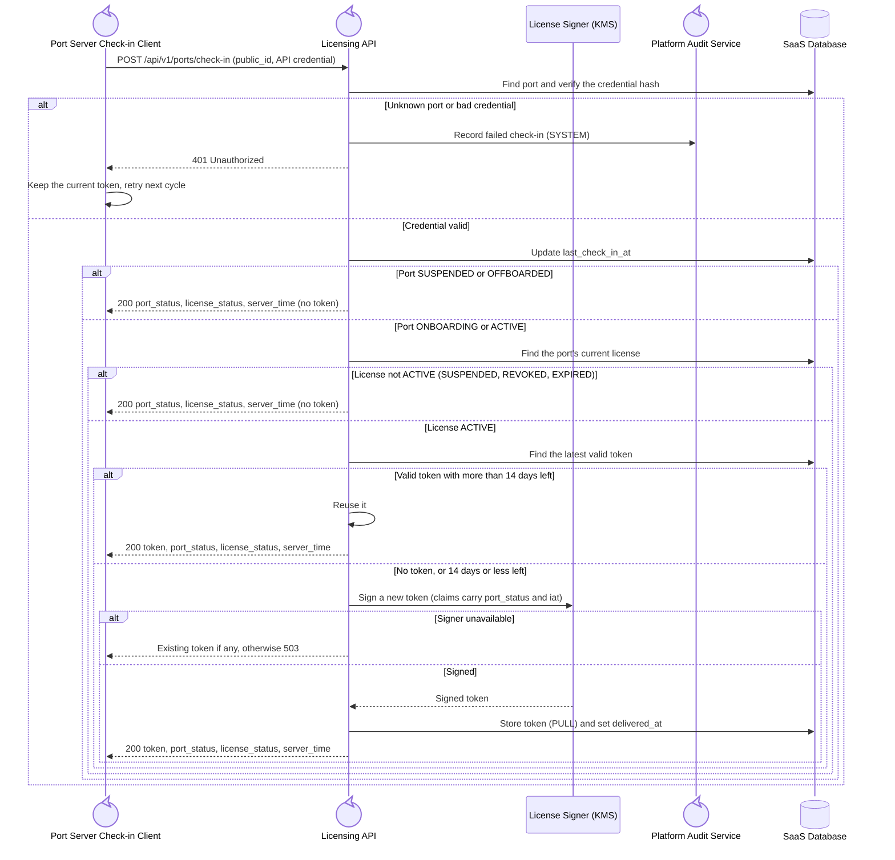
```mermaid
sequenceDiagram
    participant PS@{ "type": "control" } as Port Server Check-in Client
    participant API@{ "type": "control" } as Licensing API
    participant KMS as License Signer (KMS)
    participant AUDIT@{ "type": "control" } as Platform Audit Service
    participant DB@{ "type": "database" } as SaaS Database

    PS->>API: POST /api/v1/ports/check-in (public_id, API credential)
    API->>DB: Find port and verify the credential hash
    alt Unknown port or bad credential
        API->>AUDIT: Record failed check-in (SYSTEM)
        API-->>PS: 401 Unauthorized
        PS->>PS: Keep the current token, retry next cycle
    else Credential valid
        API->>DB: Update last_check_in_at
        alt Port SUSPENDED or OFFBOARDED
            API-->>PS: 200 port_status, license_status, server_time (no token)
        else Port ONBOARDING or ACTIVE
            API->>DB: Find the port's current license
            alt License not ACTIVE (SUSPENDED, REVOKED, EXPIRED)
                API-->>PS: 200 port_status, license_status, server_time (no token)
            else License ACTIVE
                API->>DB: Find the latest valid token
                alt Valid token with more than 14 days left
                    API->>API: Reuse it
                    API-->>PS: 200 token, port_status, license_status, server_time
                else No token, or 14 days or less left
                    API->>KMS: Sign a new token (claims carry port_status and iat)
                    alt Signer unavailable
                        API-->>PS: Existing token if any, otherwise 503
                    else Signed
                        KMS-->>API: Signed token
                        API->>DB: Store token (PULL) and set delivered_at
                        API-->>PS: 200 token, port_status, license_status, server_time
                    end
                end
            end
        end
    end
```

### 1.11 Daily license status roll-over

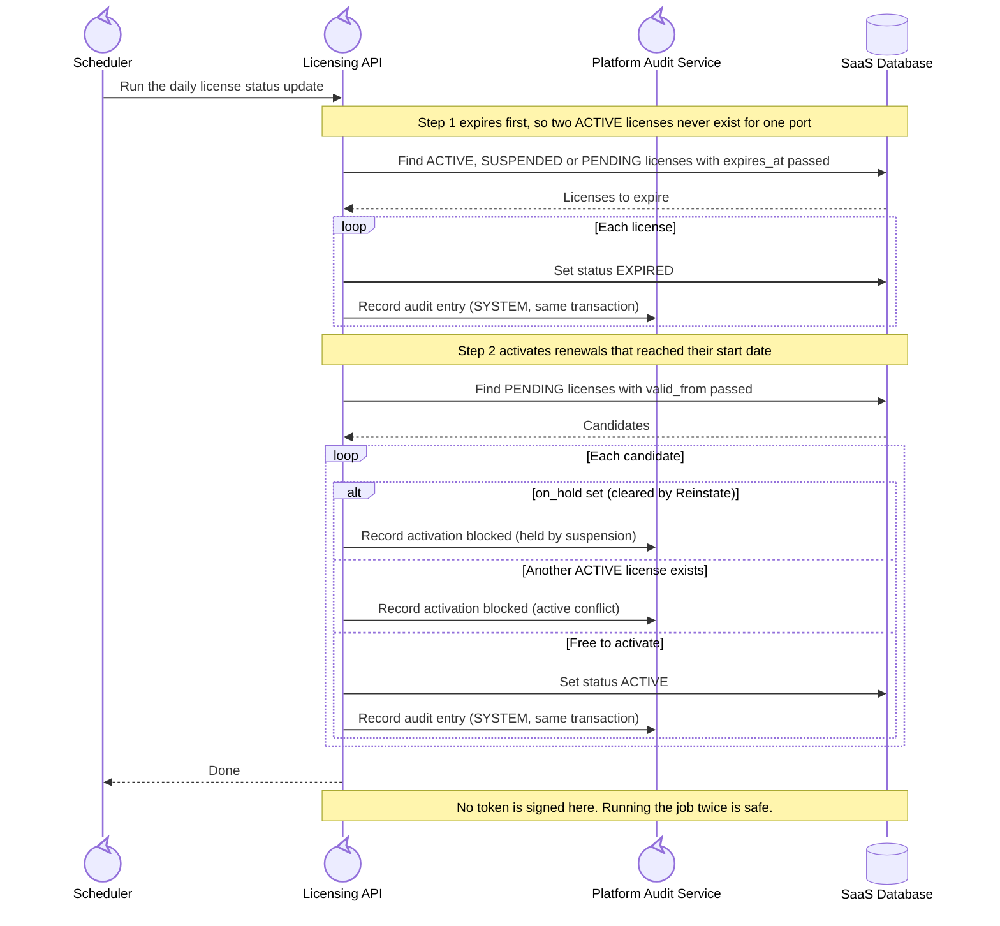
```mermaid
sequenceDiagram
    participant SCH@{ "type": "control" } as Scheduler
    participant API@{ "type": "control" } as Licensing API
    participant AUDIT@{ "type": "control" } as Platform Audit Service
    participant DB@{ "type": "database" } as SaaS Database

    SCH->>API: Run the daily license status update

    Note over API,DB: Step 1 expires first, so two ACTIVE licenses never exist for one port
    API->>DB: Find ACTIVE, SUSPENDED or PENDING licenses with expires_at passed
    DB-->>API: Licenses to expire
    loop Each license
        API->>DB: Set status EXPIRED
        API->>AUDIT: Record audit entry (SYSTEM, same transaction)
    end

    Note over API,DB: Step 2 activates renewals that reached their start date
    API->>DB: Find PENDING licenses with valid_from passed
    DB-->>API: Candidates
    loop Each candidate
        alt on_hold set (cleared by Reinstate)
            API->>AUDIT: Record activation blocked (held by suspension)
        else Another ACTIVE license exists
            API->>AUDIT: Record activation blocked (active conflict)
        else Free to activate
            API->>DB: Set status ACTIVE
            API->>AUDIT: Record audit entry (SYSTEM, same transaction)
        end
    end

    API-->>SCH: Done
    Note over API,DB: No token is signed here. Running the job twice is safe.
```

### 1.12 Annual billing records

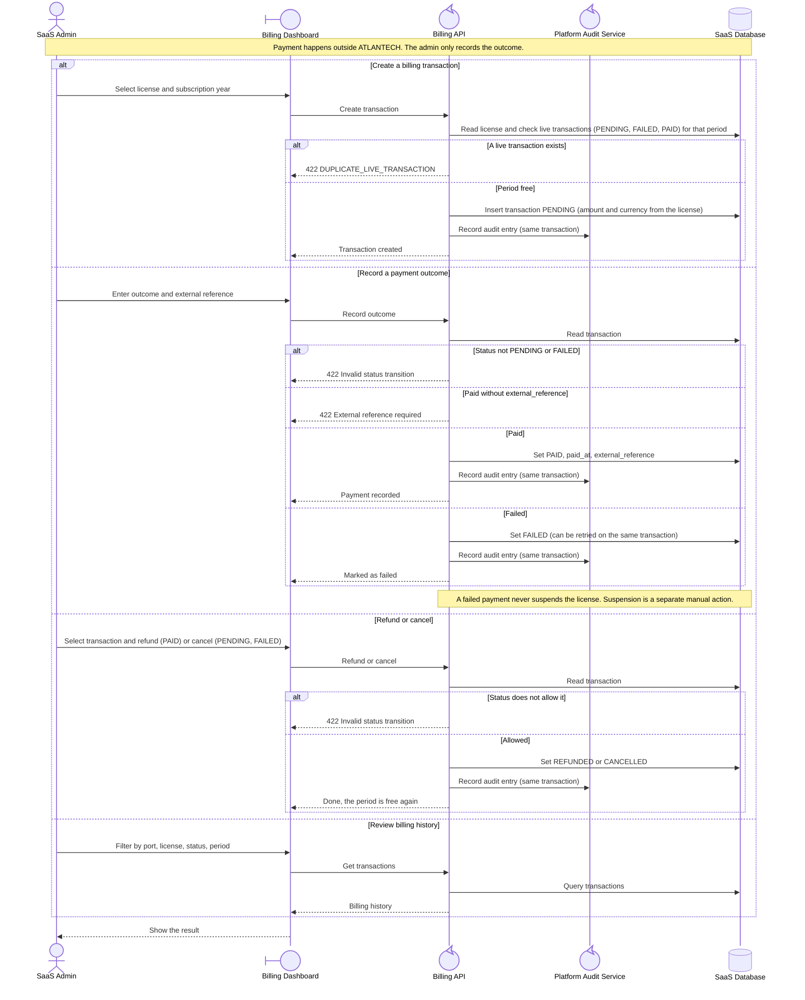
```mermaid
sequenceDiagram
    actor SA as SaaS Admin
    participant UI@{ "type": "boundary" } as Billing Dashboard
    participant API@{ "type": "control" } as Billing API
    participant AUDIT@{ "type": "control" } as Platform Audit Service
    participant DB@{ "type": "database" } as SaaS Database

    Note over SA,DB: Payment happens outside ATLANTECH. The admin only records the outcome.

    alt Create a billing transaction
        SA->>UI: Select license and subscription year
        UI->>API: Create transaction
        API->>DB: Read license and check live transactions (PENDING, FAILED, PAID) for that period
        alt A live transaction exists
            API-->>UI: 422 DUPLICATE_LIVE_TRANSACTION
        else Period free
            API->>DB: Insert transaction PENDING (amount and currency from the license)
            API->>AUDIT: Record audit entry (same transaction)
            API-->>UI: Transaction created
        end

    else Record a payment outcome
        SA->>UI: Enter outcome and external reference
        UI->>API: Record outcome
        API->>DB: Read transaction
        alt Status not PENDING or FAILED
            API-->>UI: 422 Invalid status transition
        else Paid without external_reference
            API-->>UI: 422 External reference required
        else Paid
            API->>DB: Set PAID, paid_at, external_reference
            API->>AUDIT: Record audit entry (same transaction)
            API-->>UI: Payment recorded
        else Failed
            API->>DB: Set FAILED (can be retried on the same transaction)
            API->>AUDIT: Record audit entry (same transaction)
            API-->>UI: Marked as failed
        end
        Note over API,DB: A failed payment never suspends the license. Suspension is a separate manual action.

    else Refund or cancel
        SA->>UI: Select transaction and refund (PAID) or cancel (PENDING, FAILED)
        UI->>API: Refund or cancel
        API->>DB: Read transaction
        alt Status does not allow it
            API-->>UI: 422 Invalid status transition
        else Allowed
            API->>DB: Set REFUNDED or CANCELLED
            API->>AUDIT: Record audit entry (same transaction)
            API-->>UI: Done, the period is free again
        end

    else Review billing history
        SA->>UI: Filter by port, license, status, period
        UI->>API: Get transactions
        API->>DB: Query transactions
        API-->>UI: Billing history
    end

    UI-->>SA: Show the result
```

### 1.13 Port license check-in and token upload

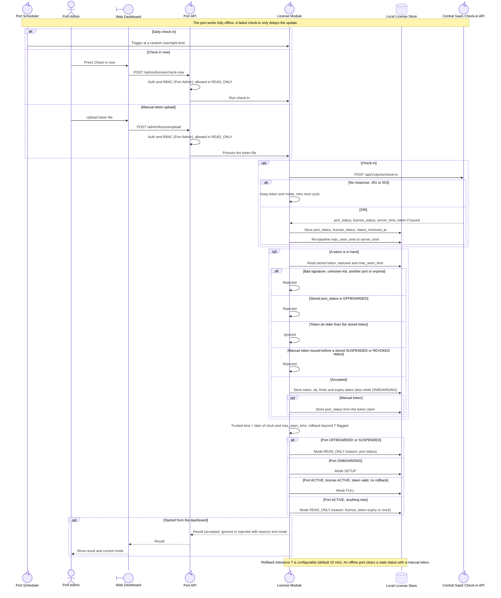
```mermaid
sequenceDiagram
    participant SCH@{ "type": "control" } as Port Scheduler
    actor PA as Port Admin
    participant WEB@{ "type": "boundary" } as Web Dashboard
    participant API@{ "type": "control" } as Port API
    participant LM@{ "type": "control" } as License Module
    participant LS@{ "type": "database" } as Local License Store
    participant SAAS@{ "type": "control" } as Central SaaS Check-in API

    Note over SCH,SAAS: The port works fully offline. A failed check-in only delays the update.

    alt Daily check-in
        SCH->>LM: Trigger at a random overnight time
    else Check in now
        PA->>WEB: Press Check in now
        WEB->>API: POST /admin/license/check-now
        API->>API: Auth and RBAC (Port Admin), allowed in READ_ONLY
        API->>LM: Run check-in
    else Manual token upload
        PA->>WEB: Upload token file
        WEB->>API: POST /admin/license/upload
        API->>API: Auth and RBAC (Port Admin), allowed in READ_ONLY
        API->>LM: Process the token file
    end

    opt Check-in
        LM->>SAAS: POST /api/v1/ports/check-in
        alt No response, 401 or 503
            LM->>LM: Keep token and mode, retry next cycle
        else 200
            SAAS-->>LM: port_status, license_status, server_time, token if issued
            LM->>LS: Store port_status, license_status, status_received_at
            LM->>LS: Re-baseline max_seen_time to server_time
        end
    end

    opt A token is in hand
        LM->>LS: Read stored token, statuses and max_seen_time
        alt Bad signature, unknown kid, another port or expired
            LM->>LM: Rejected
        else Stored port_status is OFFBOARDED
            LM->>LM: Rejected
        else Token iat older than the stored token
            LM->>LM: Ignored
        else Manual token issued before a stored SUSPENDED or REVOKED status
            LM->>LM: Rejected
        else Accepted
            LM->>LS: Store token, iat, limits and expiry dates (also while ONBOARDING)
            opt Manual token
                LM->>LS: Store port_status from the token claim
            end
        end
    end

    LM->>LM: Trusted time = later of clock and max_seen_time, rollback beyond T flagged
    alt Port OFFBOARDED or SUSPENDED
        LM->>LS: Mode READ_ONLY (reason: port status)
    else Port ONBOARDING
        LM->>LS: Mode SETUP
    else Port ACTIVE, license ACTIVE, token valid, no rollback
        LM->>LS: Mode FULL
    else Port ACTIVE, anything else
        LM->>LS: Mode READ_ONLY (reason: license, token expiry or clock)
    end

    opt Started from the dashboard
        LM-->>API: Result (accepted, ignored or rejected with reason) and mode
        API-->>WEB: Result
        WEB-->>PA: Show result and current mode
    end
    Note over LM,LS: Rollback tolerance T is configurable (default 10 min). An offline port clears a stale status with a manual token.
```

### 1.14 Read-only enforcement, limits and license status

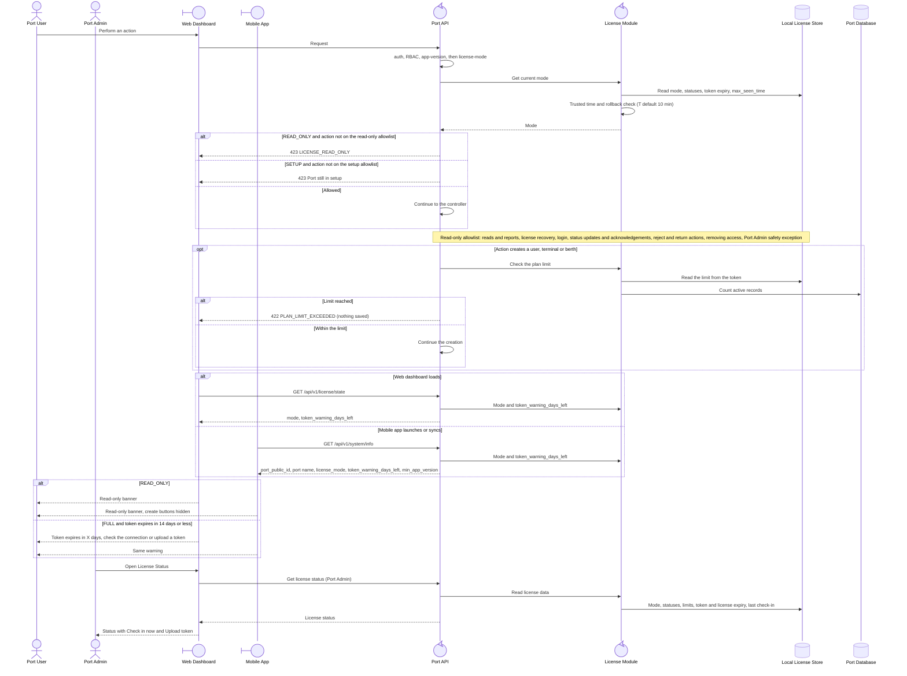
```mermaid
sequenceDiagram
    actor U as Port User
    actor PA as Port Admin
    participant WEB@{ "type": "boundary" } as Web Dashboard
    participant MOB@{ "type": "boundary" } as Mobile App
    participant API@{ "type": "control" } as Port API
    participant LM@{ "type": "control" } as License Module
    participant LS@{ "type": "database" } as Local License Store
    participant DB@{ "type": "database" } as Port Database

    U->>WEB: Perform an action
    WEB->>API: Request
    API->>API: auth, RBAC, app-version, then license-mode
    API->>LM: Get current mode
    LM->>LS: Read mode, statuses, token expiry, max_seen_time
    LM->>LM: Trusted time and rollback check (T default 10 min)
    LM-->>API: Mode
    alt READ_ONLY and action not on the read-only allowlist
        API-->>WEB: 423 LICENSE_READ_ONLY
    else SETUP and action not on the setup allowlist
        API-->>WEB: 423 Port still in setup
    else Allowed
        API->>API: Continue to the controller
    end
    Note over API,LS: Read-only allowlist: reads and reports, license recovery, login, status updates and acknowledgements, reject and return actions, removing access, Port Admin safety exception

    opt Action creates a user, terminal or berth
        API->>LM: Check the plan limit
        LM->>LS: Read the limit from the token
        LM->>DB: Count active records
        alt Limit reached
            API-->>WEB: 422 PLAN_LIMIT_EXCEEDED (nothing saved)
        else Within the limit
            API->>API: Continue the creation
        end
    end

    alt Web dashboard loads
        WEB->>API: GET /api/v1/license/state
        API->>LM: Mode and token_warning_days_left
        API-->>WEB: mode, token_warning_days_left
    else Mobile app launches or syncs
        MOB->>API: GET /api/v1/system/info
        API->>LM: Mode and token_warning_days_left
        API-->>MOB: port_public_id, port name, license_mode, token_warning_days_left, min_app_version
    end
    alt READ_ONLY
        WEB-->>U: Read-only banner
        MOB-->>U: Read-only banner, create buttons hidden
    else FULL and token expires in 14 days or less
        WEB-->>U: Token expires in X days, check the connection or upload a token
        MOB-->>U: Same warning
    end

    PA->>WEB: Open License Status
    WEB->>API: Get license status (Port Admin)
    API->>LM: Read license data
    LM->>LS: Mode, statuses, limits, token and license expiry, last check-in
    API-->>WEB: License status
    WEB-->>PA: Status with Check in now and Upload token
```

## Category 2 — Port Setup, Operations and Recommendation

### 2.1 Web and mobile sign-in

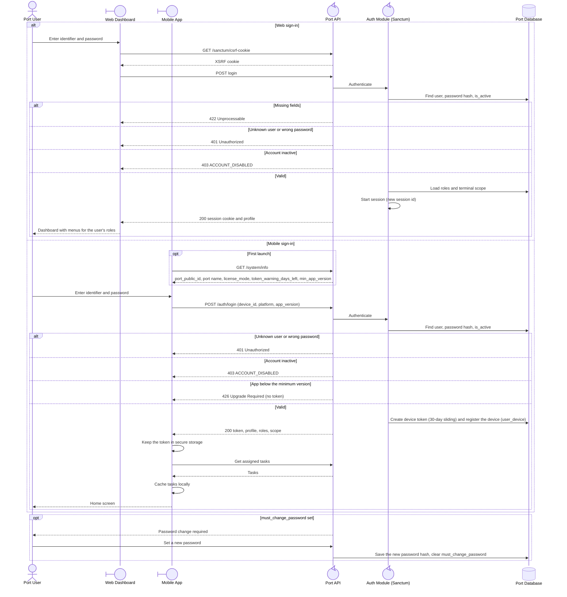
```mermaid
sequenceDiagram
    actor U as Port User
    participant WEB@{ "type": "boundary" } as Web Dashboard
    participant MOB@{ "type": "boundary" } as Mobile App
    participant API@{ "type": "control" } as Port API
    participant AUTH@{ "type": "control" } as Auth Module (Sanctum)
    participant DB@{ "type": "database" } as Port Database

    alt Web sign-in
        U->>WEB: Enter identifier and password
        WEB->>API: GET /sanctum/csrf-cookie
        API-->>WEB: XSRF cookie
        WEB->>API: POST login
        API->>AUTH: Authenticate
        AUTH->>DB: Find user, password hash, is_active
        alt Missing fields
            API-->>WEB: 422 Unprocessable
        else Unknown user or wrong password
            API-->>WEB: 401 Unauthorized
        else Account inactive
            API-->>WEB: 403 ACCOUNT_DISABLED
        else Valid
            AUTH->>DB: Load roles and terminal scope
            AUTH->>AUTH: Start session (new session id)
            API-->>WEB: 200 session cookie and profile
            WEB-->>U: Dashboard with menus for the user's roles
        end

    else Mobile sign-in
        opt First launch
            MOB->>API: GET /system/info
            API-->>MOB: port_public_id, port name, license_mode, token_warning_days_left, min_app_version
        end
        U->>MOB: Enter identifier and password
        MOB->>API: POST /auth/login (device_id, platform, app_version)
        API->>AUTH: Authenticate
        AUTH->>DB: Find user, password hash, is_active
        alt Unknown user or wrong password
            API-->>MOB: 401 Unauthorized
        else Account inactive
            API-->>MOB: 403 ACCOUNT_DISABLED
        else App below the minimum version
            API-->>MOB: 426 Upgrade Required (no token)
        else Valid
            AUTH->>DB: Create device token (30-day sliding) and register the device (user_device)
            API-->>MOB: 200 token, profile, roles, scope
            MOB->>MOB: Keep the token in secure storage
            MOB->>API: Get assigned tasks
            API-->>MOB: Tasks
            MOB->>MOB: Cache tasks locally
            MOB-->>U: Home screen
        end
    end

    opt must_change_password set
        API-->>U: Password change required
        U->>API: Set a new password
        API->>DB: Save the new password hash, clear must_change_password
    end
```

### 2.2 Request checks, re-authentication and logout

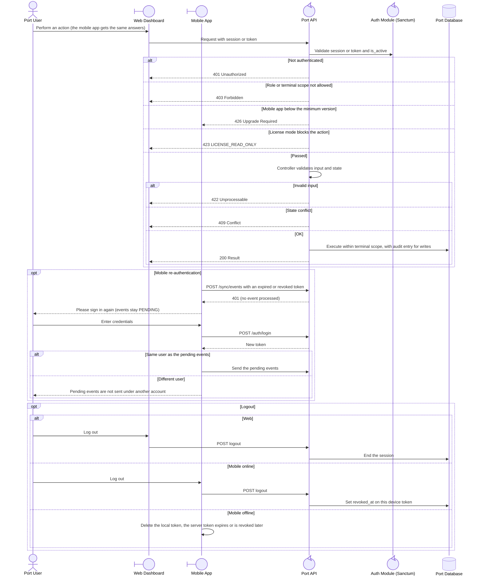
```mermaid
sequenceDiagram
    actor U as Port User
    participant WEB@{ "type": "boundary" } as Web Dashboard
    participant MOB@{ "type": "boundary" } as Mobile App
    participant API@{ "type": "control" } as Port API
    participant AUTH@{ "type": "control" } as Auth Module (Sanctum)
    participant DB@{ "type": "database" } as Port Database

    U->>WEB: Perform an action (the mobile app gets the same answers)
    WEB->>API: Request with session or token
    API->>AUTH: Validate session or token and is_active
    alt Not authenticated
        API-->>WEB: 401 Unauthorized
    else Role or terminal scope not allowed
        API-->>WEB: 403 Forbidden
    else Mobile app below the minimum version
        API-->>MOB: 426 Upgrade Required
    else License mode blocks the action
        API-->>WEB: 423 LICENSE_READ_ONLY
    else Passed
        API->>API: Controller validates input and state
        alt Invalid input
            API-->>WEB: 422 Unprocessable
        else State conflict
            API-->>WEB: 409 Conflict
        else OK
            API->>DB: Execute within terminal scope, with audit entry for writes
            API-->>WEB: 200 Result
        end
    end

    opt Mobile re-authentication
        MOB->>API: POST /sync/events with an expired or revoked token
        API-->>MOB: 401 (no event processed)
        MOB-->>U: Please sign in again (events stay PENDING)
        U->>MOB: Enter credentials
        MOB->>API: POST /auth/login
        API-->>MOB: New token
        alt Same user as the pending events
            MOB->>API: Send the pending events
        else Different user
            MOB-->>U: Pending events are not sent under another account
        end
    end

    opt Logout
        alt Web
            U->>WEB: Log out
            WEB->>API: POST logout
            API->>DB: End the session
        else Mobile online
            U->>MOB: Log out
            MOB->>API: POST logout
            API->>DB: Set revoked_at on this device token
        else Mobile offline
            MOB->>MOB: Delete the local token, the server token expires or is revoked later
        end
    end
```

### 2.3 Users, roles and devices

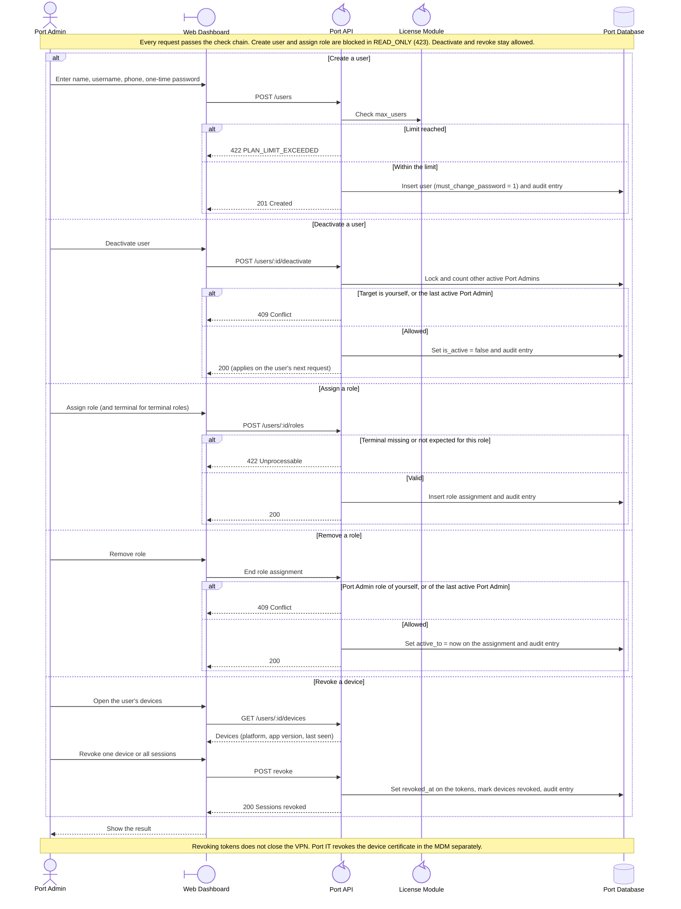
```mermaid
sequenceDiagram
    actor PA as Port Admin
    participant WEB@{ "type": "boundary" } as Web Dashboard
    participant API@{ "type": "control" } as Port API
    participant LM@{ "type": "control" } as License Module
    participant DB@{ "type": "database" } as Port Database

    Note over PA,DB: Every request passes the check chain. Create user and assign role are blocked in READ_ONLY (423). Deactivate and revoke stay allowed.

    alt Create a user
        PA->>WEB: Enter name, username, phone, one-time password
        WEB->>API: POST /users
        API->>LM: Check max_users
        alt Limit reached
            API-->>WEB: 422 PLAN_LIMIT_EXCEEDED
        else Within the limit
            API->>DB: Insert user (must_change_password = 1) and audit entry
            API-->>WEB: 201 Created
        end

    else Deactivate a user
        PA->>WEB: Deactivate user
        WEB->>API: POST /users/:id/deactivate
        API->>DB: Lock and count other active Port Admins
        alt Target is yourself, or the last active Port Admin
            API-->>WEB: 409 Conflict
        else Allowed
            API->>DB: Set is_active = false and audit entry
            API-->>WEB: 200 (applies on the user's next request)
        end

    else Assign a role
        PA->>WEB: Assign role (and terminal for terminal roles)
        WEB->>API: POST /users/:id/roles
        alt Terminal missing or not expected for this role
            API-->>WEB: 422 Unprocessable
        else Valid
            API->>DB: Insert role assignment and audit entry
            API-->>WEB: 200
        end

    else Remove a role
        PA->>WEB: Remove role
        WEB->>API: End role assignment
        alt Port Admin role of yourself, or of the last active Port Admin
            API-->>WEB: 409 Conflict
        else Allowed
            API->>DB: Set active_to = now on the assignment and audit entry
            API-->>WEB: 200
        end

    else Revoke a device
        PA->>WEB: Open the user's devices
        WEB->>API: GET /users/:id/devices
        API-->>WEB: Devices (platform, app version, last seen)
        PA->>WEB: Revoke one device or all sessions
        WEB->>API: POST revoke
        API->>DB: Set revoked_at on the tokens, mark devices revoked, audit entry
        API-->>WEB: 200 Sessions revoked
    end

    WEB-->>PA: Show the result
    Note over PA,DB: Revoking tokens does not close the VPN. Port IT revokes the device certificate in the MDM separately.
```

### 2.4 Port profile, terminals and berths

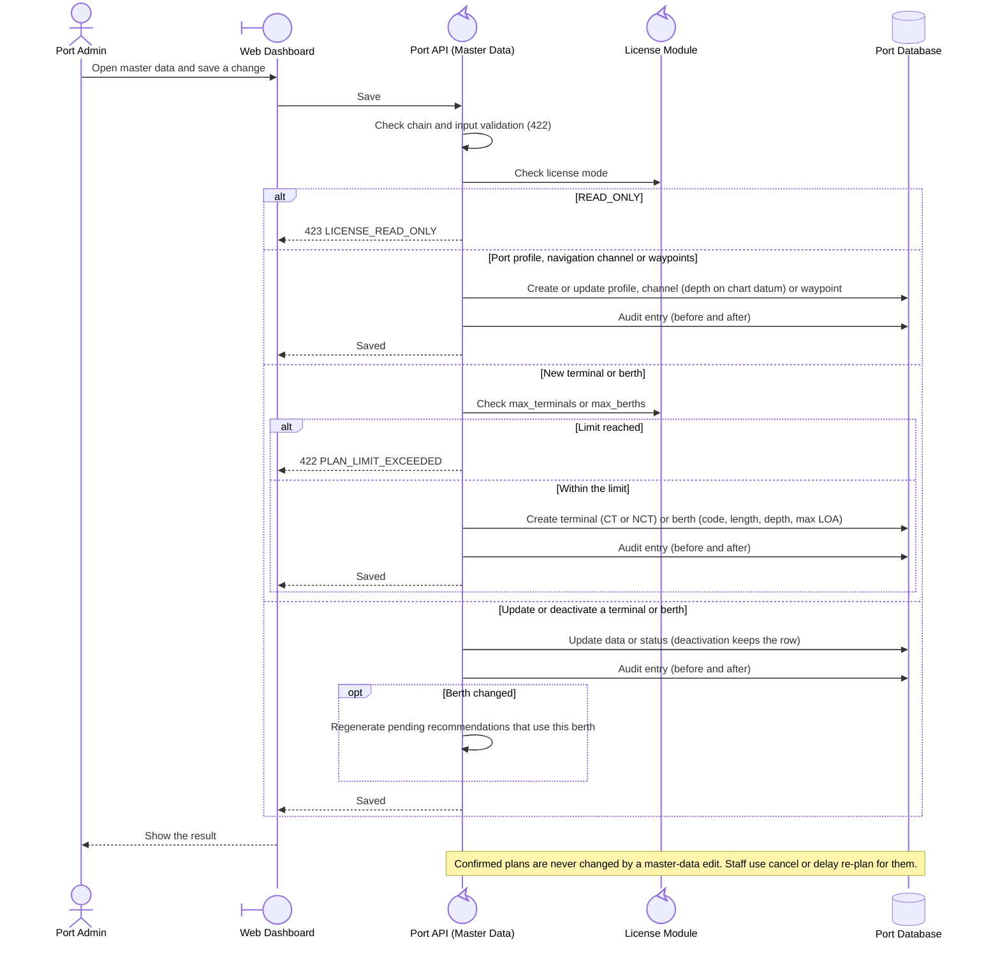
```mermaid
sequenceDiagram
    actor PA as Port Admin
    participant WEB@{ "type": "boundary" } as Web Dashboard
    participant API@{ "type": "control" } as Port API (Master Data)
    participant LM@{ "type": "control" } as License Module
    participant DB@{ "type": "database" } as Port Database

    PA->>WEB: Open master data and save a change
    WEB->>API: Save
    API->>API: Check chain and input validation (422)
    API->>LM: Check license mode
    alt READ_ONLY
        API-->>WEB: 423 LICENSE_READ_ONLY

    else Port profile, navigation channel or waypoints
        API->>DB: Create or update profile, channel (depth on chart datum) or waypoint
        API->>DB: Audit entry (before and after)
        API-->>WEB: Saved

    else New terminal or berth
        API->>LM: Check max_terminals or max_berths
        alt Limit reached
            API-->>WEB: 422 PLAN_LIMIT_EXCEEDED
        else Within the limit
            API->>DB: Create terminal (CT or NCT) or berth (code, length, depth, max LOA)
            API->>DB: Audit entry (before and after)
            API-->>WEB: Saved
        end

    else Update or deactivate a terminal or berth
        API->>DB: Update data or status (deactivation keeps the row)
        API->>DB: Audit entry (before and after)
        opt Berth changed
            API->>API: Regenerate pending recommendations that use this berth
        end
        API-->>WEB: Saved
    end

    WEB-->>PA: Show the result
    Note over API,DB: Confirmed plans are never changed by a master-data edit. Staff use cancel or delay re-plan for them.
```

### 2.5 Tugs, tug masters and pilots

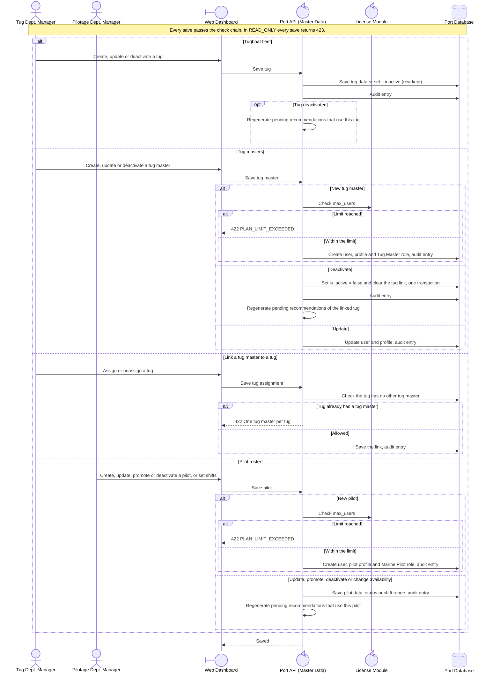
```mermaid
sequenceDiagram
    actor TM as Tug Dept. Manager
    actor PM as Pilotage Dept. Manager
    participant WEB@{ "type": "boundary" } as Web Dashboard
    participant API@{ "type": "control" } as Port API (Master Data)
    participant LM@{ "type": "control" } as License Module
    participant DB@{ "type": "database" } as Port Database

    Note over TM,DB: Every save passes the check chain. In READ_ONLY every save returns 423.

    alt Tugboat fleet
        TM->>WEB: Create, update or deactivate a tug
        WEB->>API: Save tug
        API->>DB: Save tug data or set it inactive (row kept)
        API->>DB: Audit entry
        opt Tug deactivated
            API->>API: Regenerate pending recommendations that use this tug
        end

    else Tug masters
        TM->>WEB: Create, update or deactivate a tug master
        WEB->>API: Save tug master
        alt New tug master
            API->>LM: Check max_users
            alt Limit reached
                API-->>WEB: 422 PLAN_LIMIT_EXCEEDED
            else Within the limit
                API->>DB: Create user, profile and Tug Master role, audit entry
            end
        else Deactivate
            API->>DB: Set is_active = false and clear the tug link, one transaction
            API->>DB: Audit entry
            API->>API: Regenerate pending recommendations of the linked tug
        else Update
            API->>DB: Update user and profile, audit entry
        end

    else Link a tug master to a tug
        TM->>WEB: Assign or unassign a tug
        WEB->>API: Save tug assignment
        API->>DB: Check the tug has no other tug master
        alt Tug already has a tug master
            API-->>WEB: 422 One tug master per tug
        else Allowed
            API->>DB: Save the link, audit entry
        end

    else Pilot roster
        PM->>WEB: Create, update, promote or deactivate a pilot, or set shifts
        WEB->>API: Save pilot
        alt New pilot
            API->>LM: Check max_users
            alt Limit reached
                API-->>WEB: 422 PLAN_LIMIT_EXCEEDED
            else Within the limit
                API->>DB: Create user, pilot profile and Marine Pilot role, audit entry
            end
        else Update, promote, deactivate or change availability
            API->>DB: Save pilot data, status or shift range, audit entry
            API->>API: Regenerate pending recommendations that use this pilot
        end
    end

    API-->>WEB: Saved
```

### 2.6 Terminal equipment, yard, safety limits and audit

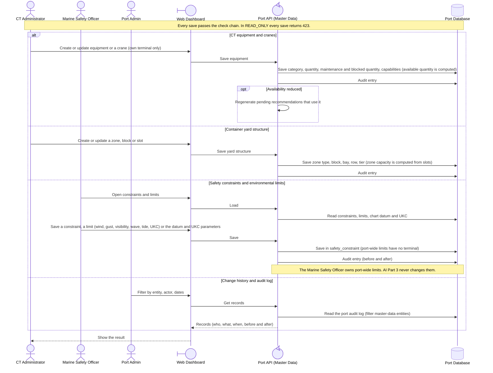
```mermaid
sequenceDiagram
    actor CTA as CT Administrator
    actor MSO as Marine Safety Officer
    actor PA as Port Admin
    participant WEB@{ "type": "boundary" } as Web Dashboard
    participant API@{ "type": "control" } as Port API (Master Data)
    participant DB@{ "type": "database" } as Port Database

    Note over CTA,DB: Every save passes the check chain. In READ_ONLY every save returns 423.

    alt CT equipment and cranes
        CTA->>WEB: Create or update equipment or a crane (own terminal only)
        WEB->>API: Save equipment
        API->>DB: Save category, quantity, maintenance and blocked quantity, capabilities (available quantity is computed)
        API->>DB: Audit entry
        opt Availability reduced
            API->>API: Regenerate pending recommendations that use it
        end

    else Container yard structure
        CTA->>WEB: Create or update a zone, block or slot
        WEB->>API: Save yard structure
        API->>DB: Save zone type, block, bay, row, tier (zone capacity is computed from slots)
        API->>DB: Audit entry

    else Safety constraints and environmental limits
        MSO->>WEB: Open constraints and limits
        WEB->>API: Load
        API->>DB: Read constraints, limits, chart datum and UKC
        MSO->>WEB: Save a constraint, a limit (wind, gust, visibility, wave, tide, UKC) or the datum and UKC parameters
        WEB->>API: Save
        API->>DB: Save in safety_constraint (port-wide limits have no terminal)
        API->>DB: Audit entry (before and after)
        Note over API,DB: The Marine Safety Officer owns port-wide limits. AI Part 3 never changes them.

    else Change history and audit log
        PA->>WEB: Filter by entity, actor, dates
        WEB->>API: Get records
        API->>DB: Read the port audit log (filter master-data entities)
        API-->>WEB: Records (who, what, when, before and after)
    end

    WEB-->>CTA: Show the result
```

### 2.7 BAPLIE upload and parsing

```mermaid
sequenceDiagram
    actor ST as Port Authority Staff
    participant WEB@{ "type": "boundary" } as Web Dashboard
    participant API@{ "type": "control" } as Port API (BAPLIE)
    participant FS@{ "type": "database" } as BAPLIE File Volume
    participant Q@{ "type": "queue" } as Redis Queue
    participant PR@{ "type": "control" } as EDI Parser
    participant DB@{ "type": "database" } as Port Database

    ST->>WEB: Upload BAPLIE file, select the berthing request or leave it empty
    WEB->>API: Upload
    API->>API: Check chain
    alt READ_ONLY
        API-->>WEB: 423 LICENSE_READ_ONLY
    else Request left empty
        API->>DB: Match by IMO in the file and ETA within 24 h among open requests
        alt Zero or several matches
            API-->>WEB: 422 Select the request
        else Exactly one match
            API->>API: Link that request
        end
    end

    opt Request linked
        API->>DB: Check file hash for this request (non-withdrawn files)
        alt Same file already uploaded for this request
            API-->>WEB: 409 Duplicate file
        else New file
            API->>FS: Store the file
            API->>DB: Create baplie_file (request linked, status STAGED, parse_status PENDING)
            API->>Q: Push parse job
            API-->>WEB: Accepted, processing
        end
    end

    Q->>PR: Deliver parse job
    PR->>FS: Read the file
    PR->>PR: Parse and validate (EDIFACT D.17A, SMDG 2019)
    PR->>DB: Read the request's vessel
    alt IMO differs from the request
        PR->>DB: parse_status QUARANTINED (blocking mismatch)
    else Valid
        PR->>DB: Find or create the vessel by IMO, fill empty fields only
        PR->>DB: Mark the earlier ACTIVE file of this request REPLACED
        PR->>DB: Store containers and stowage, file ACTIVE, parse_status PARSED
        Note over PR,DB: One transaction. Data from the request form is never overwritten.
    else Invalid or incomplete
        PR->>DB: Save staged payload and diagnostics, parse_status QUARANTINED
        Note over PR,DB: Nothing reaches operational data
    else File unreadable
        PR->>DB: parse_status FAILED (no staged data)
    end

    API->>DB: Read parse_status
    API-->>WEB: SSE update
    WEB-->>ST: Processed, or errors to review
```

### 2.8 BAPLIE correction, withdraw and vessel data

```mermaid
sequenceDiagram
    actor ST as Port Authority Staff
    participant WEB@{ "type": "boundary" } as Web Dashboard
    participant API@{ "type": "control" } as Port API (BAPLIE)
    participant DB@{ "type": "database" } as Port Database

    Note over ST,DB: Every write passes the check chain. Correction, withdraw and vessel edit return 423 in READ_ONLY.

    alt Review and correct a file with errors
        ST->>WEB: Open diagnostics
        WEB->>API: Get diagnostics
        API->>DB: Read staged payload and errors per field
        API-->>WEB: Diagnostics
        ST->>WEB: Correct the staged data
        WEB->>API: Submit correction
        API->>API: Validate with the shared rule set
        alt Still invalid
            API-->>WEB: Remaining errors, nothing committed
        else Valid
            API->>DB: Find or create vessel by IMO, fill empty fields only
            API->>DB: Earlier ACTIVE file REPLACED, store containers, file ACTIVE, parse_status PARSED
            API->>DB: Mark corrected_by and audit entry
            Note over API,DB: One transaction
            API-->>WEB: Corrected
        end

    else Withdraw a file uploaded by mistake
        ST->>WEB: Withdraw file
        WEB->>API: Withdraw
        API->>DB: Read file and plans that used it
        alt Already WITHDRAWN
            API-->>WEB: 422 Invalid status transition
        else A PLAN_CONFIRMED plan used it
            API-->>WEB: 409 Cancel the plan first
        else Allowed
            API->>DB: Set WITHDRAWN (nothing deleted)
            opt It was the ACTIVE file
                API->>DB: Make the latest REPLACED file of the request ACTIVE again
            end
            API->>DB: Audit entry
            API-->>WEB: Withdrawn
        end

    else Edit vessel data
        ST->>WEB: Edit vessel particulars
        WEB->>API: Save vessel
        alt Invalid
            API-->>WEB: 422 Validation error
        else Valid
            API->>DB: Update vessel and audit entry
            API-->>WEB: Saved
        end
    end

    WEB-->>ST: Show the result
```

### 2.9 Berthing request: create, change and review

```mermaid
sequenceDiagram
    actor ST as Port Authority Staff
    participant WEB@{ "type": "boundary" } as Web Dashboard
    participant API@{ "type": "control" } as Port API (Berthing)
    participant DB@{ "type": "database" } as Port Database

    Note over ST,DB: Every request is created manually by staff. Each status change writes status history and an audit entry.

    ST->>WEB: Fill the request (IMO, name, LOA, beam, max draft, arrival draft, block coefficient, DWT, GT, ETA, terminal)
    WEB->>API: POST /berthing-requests
    alt READ_ONLY
        API-->>WEB: 423 LICENSE_READ_ONLY
    else Invalid values
        API-->>WEB: 422 Validation error
    else Valid
        API->>DB: Find or create the vessel by IMO with the form data
        API->>DB: Insert request SUBMITTED
        API-->>WEB: 201 Created
    end

    opt Modify or cancel before preliminary approval
        ST->>WEB: Edit, or cancel with a reason
        WEB->>API: Update or cancel
        alt READ_ONLY
            API-->>WEB: 423 LICENSE_READ_ONLY
        else Status not SUBMITTED or NEEDS_REVISION
            API-->>WEB: 409 Conflict
        else Cancel without a reason
            API-->>WEB: 422 Reason required
        else Allowed
            API->>DB: Save the change, or set CANCELLED
            API-->>WEB: 200
        end
    end

    alt Approve
        ST->>WEB: Record preliminary approval
        WEB->>API: Approve
        alt READ_ONLY
            API-->>WEB: 423 LICENSE_READ_ONLY
        else FULL
            API->>DB: Status PRELIMINARY_APPROVED
            API-->>WEB: 200
        end
    else Return for revision (allowed in READ_ONLY)
        ST->>WEB: Return with a reason
        WEB->>API: Return
        API->>DB: Status NEEDS_REVISION with the reason
        API-->>WEB: 200
        opt Creator edits and resubmits
            ST->>WEB: Edit and resubmit
            WEB->>API: Resubmit
            API->>DB: Status SUBMITTED
        end
    else Reject (allowed in READ_ONLY)
        ST->>WEB: Reject with a reason
        WEB->>API: Reject
        API->>DB: Status REJECTED with the reason
        API-->>WEB: 200
    end
```

### 2.10 Customs approval and entry-window assessment

```mermaid
sequenceDiagram
    actor ST as Port Authority Staff
    participant API@{ "type": "control" } as Port API (Berthing)
    participant DB@{ "type": "database" } as Port Database
    participant Q@{ "type": "queue" } as Part 1 Queue
    participant P1@{ "type": "control" } as AI Part 1 Worker
    participant WX as Weather Providers

    ST->>API: Record customs approval
    alt READ_ONLY
        API-->>ST: 423 LICENSE_READ_ONLY
    else Status not PRELIMINARY_APPROVED
        API-->>ST: 409 Conflict
    else Valid
        API->>DB: Status CUSTOMS_APPROVED
        API->>DB: Create part1_run QUEUED
        API->>Q: Enqueue Part 1 run
        API-->>ST: 202 Accepted, result by SSE
    end

    Q->>P1: Run (QUEUED to RUNNING)
    P1->>DB: Load request, vessel particulars, channel and limits
    alt Request no longer CUSTOMS_APPROVED
        P1->>P1: Discard the run
    else Eligible
        P1->>WX: Weather and sea level from the primary provider
        alt Primary fails
            P1->>P1: Log an alert (application log)
            P1->>WX: Try the secondary provider
        end
        alt Fresh data received
            P1->>DB: Store forecast
        else Both providers fail
            P1->>DB: Read stored data
            P1->>P1: Usable only if measured within 48 h and covering the horizon
        end

        alt Usable environmental data
            P1->>DB: Read astronomical tide (compute missing hours)
            P1->>P1: Surge = sea level minus tide
            P1->>P1: Check wind, visibility, waves, tide and surge, UKC and squat against the limits
            alt Feasible windows
                P1->>DB: Store windows and blocked periods, outcome WINDOWS_FOUND (run DONE, earlier run REPLACED)
            else NO_FEASIBLE_WINDOW
                P1->>DB: Store blocked periods with the limiting factor, outcome NO_FEASIBLE_WINDOW
            end
        else No usable data
            P1->>DB: Outcome ENV_DATA_UNAVAILABLE
        end
    end
    Note over P1,DB: A failed run is retried up to 3 times, then marked FAILED
    API-->>ST: SSE update with the outcome
```

### 2.11 Entry-window decision

```mermaid
sequenceDiagram
    actor ST as Port Authority Staff
    participant WEB@{ "type": "boundary" } as Web Dashboard
    participant API@{ "type": "control" } as Port API (Berthing)
    participant DB@{ "type": "database" } as Port Database
    participant Q1@{ "type": "queue" } as Part 1 Queue
    participant Q2@{ "type": "queue" } as Part 2 Queue

    ST->>WEB: Open the Part 1 result
    WEB->>API: Get latest result
    API->>DB: Read windows, blocked periods, data sources
    API-->>WEB: Result

    alt ENV_DATA_UNAVAILABLE
        ST->>WEB: Enter manual environmental data
        WEB->>API: Submit manual data
        alt READ_ONLY
            API-->>WEB: 423 LICENSE_READ_ONLY
        else Invalid or not covering the horizon
            API-->>WEB: 422 Validation error
        else Valid
            API->>DB: Store data (pull_type MANUAL, provider_rank MANUAL, submitted_by)
            API->>Q1: Recompute
        end

    else NO_FEASIBLE_WINDOW
        ST->>WEB: Recompute later
        WEB->>API: Recompute
        API->>Q1: New Part 1 run (423 in READ_ONLY)

    else Feasible windows
        alt Confirm one window
            ST->>WEB: Select a window
            WEB->>API: Confirm window
            alt READ_ONLY
                API-->>WEB: 423 LICENSE_READ_ONLY
            else Window not in the latest result, or server check fails
                API-->>WEB: 409 with the reason, press Recompute
            else Valid
                API->>DB: Status ENTRY_WINDOW_CONFIRMED, store the window
                API->>Q2: Enqueue Part 2 recommendation
                API-->>WEB: 200 Window confirmed
            end
        else Reject all windows (allowed in READ_ONLY)
            ST->>WEB: Reject all with a reason
            WEB->>API: Reject all windows
            API->>DB: Proposal REJECTED with rejection_reason and rejected_by, request stays CUSTOMS_APPROVED
            API-->>WEB: 200 Waiting for a new assessment
        end
    end

    opt Reopen a confirmed window
        ST->>WEB: Reopen with a reason
        WEB->>API: Reopen window
        alt READ_ONLY
            API-->>WEB: 423 LICENSE_READ_ONLY
        else Not ENTRY_WINDOW_CONFIRMED, or a plan is confirmed
            API-->>WEB: 409 Conflict
        else Allowed
            API->>DB: Status CUSTOMS_APPROVED
            API->>Q1: New Part 1 run
            API-->>WEB: 200 Reopened
        end
    end
```

### 2.12 Weather and environmental data

```mermaid
sequenceDiagram
    actor OU as Office User
    participant SCH@{ "type": "control" } as Part 1 Scheduler
    participant P1@{ "type": "control" } as AI Part 1 Worker
    participant WX as Weather Providers
    participant DB@{ "type": "database" } as Port Database
    participant API@{ "type": "control" } as Port API

    Note over P1,WX: All provider calls go out from the port. The port exposes no inbound endpoint.

    loop Every 6 hours
        SCH->>P1: Pull weather and sea level
        P1->>WX: Request from the primary provider
        alt Primary data valid
            P1->>DB: Store forecast (PRIMARY, data_stale false)
        else Primary fails
            P1->>P1: Log the failure and an alert (application log)
            P1->>WX: Request from the secondary provider
            alt Secondary data valid
                P1->>DB: Store forecast (SECONDARY, data_stale false)
            else Both fail
                P1->>DB: Keep the last data, set data_stale true
            end
        end
    end

    SCH->>P1: Daily tide job
    P1->>P1: Compute astronomical tide from harmonic constants (pyTMD)
    alt Computed
        P1->>DB: Store hourly tide predictions
    else Error
        P1->>DB: Keep existing predictions, log the failure
    end

    Note over P1,DB: For an assessment, stored data is usable only if measured within 48 h and covering the horizon. Otherwise the outcome is ENV_DATA_UNAVAILABLE.

    OU->>API: View environmental conditions
    API->>DB: Read latest weather, sea level, tide, source, age
    API->>API: Surge = sea level minus tide
    alt Data fresh
        API-->>OU: Conditions with source and last update
    else Stale, partial or manual
        API-->>OU: Conditions with a stale-data warning, age and source
    end
```

### 2.13 Recommendation generation and review

```mermaid
sequenceDiagram
    actor ST as Port Authority Staff
    participant API@{ "type": "control" } as Port API (Berthing)
    participant DB@{ "type": "database" } as Port Database
    participant Q@{ "type": "queue" } as Part 2 Queue
    participant P2@{ "type": "control" } as AI Part 2 Worker

    Q->>P2: Run after ENTRY_WINDOW_CONFIRMED
    P2->>DB: Load confirmed window, Part 1 constraints, manifest, live berth, tug and pilot state, safety constraints
    P2->>P2: Hard safety filter, service time, delay risk, solve
    alt Solved
        P2->>DB: Store recommendation version PENDING_REVIEW, source AI (ranked options with rationale)
        API-->>ST: SSE ranked options ready
    else Solver error or timeout
        P2->>DB: Store FIFO plan with source FIFO (same hard filter), failure reason in solver_run.result_detail
        API-->>ST: SSE fallback plan ready
    else Infeasible
        P2->>DB: Outcome NO_FEASIBLE_PLAN, binding constraints in solver_run.result_detail
        API-->>ST: SSE no feasible plan, request stays ENTRY_WINDOW_CONFIRMED
    end
    Note over API,DB: The request stays RECOMMENDATION_GENERATED while versions change

    ST->>API: Review the recommendation
    API->>DB: Read options, record who viewed which version (recommendation_review)
    API-->>ST: Berth, start, end, tugs, pilot, service time, delay risk, rationale

    opt Override a component
        ST->>API: Override with a new value and a reason
        alt READ_ONLY
            API-->>ST: 423 LICENSE_READ_ONLY
        else Version outdated or plan confirmed
            API-->>ST: 409 Review the latest version
        else New value breaks a constraint
            API-->>ST: 422 Override rejected with reason
        else Valid
            API->>DB: Save override, new version MODIFIED_BY_STAFF
            API-->>ST: 200 Updated recommendation
        end
    end

    opt Regenerate
        ST->>API: Regenerate with context changes
        alt READ_ONLY
            API-->>ST: 423, the current version stays
        else Plan already confirmed
            API-->>ST: 409 Use cancel or delay re-plan
        else Accepted
            API->>Q: Enqueue re-solve
            Q->>P2: Re-solve with live state
            alt Success
                P2->>DB: New version, previous version REPLACED
            else Failure or infeasible
                P2->>DB: Record failure, previous version stays current
            end
            API-->>ST: SSE result
        end
    end
```

### 2.14 Plan confirmation, cancellation and delay re-plan

```mermaid
sequenceDiagram
    actor ST as Port Authority Staff
    actor PA as Port Admin
    participant API@{ "type": "control" } as Port API (Berthing)
    participant DB@{ "type": "database" } as Port Database
    participant Q@{ "type": "queue" } as Part 2 Queue
    participant P2@{ "type": "control" } as AI Part 2 Worker

    ST->>API: Confirm the plan (version)
    alt READ_ONLY
        API-->>ST: 423 LICENSE_READ_ONLY
    else Version outdated or not reviewed
        API-->>ST: 409 Review the latest version
    else Write allowed
        API->>DB: Lock and re-check berth, tugs and pilot
        alt All still free
            API->>DB: Book resources, create operational plan CONFIRMED, request PLAN_CONFIRMED, set version CONFIRMED
            Note over API,DB: One transaction
            API-->>ST: 200 Plan confirmed
        else A resource was taken
            API->>DB: Roll back
            API-->>ST: 409 Resources changed, regenerate
        end
    end

    opt Cancel a confirmed plan
        ST->>API: Cancel with a reason
        alt READ_ONLY
            API-->>ST: 423 LICENSE_READ_ONLY
        else A component already STARTED
            API-->>ST: 409 Only the Port Admin safety exception
        else Allowed
            API->>DB: Plan CANCELLED, release resources, request PLAN_CANCELLED
            API-->>ST: 200 Cancelled
            opt The call continues
                API->>DB: Request back to ENTRY_WINDOW_CONFIRMED
                API->>Q: New recommendation (review and confirmation again)
            end
        end
    end

    opt Safety exception after work has started
        PA->>API: Cancel remaining components with a reason (allowed in READ_ONLY)
        API->>DB: Plan CANCELLED, request PLAN_CANCELLED, release unused resources
        API->>DB: Audit entry SAFETY_EXCEPTION
        API-->>PA: 200
    end

    opt Significant delay reported by execution tracking
        API->>Q: Enqueue delay re-plan
        Q->>P2: Re-plan on the rolling horizon
        P2->>DB: Store a proposal version with purpose DELAY_REPLAN (the plan stays CONFIRMED)
        API-->>ST: SSE proposal ready
        ST->>API: Confirm the proposal
        API->>DB: Reserve new resources, release unused ones, keep STARTED components
        API->>DB: Old version REPLACED, changed components back to assignment
        Note over API,DB: One transaction. On failure everything rolls back and the old version stays confirmed.
        API-->>ST: 200 Re-plan confirmed
    end
```

### 2.15 Dispatch, notifications and acknowledgement

```mermaid
sequenceDiagram
    actor PDO as Pilotage Officer
    actor TDO as Tug Officer
    actor FU as Pilot or Tug Master
    participant API@{ "type": "control" } as Port API (Dispatch)
    participant DB@{ "type": "database" } as Port Database
    participant SCH@{ "type": "control" } as Reminder Scheduler
    participant RT@{ "type": "control" } as Realtime Server (Reverb)

    Note over PDO,RT: The confirmed plan proposes the pilot and the tug. The officer confirms or replaces them.

    par Pilotage
        PDO->>API: Confirm or replace the proposed pilot and boarding time
    and Tug
        TDO->>API: Confirm or replace the proposed tug and time
    end
    alt READ_ONLY
        API-->>PDO: 423 LICENSE_READ_ONLY
    else No confirmed plan
        API-->>PDO: 409 Conflict
    else Not available, not qualified or in conflict
        API-->>PDO: 422 Rejected with reason
    else Valid
        API->>DB: Save assignment (replacement logged against the plan), audit entry
        API->>SCH: Schedule acknowledgement retries at T+10 and T+20
        API->>RT: Push task notification
        RT-->>FU: New task
        API-->>PDO: 200 Assigned and notified
    end

    loop Until acknowledged
        alt Field user acknowledges
            FU->>API: Acknowledge (sent through the phone Outbox)
            API->>DB: Mark the notification ACKNOWLEDGED
            API->>SCH: Cancel remaining retries
            API-->>PDO: SSE task acknowledged
        else Retry due (T+10, T+20)
            SCH->>API: Retry due
            API->>DB: Still not acknowledged
            API->>RT: Push retry
            RT-->>FU: Retry
        else No answer at T+30
            SCH->>API: Escalation due
            API-->>PDO: ACK_ESCALATION to the assigning officer and the department manager
        end
    end
```

### 2.16 Yard placement and TOS hand-off

```mermaid
sequenceDiagram
    actor CTP as CT Operation Planner
    participant API@{ "type": "control" } as Port API (Container Terminal)
    participant DB@{ "type": "database" } as Port Database
    participant Q@{ "type": "queue" } as Part 2 Queue
    participant P2@{ "type": "control" } as AI Part 2 Worker

    Note over CTP,P2: Requested automatically when a plan is confirmed for a container vessel with an ACTIVE BAPLIE

    API->>DB: Yard recommendation YARD_REC_REQUESTED
    API->>Q: Enqueue yard job
    Q->>P2: Generate placement
    P2->>DB: Load containers, yard structure and schedule
    alt Produced
        P2->>DB: Store placements, rationale, confidence (YARD_REC_GENERATED)
        API-->>CTP: SSE recommendation ready
    else Error or timeout
        P2->>DB: GENERATION_FAILED with reason
        API-->>CTP: SSE generation failed, request again or reject
    end

    CTP->>API: Open the recommendation
    API-->>CTP: Placements, rationale, confidence

    alt Accept, or accept with adjustments
        CTP->>API: Accept
        alt READ_ONLY
            API-->>CTP: 423 LICENSE_READ_ONLY
        else FULL
            API->>DB: YARD_REC_ACCEPTED (decision only, no slot reservation)
            API-->>CTP: 200
        end
    else Reject (allowed in READ_ONLY)
        CTP->>API: Reject with a reason
        API->>DB: YARD_REC_REJECTED, plan yard stays YARD_PENDING
        API-->>CTP: 200, request a new one when ready
    end

    opt Hand-off to the terminal TOS
        CTP->>API: Get the TOS-ready plan
        API-->>CTP: TOS-ready payload
        CTP->>CTP: Enter it into the TOS outside ATLANTECH
        CTP->>API: Record EXPORTED_TO_TOS (allowed in READ_ONLY)
        API->>DB: EXPORTED_TO_TOS, audit entry
    end
```

### 2.17 Device enrollment, VPN and lost devices

```mermaid
sequenceDiagram
    actor PIT as Port IT Administrator
    actor FU as Remote Field User
    actor PA as Port Admin
    participant MDM as MDM Platform
    participant DEV as Managed Device
    participant VPN as VPN Gateway
    participant API@{ "type": "control" } as Port API

    Note over PIT,VPN: MDM and VPN gateway are port infrastructure managed by Port IT

    PIT->>MDM: Enroll the device and assign its user
    MDM->>MDM: Issue the device certificate
    MDM->>DEV: Install certificate, app and VPN profile
    alt Installed
        DEV-->>MDM: Done
        MDM-->>PIT: Device ready
    else Installation failed
        DEV-->>MDM: Error
        MDM-->>PIT: Enrollment incomplete, retry
    end

    opt Manage the VPN gateway
        PIT->>VPN: Update routes, address pools, policy
        VPN-->>PIT: Applied, or rejected with the old settings kept
    end

    FU->>DEV: Open the app
    DEV->>VPN: Connect through the always-on VPN
    VPN->>VPN: Validate the device certificate
    alt Valid
        VPN-->>DEV: Tunnel open, port server reachable
    else Invalid, expired or revoked
        VPN-->>DEV: Rejected
        DEV-->>FU: Contact Port IT
    end

    opt Device lost or stolen
        PIT->>MDM: Revoke the certificate and selective wipe
        MDM->>VPN: Certificate revoked, tunnel closed
        alt Device reachable
            MDM->>DEV: Wipe
        else Device offline
            MDM->>MDM: Wipe on next check-in
        end
        PIT-->>PA: Inform the Port Admin
        PA->>API: Revoke the device API tokens
        API->>API: Set revoked_at on the tokens, audit entry
        Note over PIT,API: Outbox events not yet sent from a wiped device are lost
    end
```

## Category 3 — Execution Feedback and Model Learning

### 3.1 Mobile first launch and offline work

```mermaid
sequenceDiagram
    actor FU as Field User
    participant APP@{ "type": "boundary" } as Mobile App
    participant LDB@{ "type": "database" } as Local DB and Outbox
    participant API@{ "type": "control" } as Port API (Mobile Sync)

    FU->>APP: Open the app for the first time
    APP->>API: GET /system/info (fixed address app.atlantech.io, no token)
    alt Server reachable
        API-->>APP: port_public_id, port name, license_mode, token_warning_days_left, min_app_version
        APP->>LDB: Store port configuration
        APP-->>FU: Port configured, sign in
    else Unreachable
        APP-->>FU: Cannot reach the port server, check the network
    end

    FU->>APP: View assigned tasks
    APP->>LDB: Read task cache
    alt Cached tasks
        APP-->>FU: Tasks with last-synced time
    else Cache empty
        APP-->>FU: Sync required
    end

    opt Port is READ_ONLY
        APP-->>FU: Read-only banner, blocked actions shown clearly
    end

    FU->>APP: Update a task status or acknowledge (online or offline)
    APP->>APP: Validate and stamp device time
    APP->>LDB: Save the change locally
    APP->>LDB: Add Outbox event (id, idempotency key, device time) PENDING
    APP-->>FU: Saved, waiting to sync
```

### 3.2 Outbox synchronization and catch-up

```mermaid
sequenceDiagram
    actor FU as Field User
    participant APP@{ "type": "boundary" } as Mobile App
    participant LDB@{ "type": "database" } as Local DB and Outbox
    participant API@{ "type": "control" } as Port API (Mobile Sync)
    participant DB@{ "type": "database" } as Port Database
    participant RT@{ "type": "control" } as Realtime Server (Reverb)

    Note over FU,API: Sync starts when connectivity changes or the user syncs manually

    loop Up to 5 tries in this cycle (backoff from 2 s, doubling, max 60 s)
        APP->>API: GET /system/ping
        API-->>APP: Pong, or no answer
    end
    alt No answer after 5 tries
        APP-->>FU: Sync pending, events kept PENDING
    else Online
        APP->>API: Open sync (token, app version)
        alt 401 token expired or revoked
            API-->>APP: 401
            APP-->>FU: Sign in again, sync paused
        else 426 app too old
            API-->>APP: 426
            APP-->>FU: Update required, sync paused
        else Session open
            loop Each PENDING event in order
                APP->>LDB: Mark SENDING
                APP->>API: Send event (idempotency key, client_sent_at)
                alt No answer
                    APP->>LDB: Back to PENDING, end this cycle
                else Applied or duplicate
                    API->>DB: Apply once (or find already applied), audit entry
                    opt received_at minus client_sent_at over 5 min
                        API->>DB: Flag clock-skew suspect
                    end
                    API-->>APP: Applied
                    APP->>LDB: DONE
                else Invalid, or a create event in READ_ONLY
                    API-->>APP: Rejected with reason
                    APP->>LDB: REJECTED, shown to the user
                end
            end
            APP->>API: GET /api/v1/sync/changes?since=lastSyncToken
            API->>DB: Changes in the user's scope
            API-->>APP: Changes and new sync token
            APP->>LDB: Update task cache
            APP-->>FU: Summary (applied, rejected, flagged)
        end
    end

    opt Live updates while connected
        RT-->>APP: Push task changes
        RT-->>APP: After reconnect, catch up on missed changes
    end
    Note over APP,LDB: DONE and REJECTED events are purged from the phone after 30 days
```

### 3.3 Execution tracking and deviations

```mermaid
sequenceDiagram
    actor FU as Field User
    actor ST as Port Authority Staff
    participant APP@{ "type": "boundary" } as Mobile App
    participant API@{ "type": "control" } as Port API (Tracking)
    participant DB@{ "type": "database" } as Port Database
    participant Q@{ "type": "queue" } as Part 2 Queue

    FU->>APP: Update the actual status of a task
    APP->>APP: Save locally and queue in the Outbox
    APP->>API: Event delivered at the next sync
    API->>DB: Store the actual status once (idempotent), audit entry
    API->>DB: Read planned values for the task
    opt Actual differs from plan
        API->>API: Classify deviation type and size
        API->>DB: Insert deviation
        opt Deviation is significant
            API->>Q: Enqueue delay re-plan
            API-->>ST: SSE significant deviation, re-plan requested
        end
    end
    API-->>APP: Accepted

    ST->>API: Browse deviations
    API->>DB: Read deviations and clock-skew flags
    API-->>ST: Deviations with suspect indicator

    opt Review clock-skew-suspect events
        ST->>API: Open suspect events
        API-->>ST: Device time, server time, difference
        ST->>API: Record a resolution note
        alt READ_ONLY
            API-->>ST: 423 LICENSE_READ_ONLY
        else FULL
            API->>DB: Save the note, audit entry
            API-->>ST: 200
        end
        Note over API,DB: A suspect event stays untrusted and is never used for training
    end
```

### 3.4 Model evaluation and guarded retraining

```mermaid
sequenceDiagram
    actor PA as Port Admin
    participant SCH@{ "type": "control" } as Part 3 Scheduler
    participant P3@{ "type": "control" } as AI Part 3 Worker
    participant DB@{ "type": "database" } as Port Database
    participant API@{ "type": "control" } as Port API

    Note over SCH,DB: Runs on a schedule. Only trusted events are used. Part 3 never changes safety limits.

    SCH->>P3: Periodic evaluation
    P3->>DB: Load outcomes (plan vs actual, deviations, overrides, waiting times)
    P3->>P3: Compute MAE, override rate, waiting time, window accuracy
    P3->>DB: Store evaluation
    P3->>P3: Drift check on service time, demand and delay-risk models
    alt Drift above threshold
        P3->>DB: Drift alert (DRIFT_ALERT notification), audit entry
        API-->>PA: SSE drift alert
    else Healthy
        P3->>DB: Store drift measurement (is_drifted false)
    end
    P3->>DB: Store forecast bias correction (new version, provider data untouched)

    SCH->>P3: Periodic retraining
    P3->>DB: Load trusted training data
    alt Not enough data
        P3->>DB: Retraining skipped, current model stays
    else Enough data
        P3->>P3: Train a candidate on a time-based split
        P3->>P3: Compare with the current model on MAE and override rate
        alt Candidate not worse on both
            P3->>DB: Deploy candidate, keep the previous model for rollback, audit entry
            API-->>PA: SSE new model deployed with its metrics
        else Candidate worse
            P3->>DB: Candidate flagged, current model stays, audit entry
            API-->>PA: SSE candidate flagged for review
        end
    end
```
